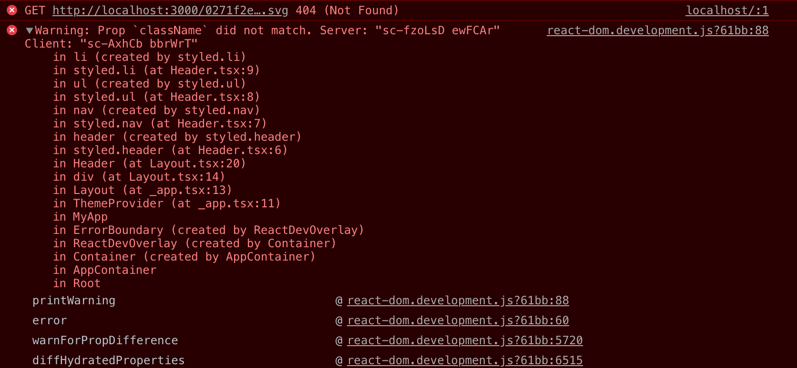

```jsx
{
  "presets": ["next/babel"],
  "plugins": [
    [
      "babel-plugin-styled-components",
      {
				// 코드가 포함된 파일명을 알려줌
				"fileName": true,
				// 클래스명에 해당 스타일 정보 추가
				"displayName": true,
				// 사용하지 않은 속성 제거
				"pure": true
			}
    ]
  ]
}
```
