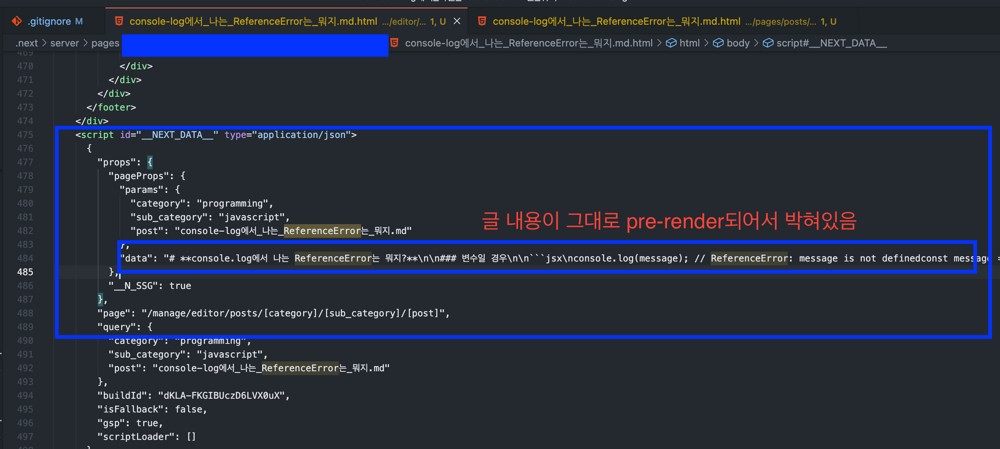

> 💡 The content of the page changes frequently? => Use SSR

> 💡 The content of the page doesn't change much? => Use SSG

## What is SSG, SSR in Next.js?

### 1. Static Site Generation(SSG)

- Pre-generated HTML on the server for pages at build time
- Using `getStaticProps, getStaticPaths`
- Created static pages in build time are provided for all requests
- Pre-rendering on the server side(build time) => No Need to fetch additional data requests from the client
- Caching => Performance improvement, server load reduction

> **Best for ⇒ static content that uses mostly low-change pages and common data**

### 2. Static Site Generation(SSG)

- Create Pre-rendered HTML for each page request
- Use `getServerSideProps` => Invoke API and more here to get data, render pages in every request(request for HTML and other assets)
- Get data for each request => Get the latest data
- Page loading time may be longer, server resource load may be reduced

> **Best for ⇒ Great for pages that change a lot, pages that change a lot**

---

### "GetStaticProps is called only when it is prebuilt

### Take an example of "Let's not use it if the content of the page changes a lot."

- environment is on the deployed internet env

1. this post is before change

now i’m gonna change like below

1. you can see there’s no change applied

because `getStaticProps` is called only at the build time, it can be considered that the value is embedded in HTML.

### 3. Therefore, if you modify it frequently or change data in the DOM frequently, it is better to use getServerSideProps

this is post using `getServerSideProps`

> 💡 in the case of the page displayed on the local server, this new article has been updated.
> (This is because the local server continues to generate new HTML.) => Show behavior like getServerSideProps
