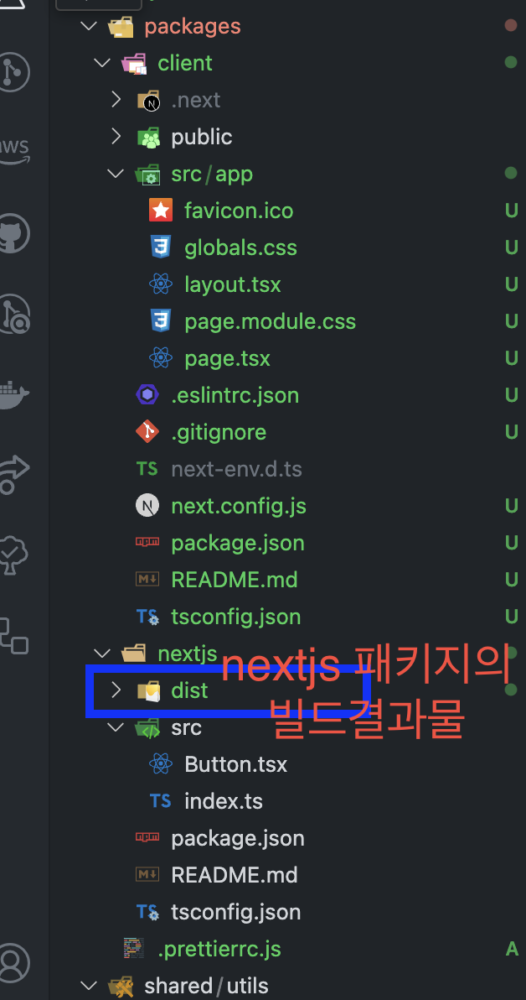
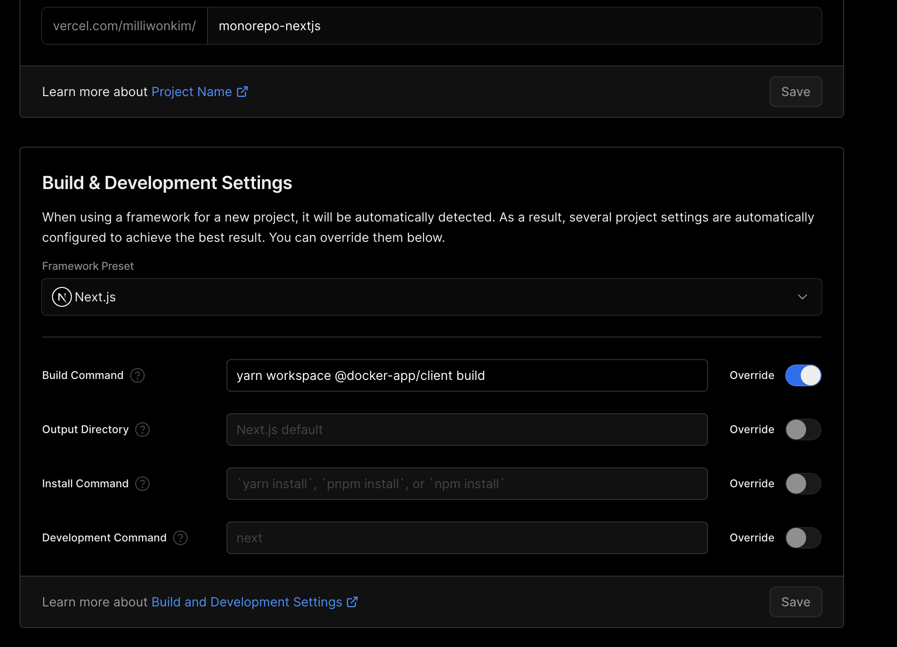
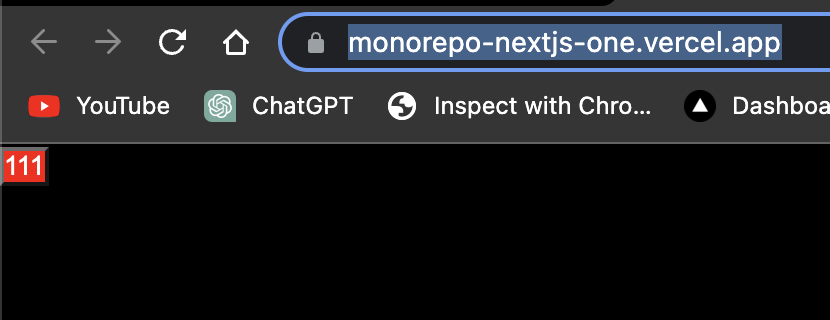

```bash
mkdir docker-app
cd docker-app
yarn set version berry

# package.json에 packages 키의 값인 array 안에 "workspaces/*"를 자동으로 항목추가하고
# projects 폴더를 생성하고
# .gitignore 설정을 해줌
yarn init -w
```

```bash
yarn add -D typescript @types/node
```

yarn add로 패키지 설치 시 @types/\* 설치파일을 찾아 설치해주는 유틸리티 플러그인 설치

[Plugins](https://yarnpkg.com/features/plugins)

```bash
yarn plugin import typescript
```

```tsx
// tsconfig.base.json

{
  "compilerOptions": {
    "target": "es2017",
    "module": "commonjs",
    "lib": ["es2017", "dom"],
		// true모듈 밖에서 사용할 수 있도록
		// type information을 생성 해 줍니다. (.d.ts 파일이 생성 됩니다.)
    "declaration": true,
		// .d.ts정의에 대해 원래의 ts파일위치 맵을 만듭니다.
		// 에디터에서 '정의로 이동' 같은
		// 코드 네비게이션 기능을 사용할 수 있게 합니다.
    "declarationMap": true,
    "sourceMap": true,
    "rootDir": ".",
		// 배포 등 전체 라이브러리를 빌드하고
		// 한 곳에 모을 필요가 있을 때, 사용되는 빌드 폴더
    "outDir": "./dist",
    "moduleResolution": "node",
    "esModuleInterop": true,
    "resolveJsonModule": true,
		// 컴파일 시 캐싱등을 이용하여 속도를 높일수 있도록 합니다.
    "incremental": true
  }
}
```

- vscode에서 ZipFS 플러그인 설치 후
  - 그리고 안전 상의 이유로 VSCode에서는 사용자 지정 타입스크립트 설정을 명시적으로 활성화해야함
    - typescript 파일을 열고
    - cmd + shift + p ⇒ Select TypeScript Version 선책 ⇒ Use Workspace Version 선택
      [Editor SDKs](https://yarnpkg.com/getting-started/editor-sdks)

```tsx
// yarn dlx는 yarn의 npx와 같음
yarn dlx @yarnpkg/sdks vscode
```

- prettier + eslint

```tsx
yarn add -D @types/eslint @typescript-eslint/eslint-plugin @typescript-eslint/parser eslint eslint-config-prettier eslint-config-standard-with-typescript eslint-plugin-import eslint-plugin-n eslint-plugin-prettier eslint-plugin-promise eslint-plugin-react prettier

yarn dlx @yarnpkg/sdks vscode
```

```json
// .eslintrc.js
module.exports = {
    parser: '@typescript-eslint/parser',
    env: {
      browser: true,
      es2021: true,
      node: true,
    },
    extends: ["standard-with-typescript", "plugin:react/recommended", "plugin:prettier/recommended"],
    overrides: [
      {
        env: {
          node: true,
        },
        files: [".eslintrc.{js,cjs}"],
        parserOptions: {
          sourceType: "script",
        },
      },
    ],
    parserOptions: {
      ecmaVersion: "latest",
      sourceType: "module",
      tsconfigRootDir: __dirname,
      project: "./tsconfig.base.json",
    },
    plugins: ['react', '@typescript-eslint/eslint-plugin', "prettier"],
    rules: {

    },
    ignorePatterns: ['.eslintrc.js', 'dist'],
    settings: {
      react: {
       version: "detect",
      },
    },
};
```

```tsx
// .prettierrc
{
  "semi": true,
  "trailingComma": "all",
  "singleQuote": true,
  "printWidth": 120,
  "tabWidth": 2,
  "useTabs": false,
  "plugins": ["prettier-plugin-tailwindcss"]
}
```

- vscode의 settings.json

```tsx
{
  ...
  "editor.formatOnSave": false,
  "editor.defaultFormatter": "esbenp.prettier-vscode",
  "editor.codeActionsOnSave": {
    "source.fixAll.eslint": true
  },
  ...
}
```

- jest 설정

```tsx
yarn add -D jest @types/jest ts-jest
```

```tsx
// jest.config.json
{
  "preset": "ts-jest",
  "testEnvironment": "node",
  "roots": ["<rootDir>/src"],
  "transform": {
    "^.+\\.tsx?$": "ts-jest"
  },
  "testRegex": "(/__tests__/.*|(\\.|/)(test|spec))\\.tsx?$",
  "moduleFileExtensions": ["ts", "tsx", "js", "jsx", "json", "node"],
  "moduleNameMapper": {
    "^@/(.*)$": "<rootDir>/src/$1"
  },
  "setupFilesAfterEnv": ["jest-extended"],
  "globals": {
    "ts-jest": {
      "tsconfig": "<rootDir>/tsconfig.json"
    }
  }
}
```

- nextjs 설정

```tsx
cd packages
yarn dlx create-next-app@latest client --use-yarn
```

```tsx
// 실행
// package.json
{
	...,
	"scripts": {
		"component:dev": "yarn workspace @docker-app/component build",
		// dev는 client 폴더 안의 package.json의 script 중 하나
    "client:dev": "yarn workspace @docker-app/client dev"
	},
	...
}
```

```tsx
// packages/client/package.json

{
  ...
  "packageManager": "yarn@3.4.1",
  ...
}
```

- images
  - aws lambda와 같은 readonly 디스크에 배포버전이 올라 갈 경우, .next/cache에 캐시 파일을 기록하려다 오류가 납니다. 이를 방지 하기 위해서 입니다. 그와같은 환경에서의 운영이 아닐 경우 생략 합니다.
- output: standalone
  - docker image를 생성할때 필요한 빌드 옵션 입니다. 역시 도커 빌드가 필요 없을경우 생략합니다.

```tsx
// packages/client/package.json

/** @type {import('next').NextConfig} */
const nextConfig = {
  experimental: {
    ...
  },
  images: {                 // (option) serverless dockerlizing을 위해
    unoptimized: true,
  },
  output: 'standalone',     // dockerlizing을 위해
};

module.exports = nextConfig;
```

```bash
yarn client:dev
```

- 공유라이브러리 구성

```tsx
cd packages
mkdir -p nextjs/src
cd nextjs

// 초기화를 하면 밑의 부분이 나옴
yarn init -y
```

```tsx
// packages/nextjs/package.json

{
  "name": "@docker-app/component",
  "packageManager": "yarn@3.6.1"
}

// 후 다음과 같이 수정한다

// packages/nextjs/package.json
{
  "name": "@docker-app/component",
  "packageManager": "yarn@3.4.1",
  "private": true,
  "main": "dist/packages/nextjs/src/index.js",
  "typings": "dist/packages/nextjs/src/index.d.ts",
  "files": [
    "dist/**/*"
  ],
  "scripts": {
    "build": "tsc"
  },
  "dependencies": {
    "react": "^18.2.0",
    "react-dom": "^18.2.0"
  },
  "devDependencies": {
    "@types/node": "^18.15.3",
    "typescript": "^4.9.5"
  }
}
```

```tsx
// packages/nextjs/tsconfig.json

{
  "extends": "../../tsconfig.base.json",
  "compilerOptions": {
    "jsx": "react",  // 중요
    "outDir": "./dist"
  },
  "include": ["./src/**/*"],
  "exclude": ["node_modules", "dist"]
}
```

```bash
#@docker-app/component 패키지를 @docker-app/client에 설치한다
yarn workspace @docker-app/client add @docker-app/component
yarn install
```

```bash
# @docker-app/component 패키지에서 새로운 코드를 반영하려면
# 다음과같이 새로운 것들을 반영해야함
yarn component:dev && yarn install
```



```tsx
// packages/client/src/app/page.tsx

import Button from "@docker-app/component/dist/packages/nextjs/src/Button";

export default function Home() {
  return <Button>fjdisafj</Button>;
}
```


---

Multi Packages

```bash
# 루트폴더 환경 docker-app 폴더로 옴
mkdir shared/utils
yarn init -y
```

```tsx
// shared/utils/package.json

{
  "name": "@docker-app/utils",
  "packageManager": "yarn@3.6.1",
}
```

```tsx
// package.json

{
	...,
	"workspaces": [
    "packages/*",
		// 추가됨
    "shared/*"
  ],
	...
}
```

```bash
yarn workspace @docker-app/utils add react react-dom
```

```tsx
// shared/utils/package.json

{
  "name": "@docker-app/utils",
  "packageManager": "yarn@3.6.1",
  "scripts": {
    "build": "tsc"
  },
  "dependencies": {
    "react": "^18.2.0",
    "react-dom": "^18.2.0"
  },
  "devDependencies": {
    "@types/react": "^18",
    "@types/react-dom": "^18"
  }
}
```

- vercel에 배포 스크립트를 설정한다



- 배포결과
  

[Create Next App](https://monorepo-nextjs-one.vercel.app/)

- 각 디렉토리에 패키지 추가

[yarn workspace 모노레포 설정하기](https://medium.com/@designdevelop/yarn-workspaces-모노레포-도입기-c0310ca41c0e)

참고

[Yarn Berry(v3) Workspace #1 - workspace 설정](https://velog.io/@projaguar/Yarn-Berryv3-Workspace1-workspace-설정)
