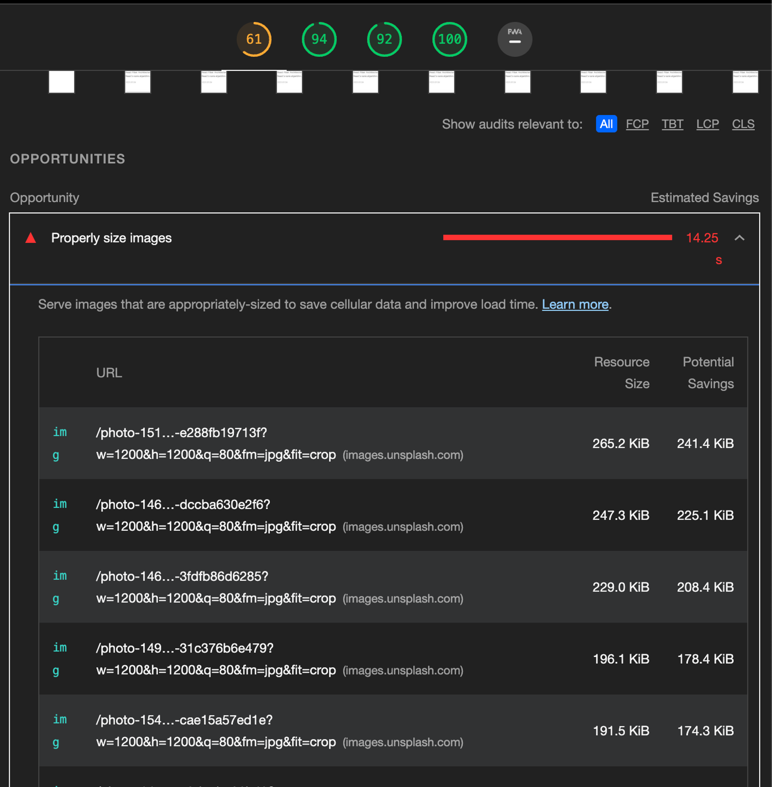
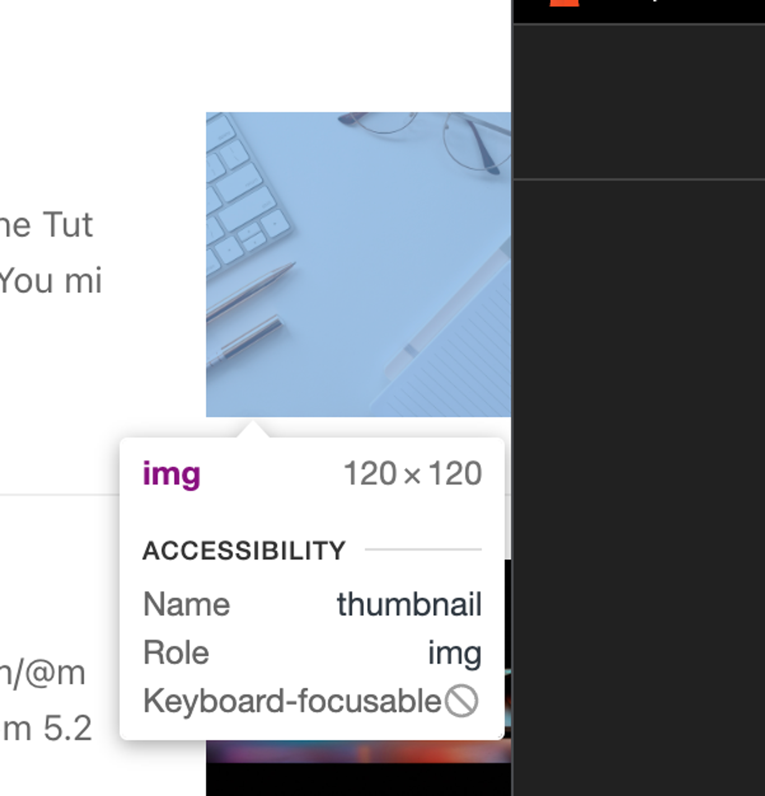
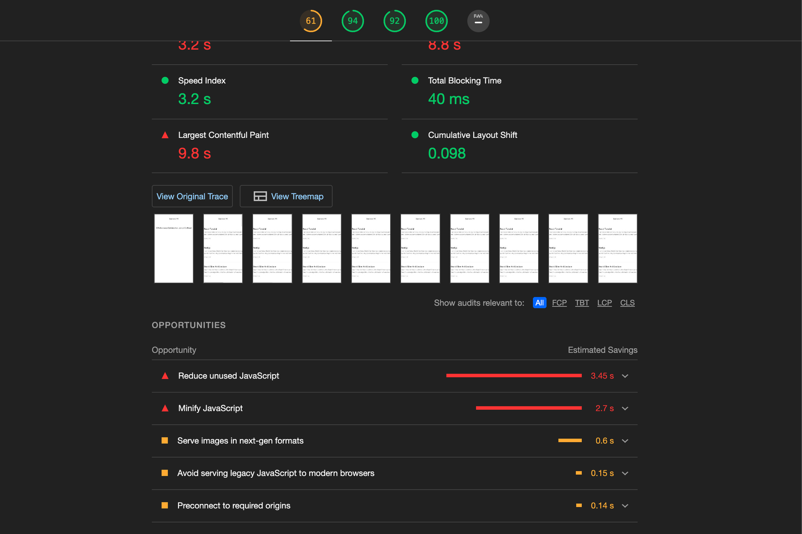

다음과 같은 경우, Lighthouse에서 적절한 사이즈의 이미지로 렌더링을 권장하는 경고가 뜹니다.

적절한 사이즈로 줄인다면, 이미지를 가져오는 용량과 약 200KiB를 줄일 수 있고, 시간을 14.25s를 줄일 수 있습니다.





```jsx
function Article(props) {
    function getParametersForUnsplash({ width, height, quality, format }) {
      return `?w=${width}&h=${height}&q=${quality}&fm=${format}&fit=crop`;
    }

    ...

    return (
        
    )
}
```

현재 가져온 이미지의 width, height는 각각 1200, 1200인데에 반해

렌더링되는 이미지의 넓이는 120, 120입니다.

다음의 코드에서 1200, 1200인 width, height를 각각 240, 240으로 줄여본 결과는 다음과 같습니다.

(120, 120이 아닌 240, 240으로 줄인 이유는, 요즘 많이 사용되는 레티나 디스플레이의 경우, 다른 디스플레이에 비해 같은 면적에서 더 많은 픽셀을 그릴 수 있기 때문의 렌더링되는 영역의 2배가 적절함)

이미지 사이즈 최적화 권장 경고가 사라졌습니다.


