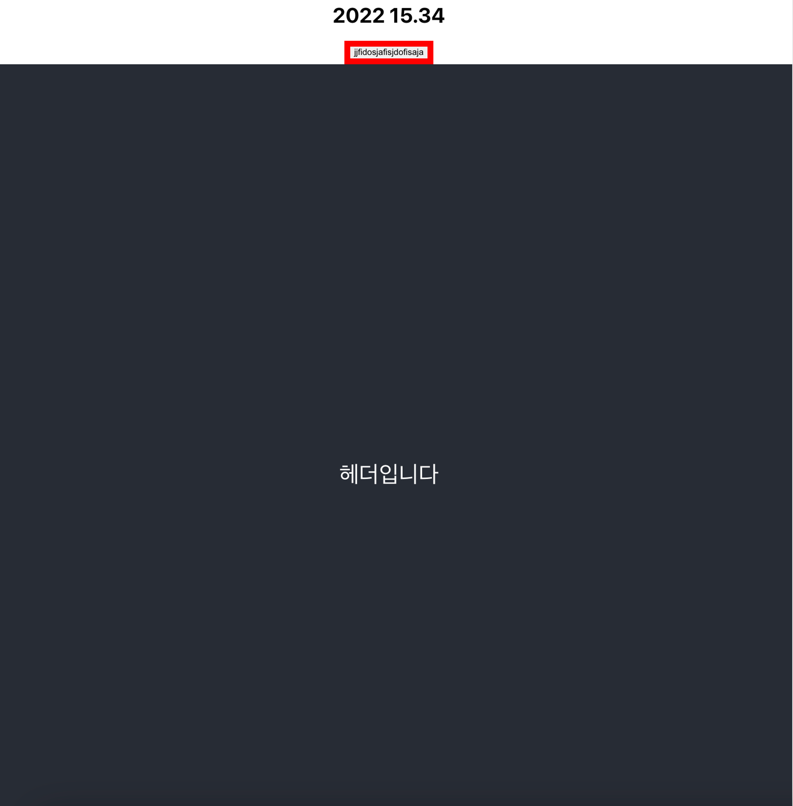

```tsx
// react-monorepo라는 폴더를 만들고 yarn init
mkdir react-monorepo && yarn init

// react-monorepo안에서 packages 폴더를 만든다
cd react-monorepo && mkdir packages

// packages 폴더 안에서 이용할 패키지들을 구성한다// 예시로 CRA로 web, common 패키지를 구성한다
cd packages && npx create-react-app web && npx create-react-app common
```

- packages
  - /web: 페이지를 렌더링 할 프로젝트(이걸 deploy 해야함)
  - /common: web에 사용할 컴포넌트 제공

```tsx
// react-monorepo 맨 상위 루트로 돌아온다
cd react-monorepo
lerna init
```

```tsx
// lerna.json(root)

{
  "packages": ["packages/*"],
  "npmClient": "yarn",
  "useWorkspaces": true,
  "version": "0.0.0"
}
```

```tsx
// package.json(root)// 모든 devDependencies는 root package.json에 있어야함
{
  "name": "@allight/monorepo-test-root",
  "private": true,
  "workspaces": [
    "packages/*"
  ],
  "scripts": {
    "build": "lerna run build"
  },
  "devDependencies": {
    "lerna": "^5.1.8"
  }
}
```

배포할 패키지 구성

```tsx
// deploy할 패키지에서 구성(web 패키지)
yarn add -D craco && cd packages/web && touch craco.config.js
```

```tsx
// packages/web/craco.config.jsconst path = require("path");
const { getLoader, loaderByName } = require("@craco/craco");

const packages = [];
packages.push(path.join(__dirname, "../common"));
packages.push(path.join(__dirname, "../ui-components"));

module.exports = {
  webpack: {
    configure: (webpackConfig, arg) => {
      const { isFound, match } = getLoader(
        webpackConfig,
        loaderByName("babel-loader")
      );
      if (isFound) {
        const include = Array.isArray(match.loader.include)
          ? match.loader.include
          : [match.loader.include];

        match.loader.include = include.concat(packages);
      }

      return webpackConfig;
    },
  },
};
```

각 패키지를 link

```tsx
// deploy할 패키지인 @allight/monorepo-test-web에// @allight/monorepo-test-common 패키지를// dependency에 npm link처럼 링크한다

npx lerna add @allight/monorepo-test-common --scope=@allight/monorepo-test-web
npx lerna add @allight/monorepo-test-ui-components --scope=@allight/monorepo-test-web
```

모든 패키지들을 동시에 start해서 수정사항 바로 반영가능

```tsx
// package.json(common 패키지)
{
  "name": "@allight/monorepo-test-common",
  "version": "0.1.0",
  "private": true,
// 여기를 통해서 컴포넌트를 가져옴"main": "./src/index.tsx",
  "dependencies": {
    "npm-run-all": "^4.1.5",
    "react": "^18.2.0",
    "react-dom": "^18.2.0",
    "react-scripts": "5.0.1",
    "styled-components": "^5.3.5"
  },
  "scripts": {
    "start": "tsc -w",
    "build": "react-scripts build",
    "test": "react-scripts test",
    "eject": "react-scripts eject"
  },
  "eslintConfig": {
    "extends": [
      "react-app",
      "react-app/jest"
    ]
  },
  "browserslist": {
    "production": [
      ">0.2%",
      "not dead",
      "not op_mini all"
    ],
    "development": [
      "last 1 chrome version",
      "last 1 firefox version",
      "last 1 safari version"
    ]
  }
}
```

```tsx
// 모든 패키지들의 build 스크립트를 실행함
npx lerna run build
```

```tsx
// 패키지들 모두의 start 명령을 동시에 실행해서// @allight/monorepo-test-common의 start 스크립트와// @allight/monorepo-test-web의 start 스크립트를 동시에 실행함// 따라서 @allight/monorepo-test-common의 수정사항이 바로바로 반영됨// yarn start 안해도됨
npx lerna run start --parallel
```

```tsx
// package.json(web 패키지)

{
  "name": "@allight/monorepo-test-web",
  "version": "0.1.0",
  "private": true,
  "dependencies": {
    "@allight/monorepo-test-common": "^0.1.0",
    "@allight/monorepo-test-ui-components": "^0.1.0",
    "@testing-library/jest-dom": "^5.16.4",
    "@testing-library/react": "^13.3.0",
    "@testing-library/user-event": "^13.5.0",
    "@types/jest": "^27.5.2",
    "@types/node": "^16.11.43",
    "@types/react": "^18.0.15",
    "@types/react-dom": "^18.0.6",
    "npm-run-all": "^4.1.5",
    "react": "^18.2.0",
    "react-dom": "^18.2.0",
    "react-scripts": "5.0.1",
    "typescript": "^4.7.4",
    "web-vitals": "^2.1.4"
  },
  "scripts": {
    "start": "craco start",
    "build": "craco build",
    "test": "craco test",
    "eject": "craco eject"
  },
  "eslintConfig": {
    "extends": [
      "react-app",
      "react-app/jest"
    ]
  },
  "browserslist": {
    "production": [
      ">0.2%",
      "not dead",
      "not op_mini all"
    ],
    "development": [
      "last 1 chrome version",
      "last 1 firefox version",
      "last 1 safari version"
    ]
  },
  "devDependencies": {
    "@craco/craco": "^6.4.5"
  }
}
```

```tsx
// App.tsx(web 패키지(deploy할 패키지))import { Button } from "@allight/monorepo-test-common";
import "./App.css";
import { TestHeader } from "@allight/monorepo-test-ui-components";

function App() {
  return (
    <div className="App">
      <h1>2022 15.34</h1>
      <Button>jjfidosjafisjdofisaja</Button>
      <TestHeader />
    </div>
  );
}

export default App;
```



소스코드: https://github.com/milliwonkim/react-monorepo
