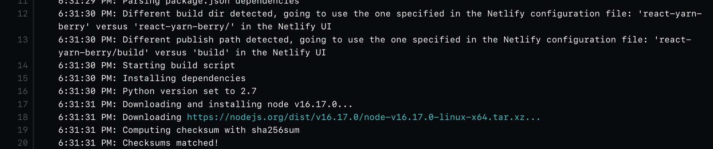
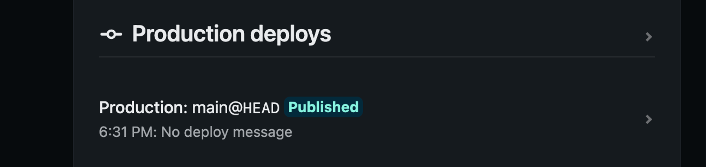

### Yarn Berry란?

yarn berry는 yarn classic 버전과는 다르게 node_modules 대신 .yarn/cache 폴더에 zip파일을 두고, 해당 모듈을 .pnp.cjs, .pnp.loader.mjs를 통해서 가져옵니다.

```tsx
// npm 기반 의존성 관련 파일 및 폴더 삭제
rm -rf node_modules package-lock.json

// yarn berry 버전으로 변경
yarn set version berry

yarn --version
// 3.2.3 => 메이저 버전이 1이면 classic version, 3 이상이면 yarn berry version// 이후 .yarn/releases 폴더 안의 yarn-3.2.3.cjs를 볼 수 있습니다// yarn berry를 이용해서 의존성 설치
yarn install
```

```tsx
// vscode에서는 typescript 설정을 안전상의 이유로 명시적으로 활성화 시켜줘야함// yarn에서 editor SDK 제공
yarn dls @yarnpkg/sdks vscode

// 자체적으로 types를 포함하고 있지 않아서, @types로 시작하는 별도의 타입 정의 설치 작업 자동화 플러그인 추가
yarn plugin import typescript

// 후 VSCode에서 ctrl + shift + p로 Typescript 버전 선택 => 작업 영역 버전 사용을 선택해서// typescript sdk 사용을 설정
```

React에 styled-components를 설치해서 사용해보기

```tsx
// 기존과 같이 설치
yarn add styled-components

// react-is 관련된 module not found 에러가 뜬다면
yarn add react-is
```

netlify 등에 배포해보기 => 잘된다




소스코드: https://github.com/milliwonkim/react-yarn-berry

[
GitHub - milliwonkim/react-yarn-berry
Contribute to milliwonkim/react-yarn-berry development by creating an account on GitHub.
github.com](https://github.com/milliwonkim/react-yarn-berry)
