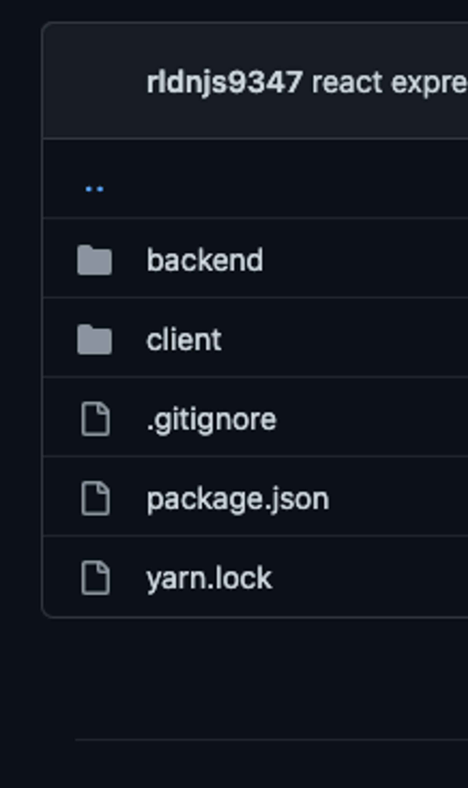

프로젝트 구조

Client: React

Backend: Express

Token Management: JWT

---

주요 기능만 블로그에 적고

구체적인 코드는 **소스코드**에 적어두겠습니다

### Client

```tsx
// client/src/services/api.jsimport axios from "axios";

export const api = axios.create({
  // express 서버가 띄워져있는 주소baseURL: "http://localhost:4000",
  // withCredentials를 true로 해야 refreshToken cookie를 주고 받을 수 있다withCredentials: true
});
```

```tsx
// client/src/services/authHeader.jsexport default function authHeader() {
  const user = JSON.parse(localStorage.getItem("user"));
  console.log("user", user);
  if (user && user.accessToken) {
    return { Authorization: "Bearer " + user.accessToken };
  } else {
    return {};
  }
}
```

```tsx
// client/src/services/authService.jsimport { api } from "./api";

const API_URL = "/auth";

const signup = (email, password) => {
  return api
    .post(API_URL + "/signup", {
      email,
      password,
    })
    .then((response) => {
      if (response.data.accessToken) {
        // user라는 key로 accessToken, refreshToken을 localStorage에 저장함// accessToken이 있다면// 이를 localStorage에 담아서 로그인 상태를 expires 기간까지 유지
        // 여기 안에 expires 기간도 적혀있음// expires 기간이 지나면 만료됨localStorage.setItem("user", JSON.stringify(response.data));
      }

      return response.data;
    });
};

const login = (email, password) => {
  return api
    .post(API_URL + "/login", {
      email,
      password,
    })
    .then((response) => {
      if (response.data.accessToken) {
        // accessToken이 있다면// 이를 localStorage에 담아서 로그인 상태를 expires 기간까지 유지localStorage.setItem("user", JSON.stringify(response.data));
      }

      return response.data;
    });
};

const logout = () => {
  localStorage.removeItem("user");
};

const getCurrentUser = () => {
  return JSON.parse(localStorage.getItem("user"));
};

const AuthService = {
  signup,
  login,
  logout,
  getCurrentUser,
};

export default AuthService;
```

```tsx
// client/src/services/postService.jsimport { api } from "./api";
import authHeader from "./authHeader";

const API_URL = "/posts";

const getAllPublicPosts = () => {
  return api.get(API_URL + "/public");
};

const getAllPrivatePosts = () => {
  // header에 authHeader를 담아서// 로그인 토큰 정보를 보낸다.return api.get(API_URL + "/private", { headers: authHeader() });
};

const postService = {
  getAllPublicPosts,
  getAllPrivatePosts,
};

export default postService;
```

###

### Backend

```tsx
// backend/routes/posts.js// authToken 미들웨어를 통과해서 privatePosts를 리턴할 수 있다
router.get("/private", authToken, (req, res) => {
  res.json(privatePosts);
});
```

```tsx
// backend/middleware/authToken.jsconst jwt = require("jsonwebtoken");
require("dotenv").config();

const authToken = async (req, res, next) => {
// Option 1const authHeader = req.headers["authorization"];
  const token = authHeader && authHeader.split(" ")[1];// Bearer Token// Option 2// const token = req.header("x-auth-token");if (!token) {
    res.status(401).json({
      errors: [
        {
          msg: "Token Not Found",
        },
      ],
    });
  }

  try {
// process.env.ACCESS_TOKEN_SECRET은// backend 폴더의 root에 .env 파일을 만들어서 적용const user = await jwt.verify(token, process.env.ACCESS_TOKEN_SECRET);
    req.user = user.email;
    next();
  } catch (err) {
    res.status(403).json({
      errors: [
        {
          msg: "invalid token",
        },
      ],
    });
  }
};

module.exports = authToken;
```

소스코드: https://github.com/milliwonkim/react-express-jwt-auth/tree/auth/react-auth

[
GitHub - milliwonkim/react-express-jwt-auth
Contribute to milliwonkim/react-express-jwt-auth development by creating an account on GitHub.
github.com](https://github.com/milliwonkim/react-express-jwt-auth/tree/auth/react-auth)
