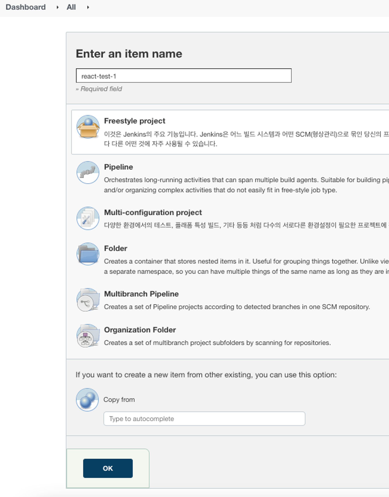
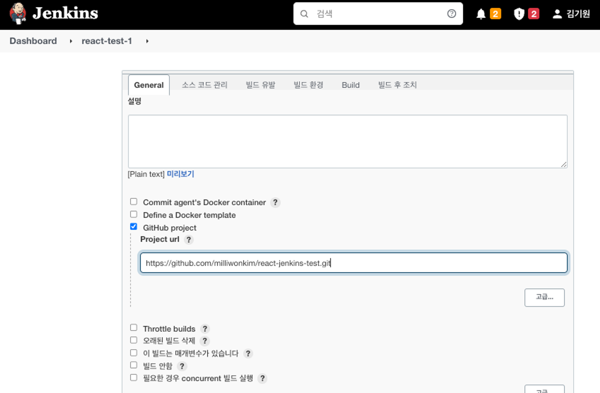
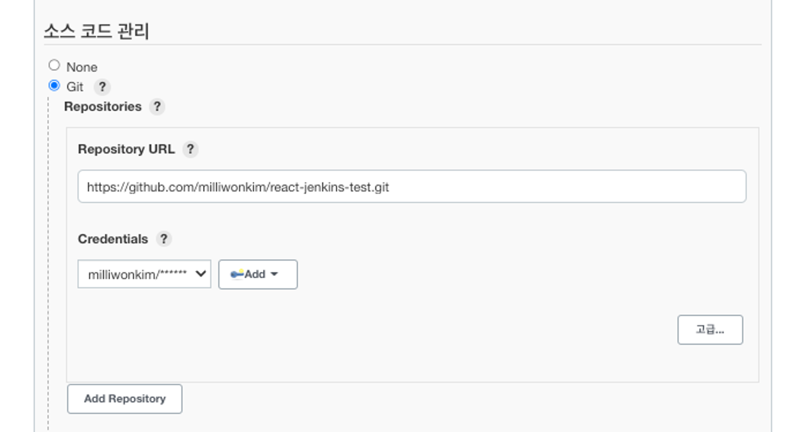
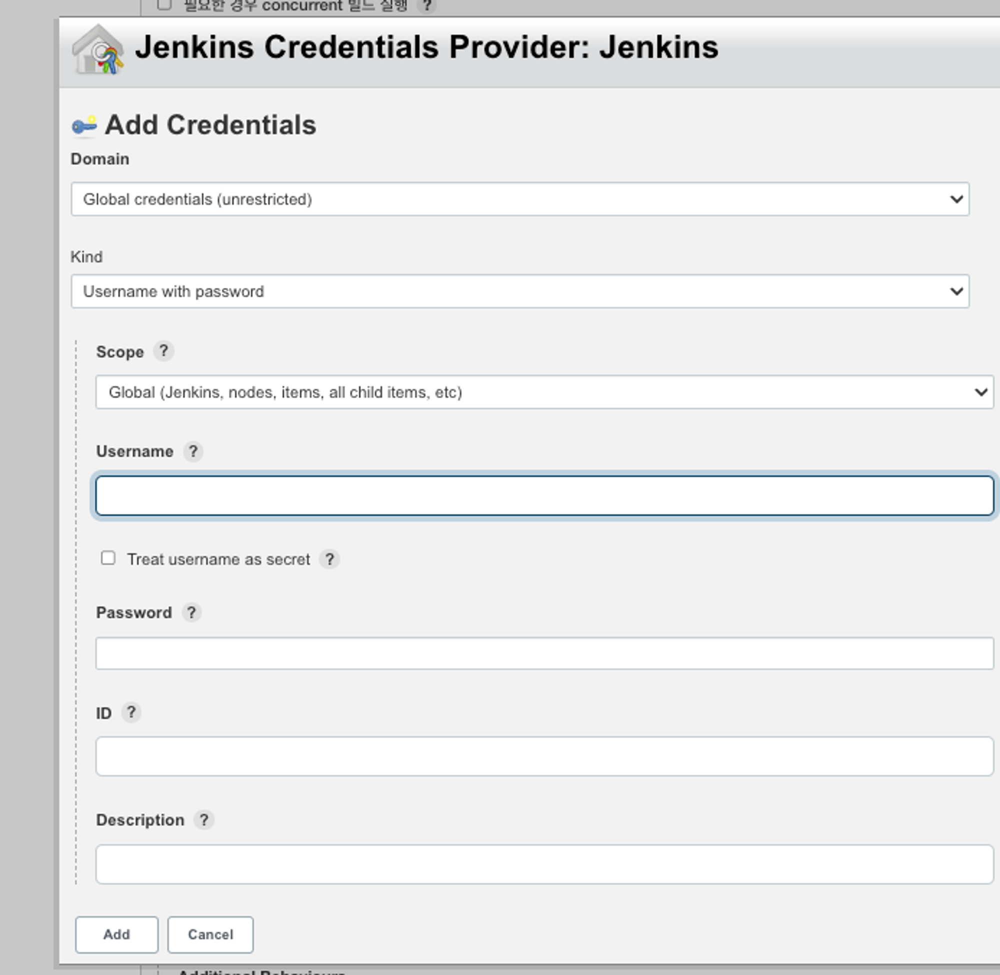
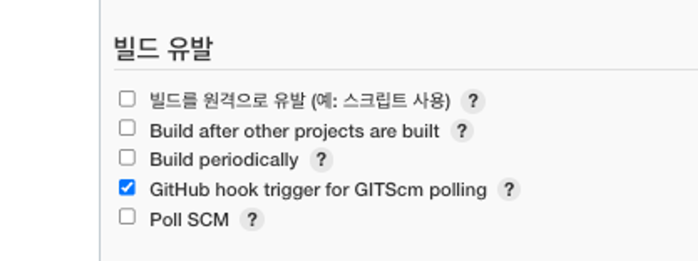
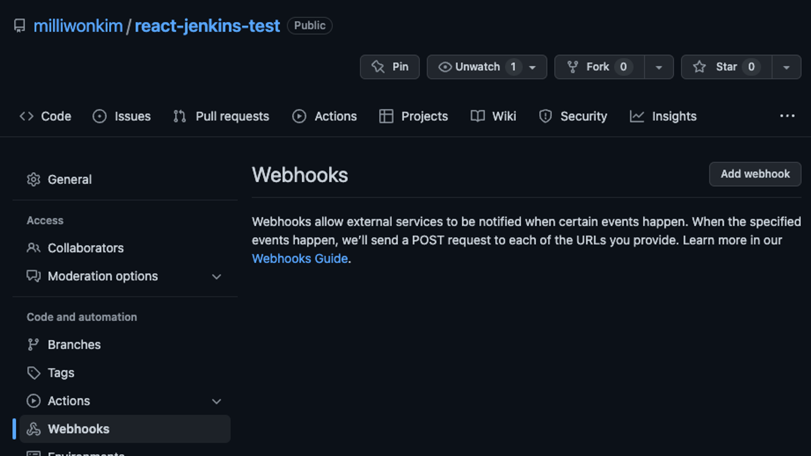
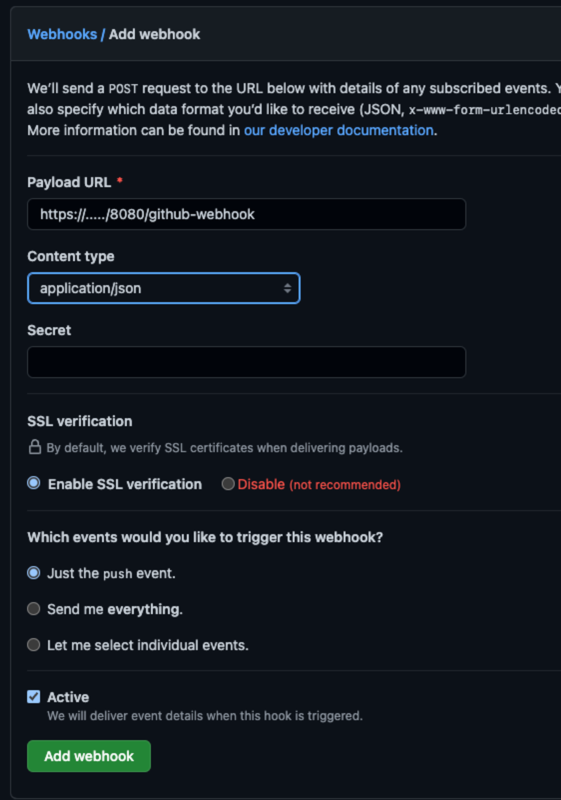
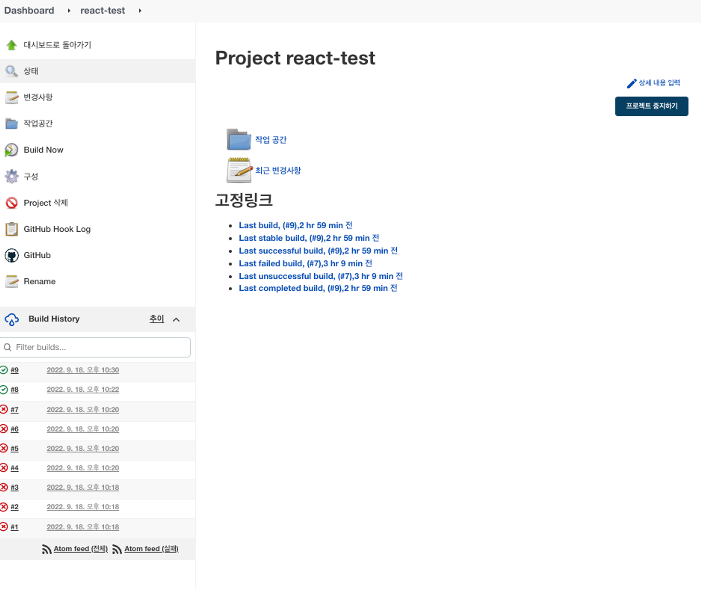

# 젠킨스 설치 후 젠킨스 시작

```sql
brew services start jenkins-lts
// 이미 실행됐을 경우 => Service `jenkins-lts` already started, use `brew services restart jenkins-lts` to restart.
```

젠킨스 MacOS 설치 및 실행 커맨드: https://www.jenkins.io/download/lts/macos/

[
macOS Installers for Jenkins LTS
macOS Installers for Jenkins LTS Homebrew Installer Jenkins can be installed using the Homebrew package manager. Homebrew formula: jenkins-lts This is a package supported by a third party which may be not as frequently updated as packages supported by the
www.jenkins.io](https://www.jenkins.io/download/lts/macos/)

```
// 최신 젠킨스 LTS 버전 설치
brew install jenkins-lts

// 측정 젠킨스 LTS 버전 설치
brew install jenkins-lts@YOUR_VERSION

// 젠킨스 서비스 실행
brew services start jenkins-lts

// 젠킨스 서비스 재실행
brew services restart jenkins-lts

// 젠킨스 버전 업데이트
brew upgrade jenkins-lts
```

# Jenkins CI/CD 아이템 만들기

새로운 아이템 클릭 => 적당한 제목 입력 후 Freestyle project 클릭 후 OK 클릭







젠킨스 처음 시작 시에는 Credentials가 없을 수도 있다(--None--)(이미지에서는 Milliwonkim/\*\*\*이 없다고 가정하자) => 그럴 경우 옆의 Add 버튼을 눌러서 => Jenkins 클릭


- Username: 깃헙 유저이름
- password: 깃헙 패스워드
- 아이디: 아무거나 가능

후 add 클릭





# 깃헙 레포 설정

깃헙에서 웹훅 설정 => add webhook 클릭



- ...에는 로컬일 경우 => https://whatismyipaddress.com/ 에서 찾은 IPv4 아이피를 넣고
- 8080 => 젠킨스가 띄워진 포트를 적기



CI/CD 아이템이 생성돼서 => CI/CD가 돌면 Build History에 기록된다


