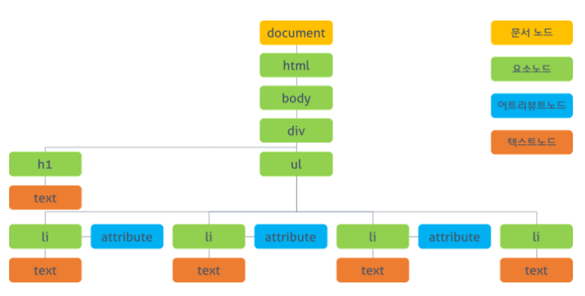
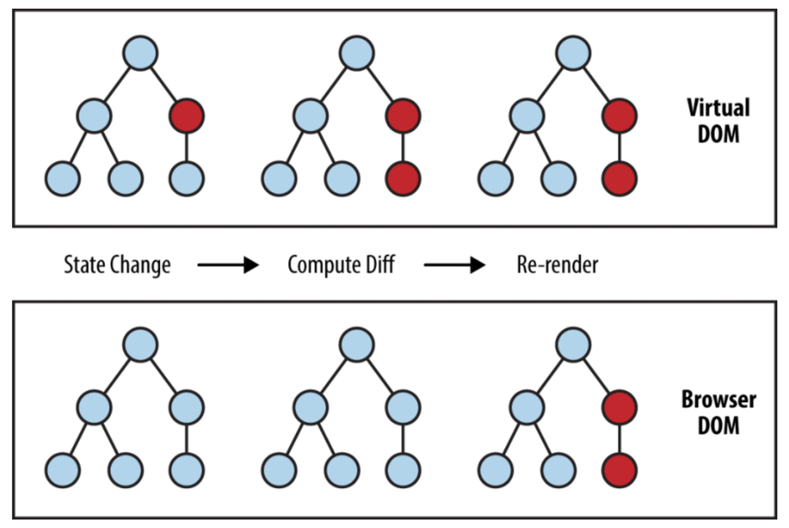

DOM(Document Object Model = 문서객체모델)

- 자바스크립트가 p, a 태그 등을 조작할 수 있게 만든 트리구조 객체모델
- HTML/CSS <=> DOM <=> JavaScript



가상돔이 필요한 이유

- 매번 document 객체를 이용해서 DOM 내의 태그 등을 가져올 경우 => 렌더링 비용이 큼

렌더링 = '스타일 => 레이아웃 => 페인트 => 합성'의 과정 중 스타일 이후의 과정(레이아웃, 페인트, 합성)

리렌더링 반복 시 => 돔 추가 삭제 등 계산이 계속 발생 => 안좋음

가상돔을 이용한 리액트의 렌더링

- '변화 전 가상돔 <=> 변화 후 가상돔' 끼리 비교 => 바뀐 부분만 실제 돔에 적용

레이아웃 계산은 한 번 뿐(일괄 돔 업데이트 방식)

작은 규모의 레이아웃이 여러번 발생(리플로우)보다 => 큰 규모의 레이아웃 한 번 발생이 더 낫다



DOM 코드

```bash
<ul class="fruits">
    <li>Apple</li>
    <li>Orange</li>
    <li>Banana</li>
</ul>
```

가상돔식으로 표현된 코드

```bash
// Virtual DOM representation
{
  type: "ul",
  props: {
    "class": "fruits"
  },
  children: [
    {
      type: "li",
      props: null,
      children: [
        "Apple"
      ]
    },
    {
      type: "li",
      props: null,
      children: [
        "Orange"
      ]
    },
    {
      type: "li",
      props: null,
      children: [
        "Banana"
      ]
    }
  ]
}
```
