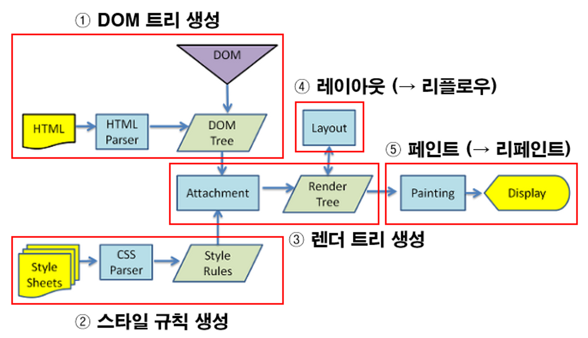
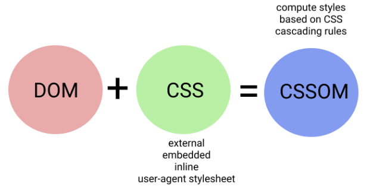
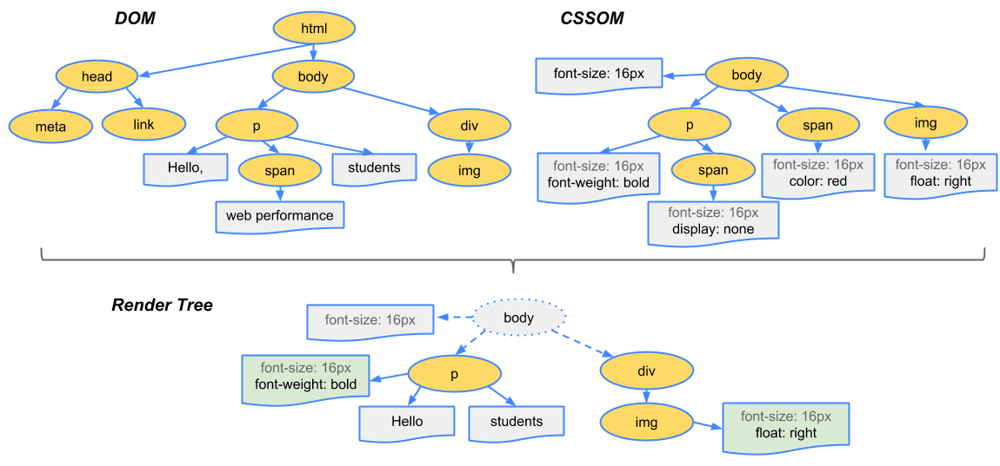
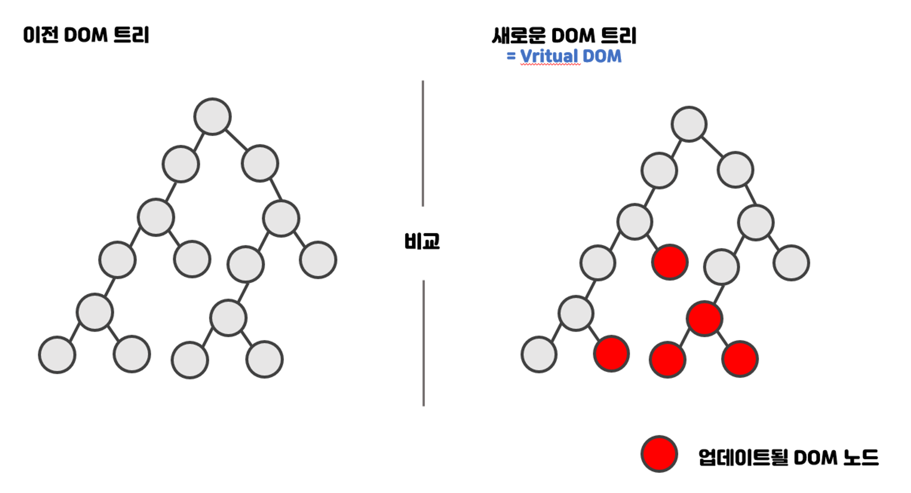
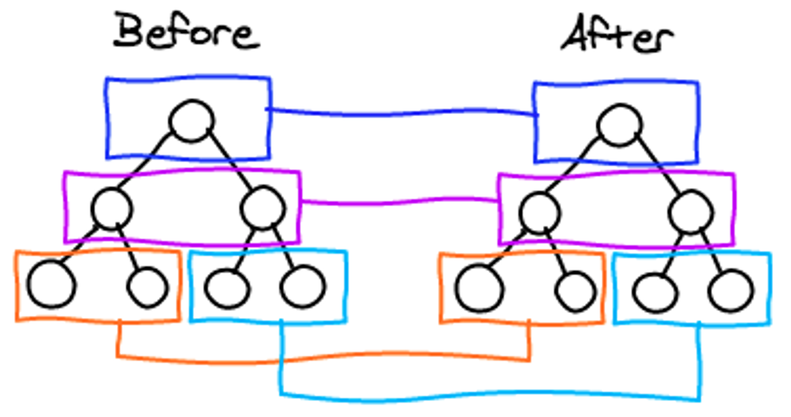

<aside>
💡 Browser Operating Principle = Rendering Process = Critical Rendering Path

</aside>



- Creating DOM(Document Object Model)

  - Lifecycle Method: DOMContentLoaded, load, beforeunload, unload

  1. DOMContentLoaded
     - Occurs immediately after completion of the DOM tree.
     - No Wait for assets like img, css etc

  ```html
  <script>
    function ready() {
      alert("DOM is ready!");

      // size is 0X0 as it is not loaded
      alert(`img size: ${img.offsetWidth}x${img.offsetHeight}`);
    }

    document.addEventListener("DOMContentLoaded", ready);
  </script>

  
  ```

  - If multiple script tags exist => DOMCcontentLoaded runs after all scripts run
    (reason: DOMcontentLoaded may have logic related to DOM manipulation)

  ```html
  <!-- b => c => a -->

  <script>
    document.addEventListener("DOMContentLoaded", () => {
      alert("DOM is ready!");
    });
    // a
  </script>

  <script
    src="https://cdnjs.cloudflare.com/ajax/libs/lodash.js/4.3.0/lodash.js"
  >
    // b
  </script>

  <script>
    // c
    alert("라이브러리 로딩이 끝나고 인라인 스크립트가 실행되었습니다.");
  </script>
  ```

  - Scripts created dynamically with document.createElement ('script')
    - and added to web pages do not prevent DOMCentLoaded.
    - if script location after CSS loading link tag - Script tag will not run until CSS loading is complete - Therefore, DOMCcontentLoaded runs after style loading too
      (reason: Possible use of style-affected properties during JS like img, offsetTop…)

  1. load
     => Executed when all external resources such as img and CSS are loaded
  1. beforeunload /
     => Occurs when a user leaves the page
     !https://blog.kakaocdn.net/dn/bwVtza/btrMI23XIp7/f7LpqlCEGumD6kfIPvEsg0/img.png
  1. unload (the last thing to do when you really leave)
     => Occurs when a user leaves the page

  ```jsx
  // only document
  window.addEventListener("DOMContentLoaded", (event) => {
    console.log("DOMContentLoaded");
  });

  // after resources (css, images)
  window.addEventListener("load", (event) => {
    console.log("load");
  });

  // before unload
  window.addEventListener("beforeunload", (event) => {
    console.log("beforeunload");
  });

  // resource is being unloaded
  window.addEventListener("unload", (event) => {
    console.log("unload");
  });
  ```

- Creating CSSOM(Cascade Style Sheet Object Model)

  - DOM + CSS = CSSOM
    => DOM + CSSOM = Render Tree
    
  - `display:none` applied to DOM => including to Final Render Tree
  - `visibility: hidden / opacity: 0` => including to Final Render Tree(Element exists, but not visible)
    

  ### Parsing HTML, CSS, JS(= Synchronous Parsing)

  - at facing <link /> tag while parsing HTML ⇒ simultaneously parsing HTML, CSS

    => CSS doesn’t change DOM structure

  - JS can change DOM structure, then if you face script tag, then stop parsing HTML parse and start JS parse

  ## No blocking if you use defer, async(= Asynchronous Parsing)

  - async

    - JS assets is downloaded at background environment
    - JS assets is loaded async, JS parsing is after HTML parsing
      - JS runs with HTML parsing pause
    - if there’s multiple async, running order is on it’s own terms

    ```html
    <script
      async
      src="https://javascript.info/article/script-async-defer/long.js"
    ></script>
    <script
      async
      src="https://javascript.info/article/script-async-defer/small.js"
    ></script>

    <!-- small.js is run first before long.js -->
    ```

    - DOMContentLoaded event, async script is not waiting each other.

    1. If the async script is downloaded after the page is configured, DOMCcontentLoaded may occur before the async script is executed,
    2. If the async script is short and is downloaded before the page configuration is finished, or if the script is cached, DOMCcontentLoaded can also occur after the async script is executed.

  - defer

    - JS download runs in the background
    - JS load is asynchronous, JS execution is synchronized (HTML parsing is completed)
    - Executed before the DOMCcontentLoaded event occurs

    ```html
    <!-- a -->
    <p>...content after script...</p>

    <!-- b -->
    <script
      defer
      src="https://javascript.info/article/script-async-defer/long.js?speed=1"
    ></script>

    <!-- see now! -->
    <!-- c -->
    <p>...script after content...</p>

    <!-- order a => c => b -->
    ```

    - The above script runs and the below script runs (small.js, a small script, is download before long.js, a long script)

    ```html
    <!-- a -->
    <script
      defer
      src="https://javascript.info/article/script-async-defer/long.js"
    ></script>
    <!-- b -->
    <script
      defer
      src="https://javascript.info/article/script-async-defer/small.js"
    ></script>

    <!-- b runs after a is completed -->
    ```

    - if src in script is not exists, then defer property is ignored(inline script tag is ignored)

    ```html
    <!-- defer is not applied -->
    <script defer>
      document.addEventListener("DOMContentLoaded", () =>
        alert("DOM is ready after running `defer`script")
      ); // (2)
    </script>

    <!-- defer is applied -->
    <script
      defer
      src="https://javascript.info/article/script-async-defer/long.js?speed=1"
    ></script>
    ```

- Creating Render Tree = DOM + CSSOM
- Run “Layout” process
  - Each node in the render tree => Calculate which viewport and where it should be placed
    - Relative properties such as %, vh, vw are converted to px
- Run “Paint” process
  - draw each node in the render tree as a real pixel on the monitor
    - When reflow occurs, paint must occur
      > However, if there are properties that affect the layout, such as background-color, visibility, etc., do not need to reflow => Therefore, only paint is performed
  - Property that neither Layout nor Paint occurs
    - transform, opacitiy, cursor, orphans, perspective etc
    - Rendering is faster than the 'Paint Only' property (absolutely reduced operations)
      > => If possible, it is recommended to use properties that do not cause Repaint or Reflow.
    - Different rendering engines in your browser(chrome, safari, firefox etc) might have different steps to process CSS properties

### 가상돔(Virtual DOM) 특징

- 현재 돔의 복사본인 가상돔 A와, 변경이 있는 가상돔 B(메모리에 새로 생성)를 비교(휴리스틱 알고리즘으로 비교) => 차이점의 모든 부분을 일괄적으로, 리액트가 실제 DOM에 반영한다
- 배치(batch) => DOM 업데이트를 일괄적으로 처리 => 실제 돔의 리렌더링 연산을 최소화(연쇄적 리플로우, 리페인트 발생 막음)

### **작은 규모의 레이아웃(리플로우)이 여러번 발생하는 것보다**

### **큰 규모의 레이아웃이 한 번 발생하는 것은 성능상의 큰 차이를 나타냄**



업데이트 된 가상돔과 이전 가상돔을 비교

---

# 재조정(Reconciliation)

- 다음 가정을 통해 => 전체 DOM 트리를 탐색하는 시간을(O(n^3))에서 O(n)으로 줄임
  - 서로 다른 타입의 두 엘리먼트는 서로 다른 트리를 만들어냄(엘리먼트가 다르면 비교 안함)
  - key props를 통해 => key가 같은 노드끼리 비교함
- 비교 방식

  - 동일한 레벨의 노드들끼리만 비교
  - 같은 위치에서 엘리먼트 타입이 다른 경우 => 기존 트리를 제거하고 새롭게 트리를 만든다(내부 엘리먼트, 내부 컴포넌트 모두 제거 후 다시 새로 만듬)
  - 같은 위치에서 엘리먼트의 타입이 같은 경우 => class가 변경됐다면 변경된 attributes만 업데이트한다 => 자식 엘리먼트들에 비교알고리즘을 재귀적으로 적용
  - 같은 위치에서 '엘리먼트 = 컴포넌트'이고, 타입이 같은경우 => 컴포넌트 인스턴트 자체는 안변함(state 유지) + 라이프사이클 메소드를 이용해 props가 업데이트됨 => render 함수를 호출해서 컴포넌트 이전 엘리먼트 트리와 다음 엘리먼트 트리에 대해 재귀적으로 적용
  - 자식 노드에 대한 재귀적 처리 시
    - => key를 이용해 동일한 key를 갖는 자식들끼리만 비교한다 => 따라서 ItemC 노드만 추가된다. (key가 없으면 두리스트를 모두 순회해야함)
    - => 인덱스를 key로 할 경우 => 리스트의 배열이 재정렬되지 않거나 last-child에서만 추가, 변경, 제거가 일어난다면 인덱스를 키로 사용해도됨
    - => 하지만 리스트 순서가 바뀌면 key가 전부 바뀌어서 key의 의미가 사라짐

  ```html
  // before
  <ul>
    <li>ItemA</li>
    //비교대상1
    <li>ItemB</li>
    //비교대상2
  </ul>

  // after
  <ul>
    <li>ItemC</li>
    //비교대상1 (ItemA -> ItemC 로 변경)
    <li>ItemA</li>
    //비교대상2 (ItemB -> ItemA 로 변경)
    <li>ItemB</li>
    //비교대상3 (ItemB 추가)
  </ul>
  ```



렌더링 트리 비교

---

참고

[[React] Virtual DOM과 브라우저의 렌더링 과정](https://velog.io/@1nthek/React-Virtual-DOM과-렌더링)

[브라우저의 동작과정부터 React까지](https://velog.io/@kmlee95/브라우저의-동작과정부터-React)

[[React] 가상돔 Virtual DOM이란?](https://dev-cini.tistory.com/11)

[모던 JavaScript 튜토리얼](https://ko.javascript.info/)

[[JavaScript] 문서의 로딩되는 시점 이벤트 제어하기 (ft. DOMContentLoaded, load, beforeunload, unload)](https://mine-it-record.tistory.com/577)
