### 9(타입 변환, 단축 평가)

```jsx
const x = 10;

// 숫자를 문자열로 명시적 타입 변환(타입 캐스팅)을 한다.const str = x.toString();

console.log(typeof str, str); // string, 10
// x 변수의 값이 변경된 것은 아님 => 원시값을 직접 변경은 불가능하다.(원시값은 변경불가능한 값)
console.log(typeof x, x); // number, 10
// ---------
// 암묵적 타입변환(=타입 강제 변환): 자바스크립트 엔진에 의해 암묵적으로 타입 자동 변환
const x = 10;

// x + ''로 인해 생성된 문자열 '10'은 x에 재할당 되지 않는다.
// 단순히 새로운 타입의 값을 만들고, 한 번 사용하고 버린다.
const str = x + "";

console.log(typeof str, str); // string, 10
// x 변수의 값이 변경된 것은 아님 => 원시값을 직접 변경은 불가능하다.(원시값은 변경불가능한 값)
console.log(typeof x, x); // number, 10
```

암묵적 타입 변환 종류

```jsx
// 문자열로 변환0 + '' => "0"
-0 + '' => "0"
1 + '' => "1"
-1 + '' => "-1"
NaN + '' => "NaN"
Infinity + '' => "Infinity"
-Infinity + '' => "-Infinity"

// 불리언 타입true + ''
// => "true"

// false + ''
// => "false"

// null 타입null + ''
// => "null"

// undefined 타입 undefined + ''
// => "undefined"

// 심벌 타입
(Symbol()) + '' => TypeError: Cannot convert a Symbol value to a string

({}) + '' => "[object Object]"
Math + '' => "[object Math]"
[] + '' => ""
[10, 20] + '' => "function(){}"
Array + '' => "function Array() { [native code] }"

// 숫자로 변환
+'' => 0
+'0' => 0
+'1' => 1
+'string' => NaN

// 불리언 타입
+true => 1
+false => 0

// null 타입
+null => 0

// undefeind 타입
+undefined => NaN

// Symbol 타입
+Symbol() => TypeError: Cannot convert a Symbol value to a number

// 객체 타입
+{} => NaN
+[] => 0
+[10, 20] => NaN
+(function(){}) => NaN
```

명시적 타입 변환 종류

```jsx
// 문자열 타입으로 변환String(1) => "1"
String(NaN) => "NaN"
String(Infinity) => "Infinity"

// 숫자타입으로 변환Number('0') => 0
Number(true) => 1
Number(false) => 0

// 불리언 타입으로 변환Boolean('x') => true
Boolean('') => false
Boolean('false') => true

!!'x' => true
!!'' => false
!!undefined => false
```

단축평가

1. 논리 연산자

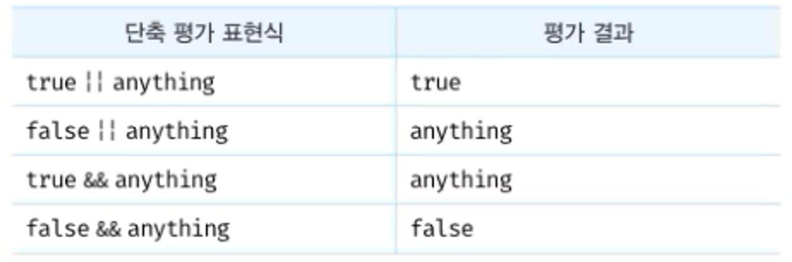

2. 옵셔널 체이닝 연산자(?.)

```jsx
const elem = null;

// elem이 null 또는 undefined이면 undefined을 반환하고
// 그렇지 않으면 우항의 프로퍼티 참조를 이어간다.
const value = elem?.value;
console.log(value); // undefined
```

3. null 병합연산자(nullish coalscing) (??)

```jsx
// 좌항의 피연산자가 null or undefined이면 우항의 피연산자를 반환하고,
// 그렇지 않으면 좌항의 피연산자를 반환한다.
const foo = null ?? "default string";
console.log(foo); // "default string"
```

---

### 10(객체 리터럴)

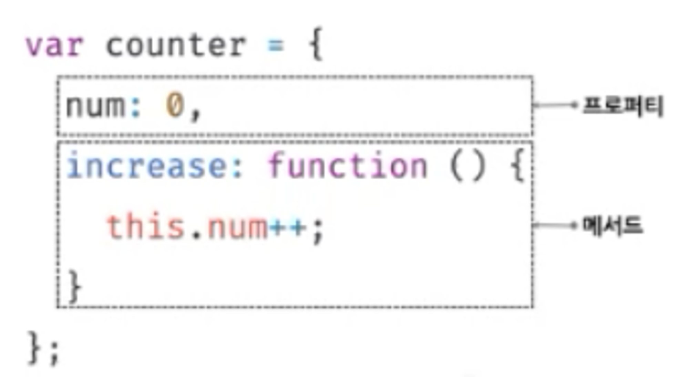

1. 객체 리터럴로 객체 생성

- 객체 리터럴
- Object 생성자 함수
- 생성자 함수
- Object.create 메서드
- 클래스

2. 프로퍼티

- 키: 문자열 혹은 심벌
- 값: 모든 타입 값

프로퍼티 접근방법 => ., ['a']

```jsx
const person = {
  name: "Lee",
};

// .console.log(person.name)

// ['']console.log(person['name'])
```

프로퍼티 삭제

```jsx
const person = {
  name: "Lee",
};

// 프로퍼티 삭제delete person.age
```

3. 메서드: 프로퍼티 값이 함수인 경우, 그 함수

```jsx
const circle = {
  radius: 5, // 프로퍼티
  getDiameter: () => {
    // 메서드
    return 2 * this.radius;
  },
};
```

---

### 11(원시값과 객체 비교)

1. 원시값 === 변경 불가능한 값

- 어떤일이 있어도 불변(데이터 신뢰성 보장)
- 불변성을 갖는 원시값을 할당한 변수 => 변수값 변경하려면, 재할당밖에 방법이 없음

```jsx
let score = 80;

// 새 원시값을 재할당하면 참조한 메모리 공간의 주소가 바뀐다.
score = 90;
```

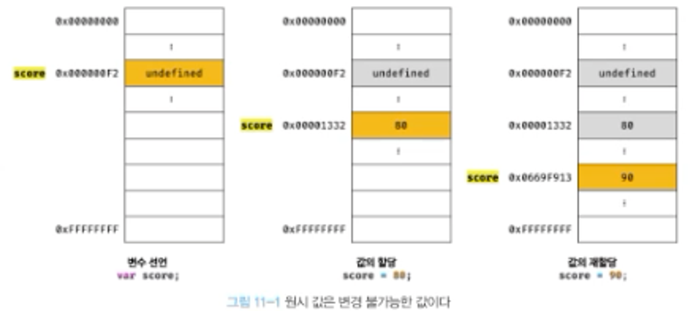

- 유사배열객체

```jsx
const str = "string";

// 문자열은 유사 배열 => 배열과 유사하게 인덱스로 각 문자에 접근가능
// 원시값인 문자열이 객체처럼 동작
// 원시값을 객체처럼 사용하면 => 원시값을 감싸는 래퍼 객체로 자동변환
console.log(str[0]); // s
console.log(str.length); // 6
console.log(str.toUpperCase()); // STRING
```

- 값에 의한 전달

```jsx
let score = 80;

// 새로운 숫자 80이 생성되어
// 새로운 메모리에 할당되고, 새로운 메모리 주소가 생성된다.
let copy = score;

// 둘 다 80은 맞지만, 각자 다른 메모리 주소를 갖고 있음
console.log(score, copy); // 80 80

score = 100;

console.log(score, copy); // 100, 80
```

항상 자바스크립트 엔진이 이렇게 동작하지는 않을 수 있다.

실제 자바스크립트 엔진을 만든 회사에 따라 내부 방식은 미묘한 차이가 있을 수 있다.

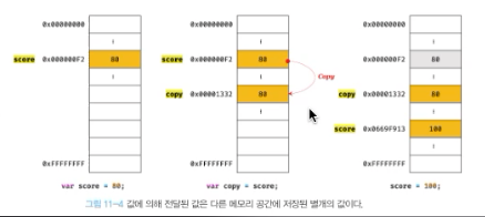

2. 객체

- 객체는 메모리공간 크기를 사전에 정해둘 수 없음(프로퍼티 개수 안정해짐. 동적으로 추가 삭제 가능)
- 해시테이블로 객체를 관리한다

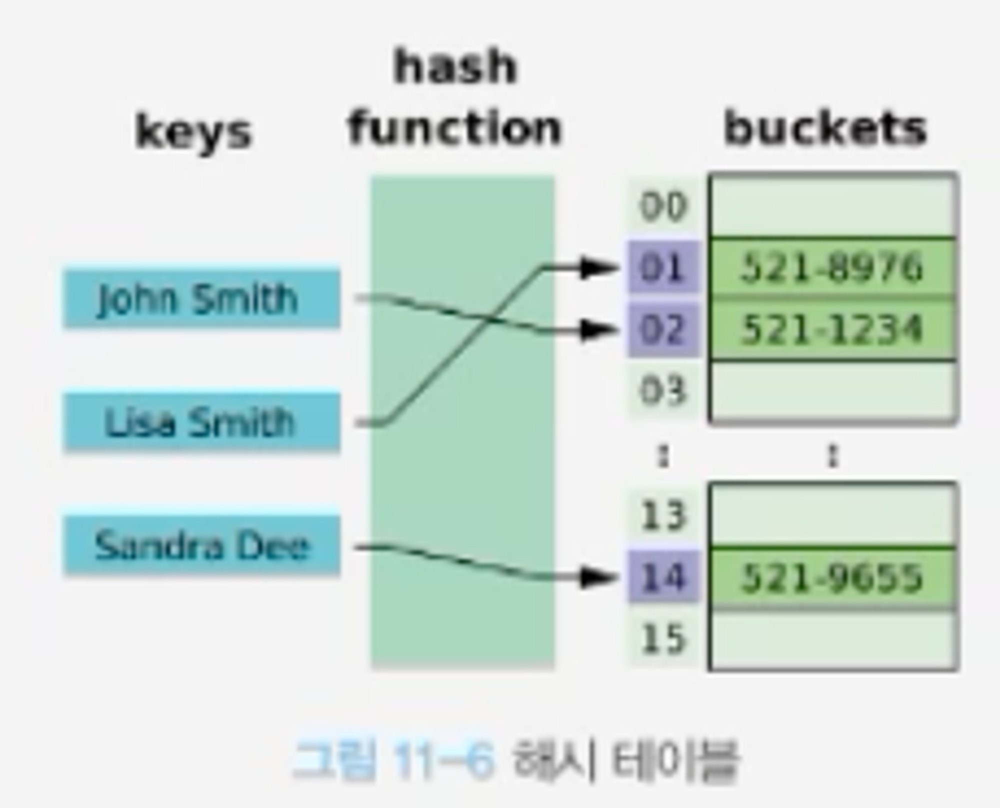

- 객체 = 변경가능한 값(참조값 = 객체가 저장된 메모리 공간 주소 그자체)
  - 어떻게 부르나?
    - 객체: '변수는 객체를 참조하고 있다(변수는 객체를 가리키고 있다.)'
    - 원시값: '변수는 어떤 값을 갖는다(원시값)'

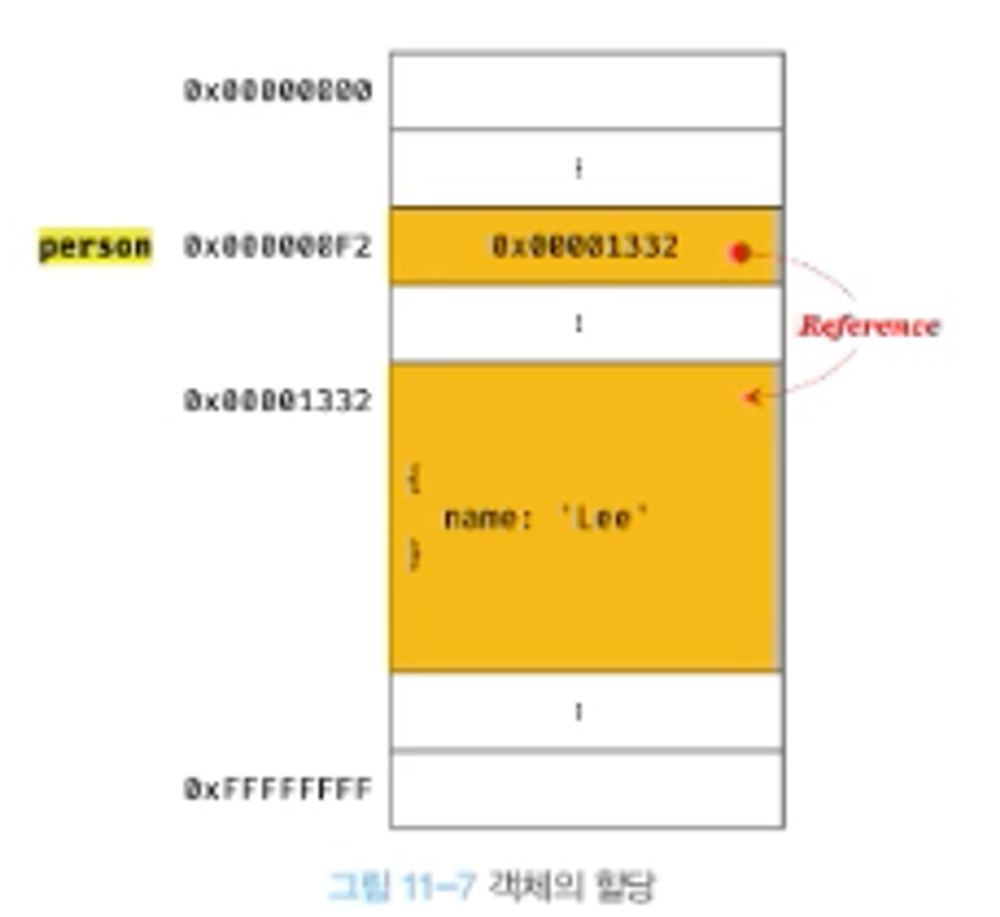

```jsx
// 할당 시점에서 객체 리터럴이 해석되고 => 객체생성
const person = {
  name: "Lee",
};

// 참조값으로 실제객체에 접근중
console.log(person);
// { name: "Lee" }
// 프로퍼티 값 갱신
person.name = "Kim";

console.log(person); // { name: "Kim" }
```

- 변경가능한 값이므로 메모리에 저장된 객체를 직접 수정 가능
  - 이유: 객체 변경 시마다 이전값을 복사해서 사용할 경우, 크기가 일정치 않아 복사해 생성하는 비용이 꽤 크다 => 따라서 변경가능한 값
  - 여러개의 식별자가 하나의 객체를 공유할 수 있다는 것이 단점

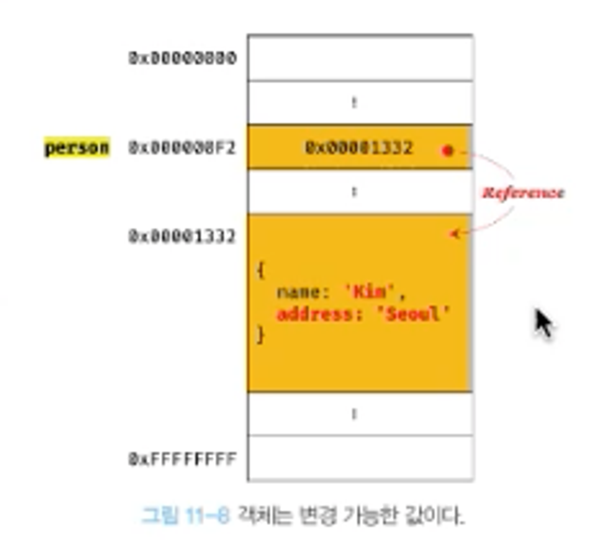

- 참조에 의한 전달

```jsx
const person = {
  name: "Lee",
};

// 다른 변수에 할당 시,
// 원본의 참조값이 복사되어 전달됨 = 참조에 의한 전달(= 얕은 복사)
// 얕은 복사: 중첩돼있는 객체는 참조값만 복사함
const copy = person;

// 깊은 복사: 객체에 중첩돼있는 모든 객체들을 복사(참조값이 아니라 값을 복사)
import _ from "lodash";
const c2 = _.cloneDeep(person);
```

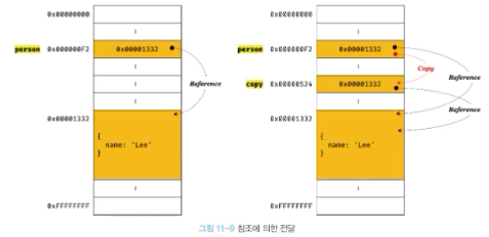

---

1.  함수

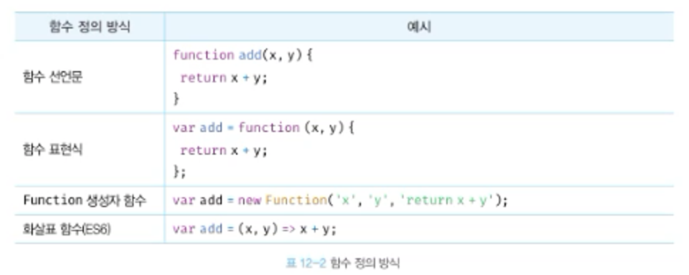

- 함수 선언문
  - 표현식이 아닌 문이다.
- 함수 호이스팅
  - 함수 선언문과 표현식 함수의 생성시점이 다름
    - 함수 선언문은 선언문 이전에 호출가능 => 런타임 이전에 자바스크립트 엔진에 의해 객체 먼저 생성됨 => 함수이름과 동일한 이름의 식별자를 암묵적으로 생성 후 => 생성된 함수 객체를 할당
      - 함수 호이스팅이 발생
    - 함수 표현식
      - 변수 선언은 런타임이전
        - 따라서 함수표현식은 함수 호이스팅이 아닌 변수 호이스팅이 발생
      - 변수에 함수를 할당은 런타임시 평가되서 함수 객체가 된다.

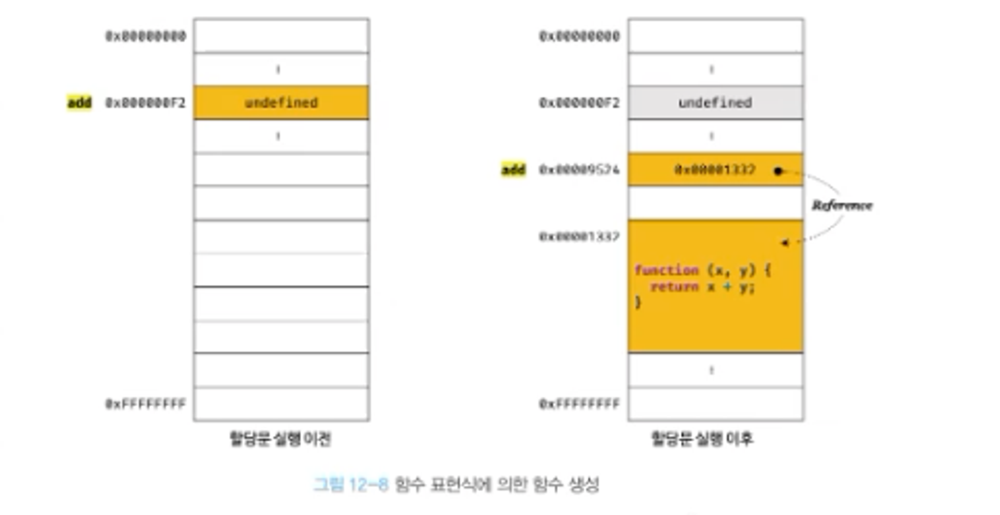

```jsx
console.dir(add); // f
add(x, y)console.dir(sub)// undefined
console.log(add(2, 5))// 7
console.log(sub(2, 5))// TypeError: sub is not a function
// 함수 선언문으로 정의한 함수는
// 함수 선언문 이전에 호출 가능
function add(x, y) {
  return x + y;
}

// 함수 표현식은, 표현식 이전에 호출이 불가능하다.
var sub = function (x, y) {
  return x - y;
};
```

- Function 생성자 함수
  - 사용 왠만하면 하지 말자..
- 화살표 함수
  - 생성자 함수로 사용할 수 없다
  - 기존함수와 this 바인딩이 다르다
  - prototype 프로퍼티가 없다
  - argument 객체를 생성하지 않는다.

---

13. 스코프

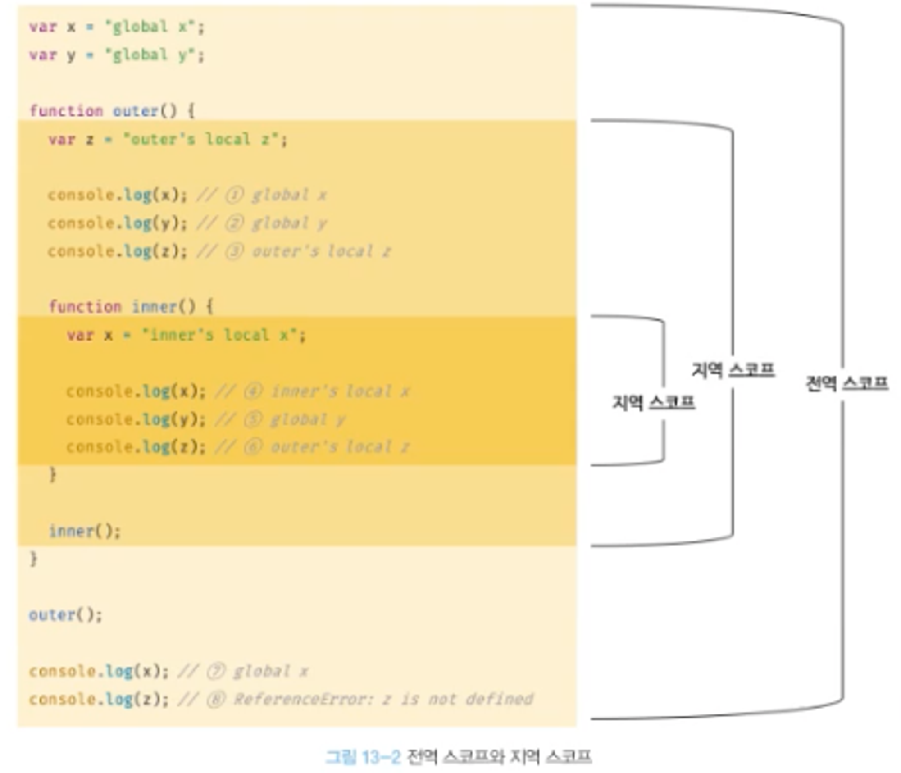

- 스코프 체인
  - 변수를 참조하는 코드의 스코프에서 시작해서, 위 스코프로 이동한다

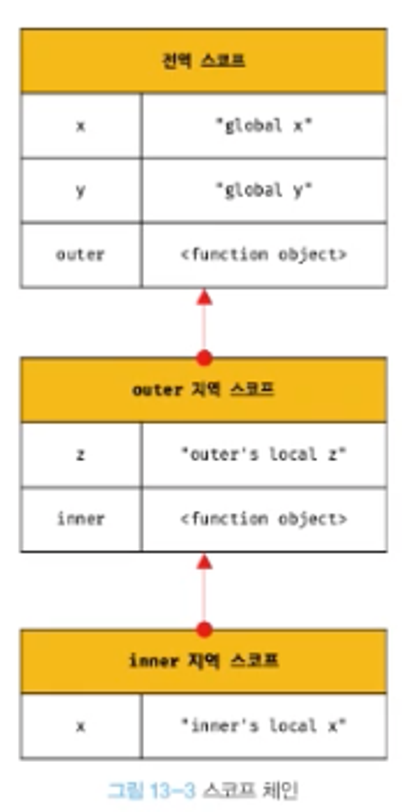

- 렉시컬 스코프
  - 함수를 어디서 정의했는지에 따라 상위스코프 결정
  - 함수를 어디서 호출했는지는 중요하지 않다.
    - 함수 정의가 실행되고 생성된 함수 객체는 => 상위 스코프를 기억(함수 호출 시, 함수 상위 스코프 참조해야해서 그렇다)
