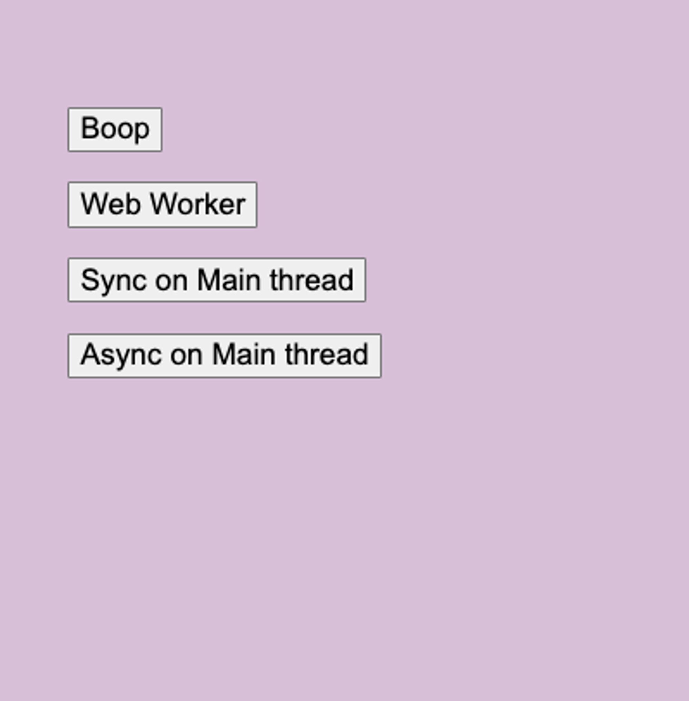

webpack5에서부터는 worker-plugin을 설치하지 않아도 worker-plugin을 이용할 수 있습니다.(자동으로 컴파일)

따라서 직접 worker-plugin을 설치해서 webpack에 적용하면 다음과 같은 에러를 만납니다

```bash
Module parse failed: ParserHelpers.addParsedVariableToModule is not a function
```

따라서 다음과 같이 해줍니다.

```bash
// 이 라이브러리는 원하는 RPC와 같은 경험을 제공한다.
// worker-plugin에 wrap해서 사용
yarn add comlink
```

```jsx
// App.css

body {
  margin: 0;
  overflow: hidden;
  font-size: 3rem;
}

button {
  font-size: 1.2rem;
  display: block;
  margin: 1em 0;
}

div {
  background-color: thistle;
  height: 100vh;
  margin: 0;
  padding: 1em;
}
```

수많은 연산을 하도록 하는 함수를 작성한다

```js
// utils.js

const bigTask = (int) => {
  console.log(int);

  const sum = new Array(int)
    .fill(0)
    .map((el, idx) => el + idx)
    .reduce((sum, el) => sum + el, 0);

  console.log(sum);
};

export const runBigTask = (int) => {
  bigTask(int);
  return "done";
};

export const runBigTaskAsync = async (int) => {
  bigTask(int);
  return "done";
};
```

멀티쓰레드 사용을 위한 워커를 구성한다

```js
// worker.js

import { expose } from "comlink";
import { runBigTask } from "./utils";

const worker = {
  runBigTask,
};

expose(worker);
```

비교하기 위한 앱을 만든다

```jsx
// App.js

import React, { useState } from "react";
import { wrap } from "comlink";
import "../styles/App.css";
import { runBigTask, runBigTaskAsync } from "../utils";

const SECOND = 100000000;

function App() {
  const [data, setData] = useState();
  return (
    <div
      style={{
        backgroundColor: `${data === "loading" ? "orange" : "transparent"}`,
      }}
    >
      <button
        onClick={() => {
          console.log("boop");
        }}
      >
        Boop
      </button>
      <button
        onClick={async () => {
          setData("loading");
          const worker = new Worker(new URL("../worker", import.meta.url), {
            name: "runBigTaskWorker",
            type: "module",
          });
          const { runBigTask } = wrap(worker);
          setData(await runBigTask(SECOND));
        }}
      >
        Web Worker
      </button>
      <button
        onClick={() => {
          setData("loading");
          setData(runBigTask(SECOND));
        }}
      >
        Sync on Main thread
      </button>
      <button
        onClick={async () => {
          setData("loading");
          setData(await runBigTaskAsync(SECOND));
        }}
      >
        Async on Main thread
      </button>
    </div>
  );
}

export default App;
```

결과는 다음과 같다

- Sync, Async on Main Thread 버튼을 눌렀을 때, 연산이 다 끝나고 나서야 Boop을 누를 수 있거나 console이 Boop이라고 반응했다.
- 반면에 Web Worker 버튼을 눌렀을 때, 연산은 다른 쓰레드에서하므로 메인쓰레드에서는 Boop을 바로 눌러서 console을 바로 확인할 수 있었다.



소스코드: https://github.com/milliwonkim/react-worker-plugin

[
GitHub - milliwonkim/react-worker-plugin
Contribute to milliwonkim/react-worker-plugin development by creating an account on GitHub.
github.com](https://github.com/milliwonkim/react-worker-plugin)
