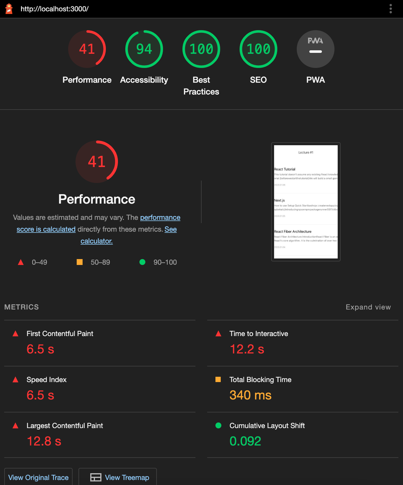
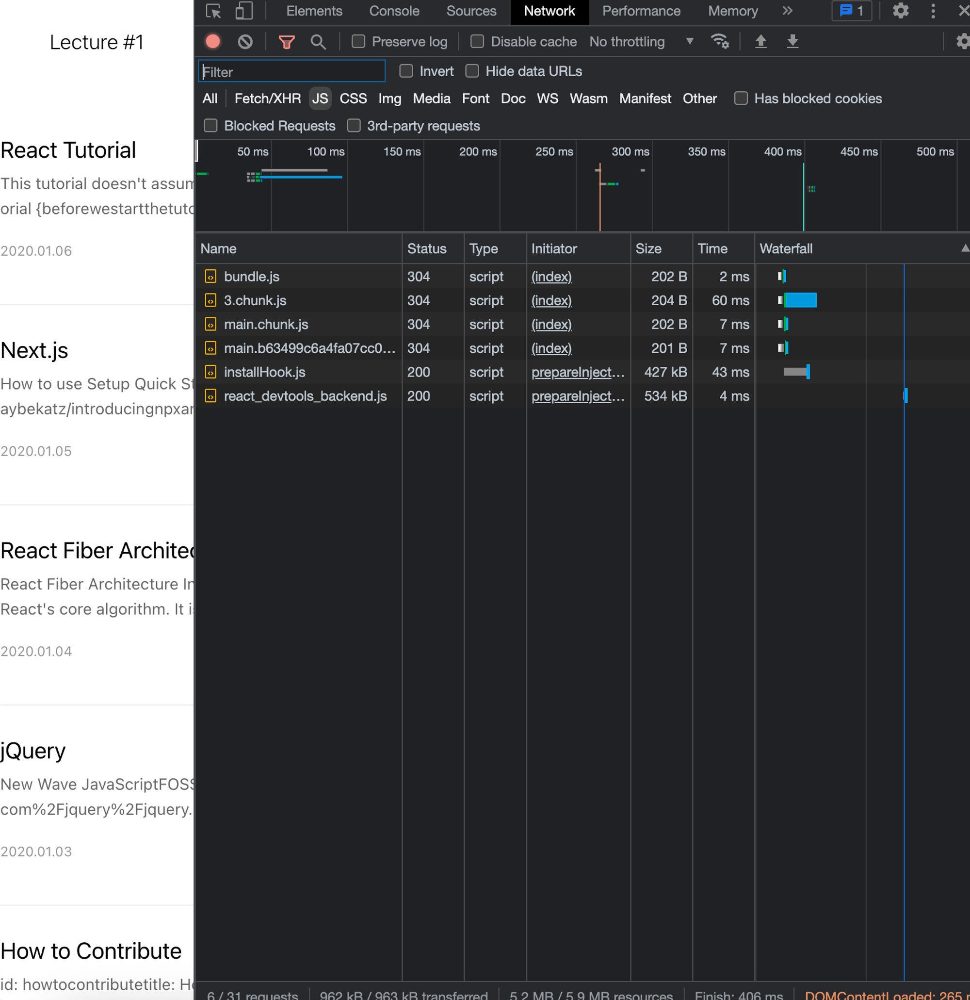
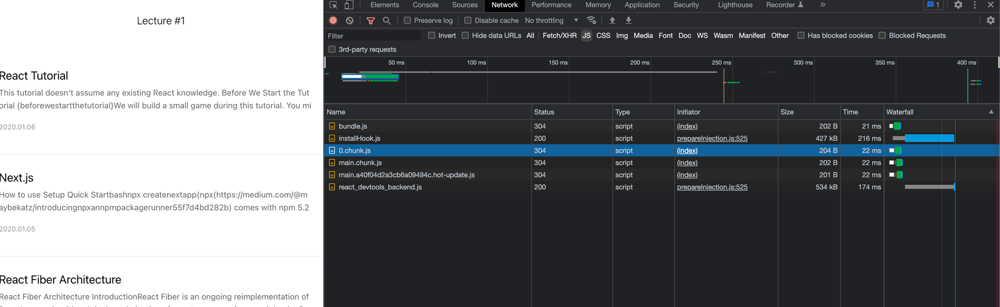
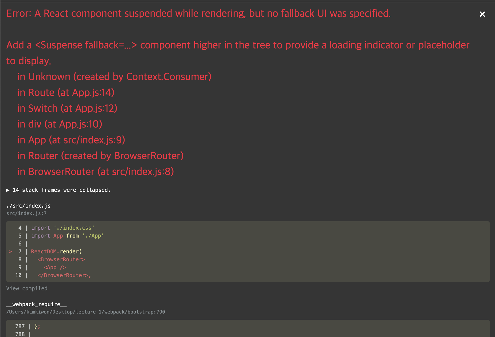
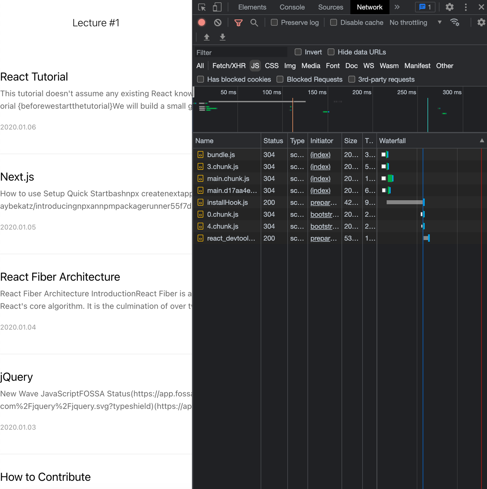
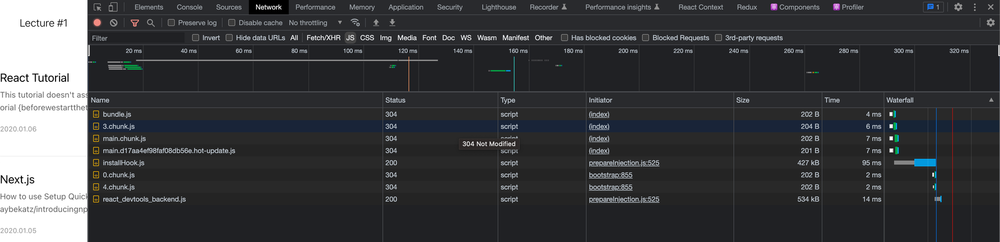
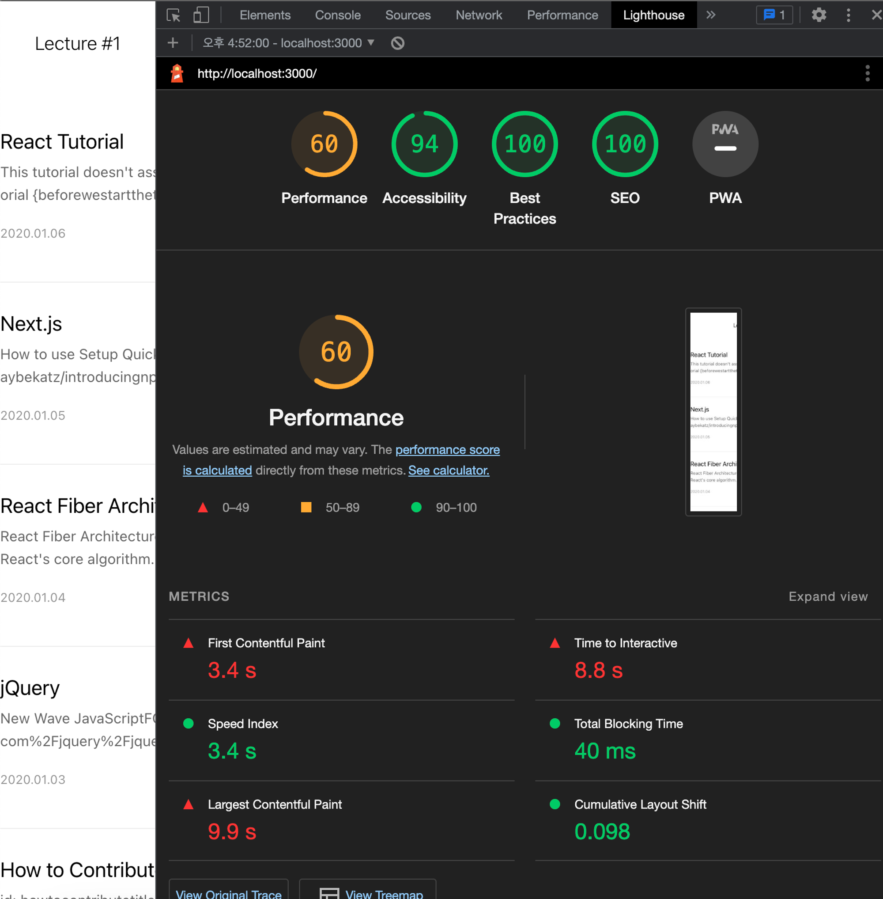
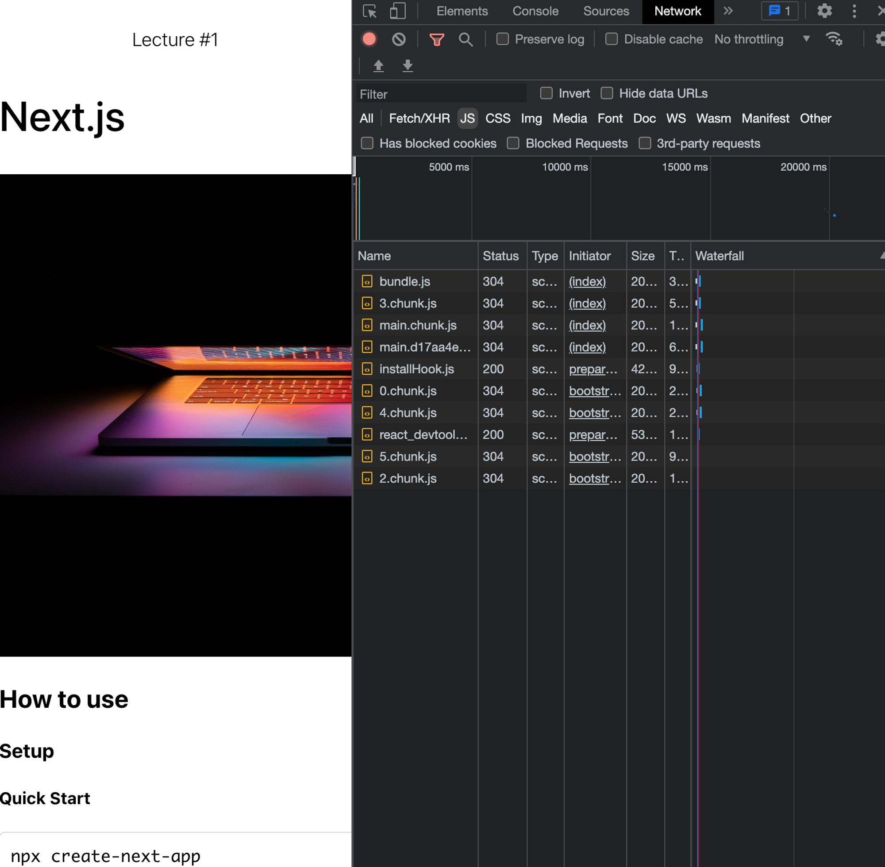

```jsx
import React from "react";
import { Switch, Route } from "react-router-dom";
import "./App.css";
import ListPage from "./pages/ListPage/index";
import ViewPage from "./pages/ViewPage/index";

function App() {
  return (
    <div className="App">
      <Switch>
        <Route path="/" component={ListPage} exact />
        <Route path="/view/:id" component={ViewPage} exact />
      </Switch>
    </div>
  );
}

export default App;
```

다음과 같은 코드를 렌더링 하면 크롬에서의 퍼포먼스와 fetching하는 파일들은 다음과 같습니다.

퍼포먼스



앱이 로드 되자마자 ListPage, ViewPage에 관련된 모든 js 파일이 다 업로드 됐습니다.





0.chunk.js의 로딩 시간이 22ms

다음의 상황에서 퍼포먼스 향상을 위해서

Lazy Loading을 이용해서 필요할 때만 컴포넌트를 렌더링 하는 방법을 사용할 겁니다.

# Lazy Loading

```jsx
import React, { Suspense } from "react";
import { Switch, Route } from "react-router-dom";
import "./App.css";

const ListPage = React.lazy(() => import("./pages/ListPage/index"));
const ViewPage = React.lazy(() => import("./pages/ViewPage/index"));

function App() {
  return (
    <div className="App">
      <Suspense fallback={<p>loading...</p>}>
        <Switch>
          <Route path="/" component={ListPage} exact />
          <Route path="/view/:id" component={ViewPage} exact />
        </Switch>
      </Suspense>
    </div>
  );
}

export default App;
```

Suspense로 감싸지 않으면 다음과 같은 에러를 마주할 수 있습니다.



Lazy Loading을 적용한 결과는 다음과 같습니다.



ViewPage에 해당하는 URL로 이동 시, ViewPage이 렌더링 되면서

그에 해당하는 2.chunk.js, 5.chunk.js가 로드 됩니다.



3.chunk.js 파일 로드 시간이 6ms로 줄었습니다.



퍼포먼스도 20점이나 오른 것을 볼 수 있습니다.


