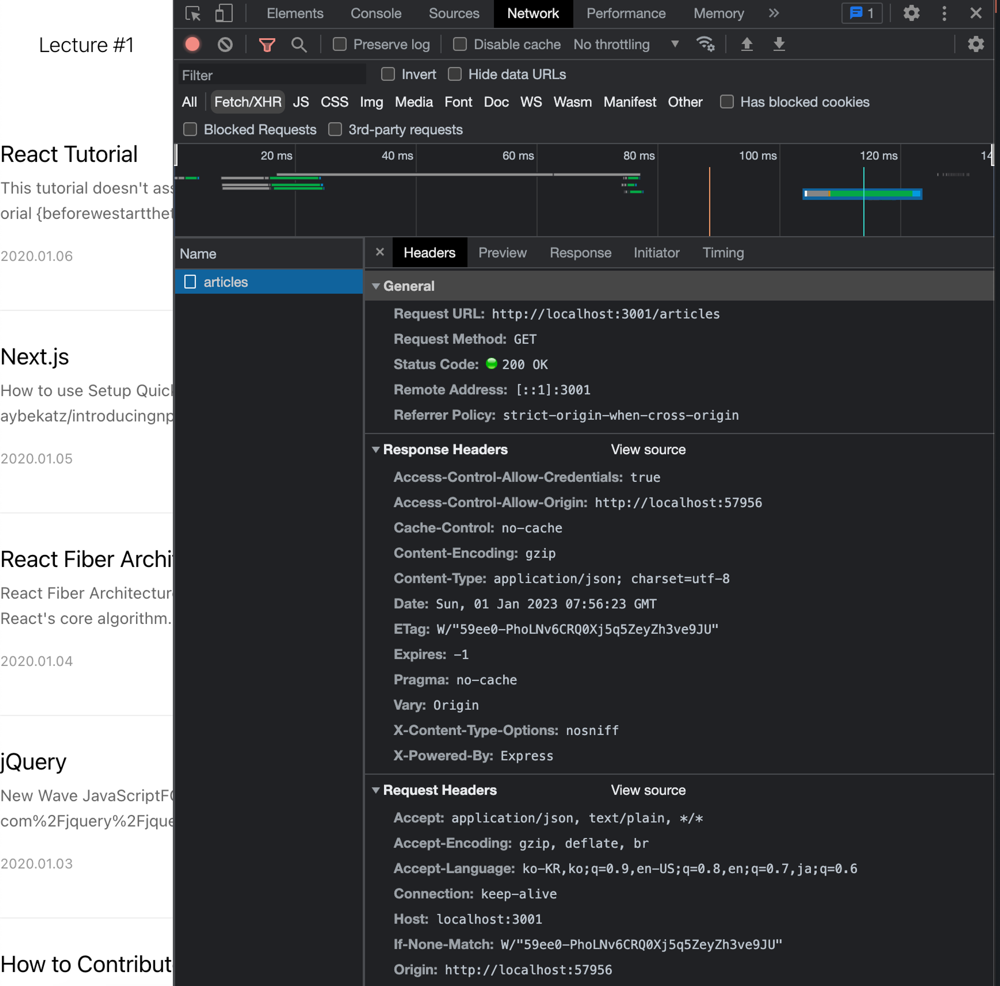
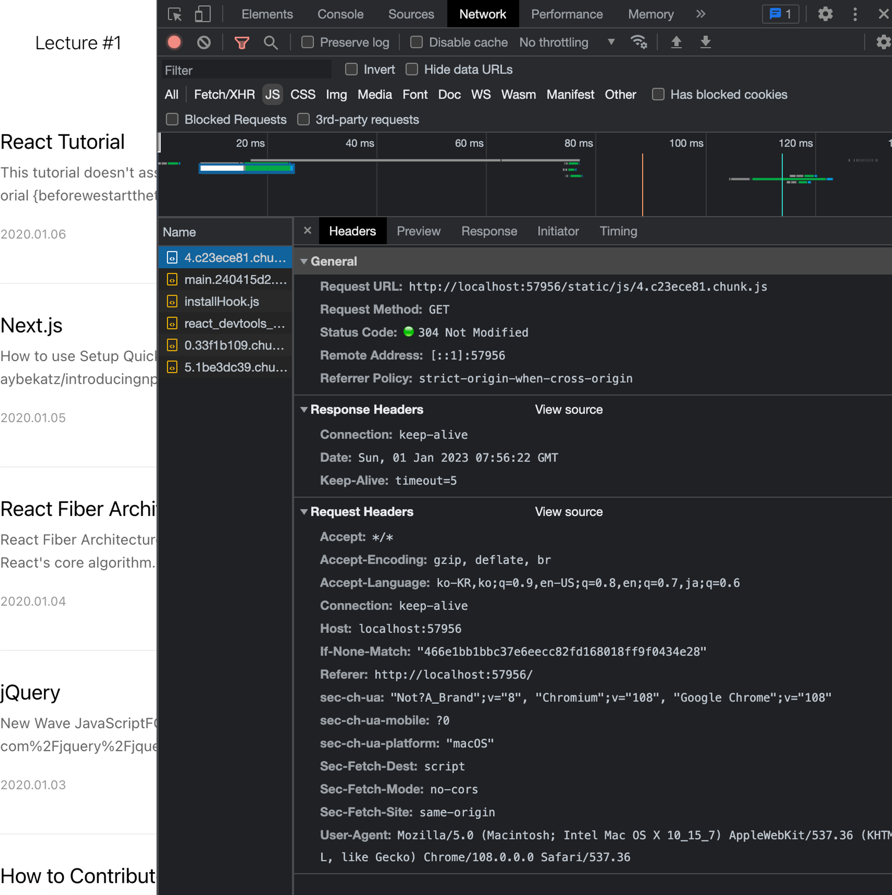
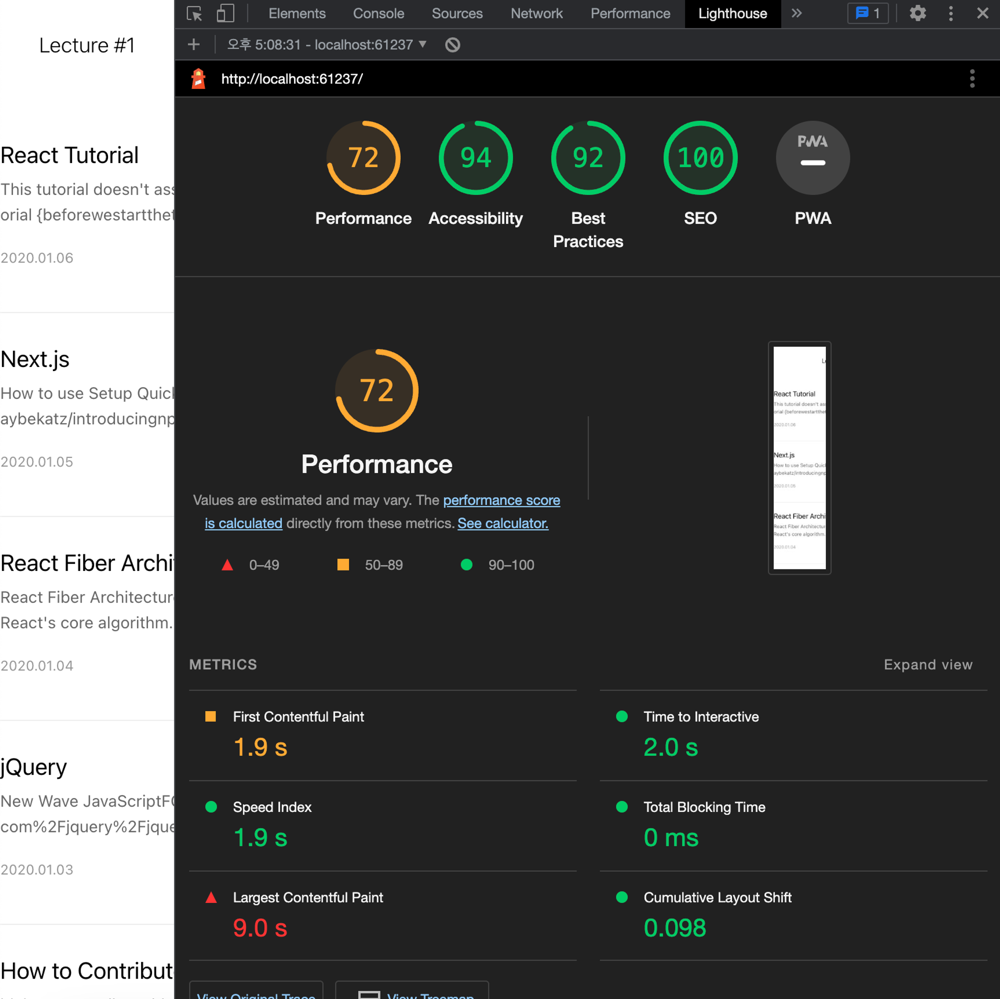
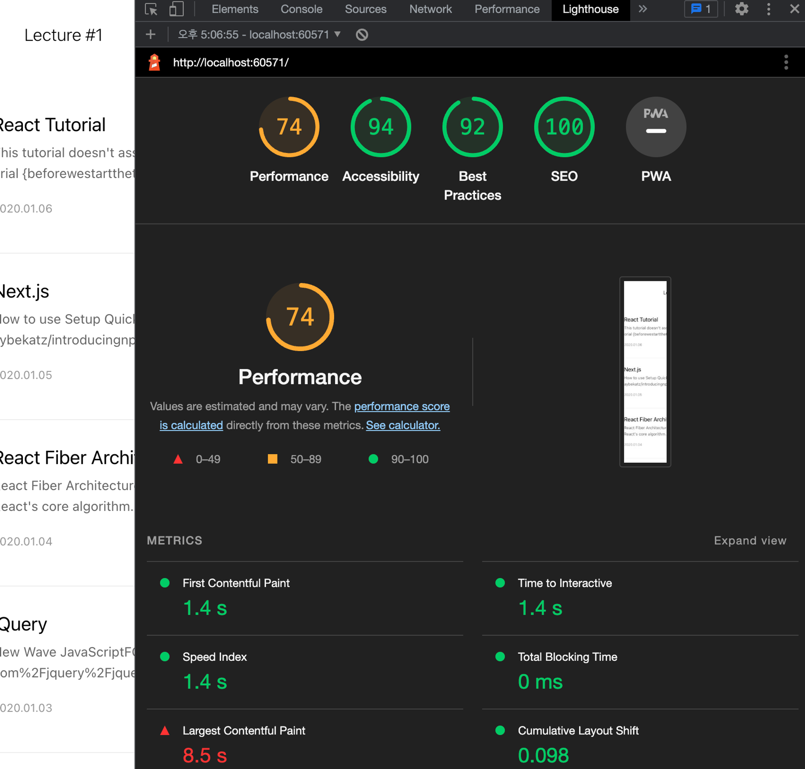
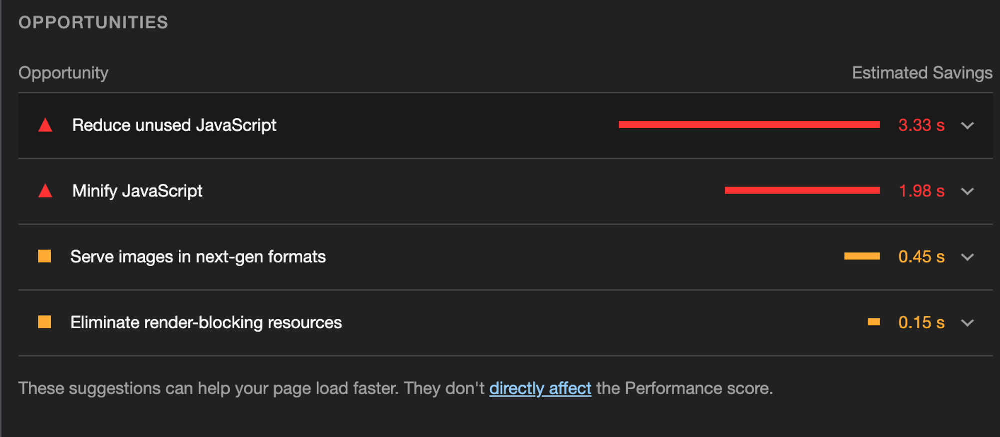

기본적으로 HTML, CSS, JS 파일 모두 텍스트로 만들어져있습니다.

이 텍스트들도 용량을 갖고 있는데, 이 용량들도 압축시킨다면

더 빠른 파일 로딩이 가능합니다.

주로 텍스트 압축에 사용하는 방식은 gzip 방식입니다. (Deflate도 있습니다. gzip은 내부적으로 deflate를 사용하면서 deflate 방식에서 조금 더 효율적인 압축을 제공)

다음과 같이 articles API로 불러오는 것에는 Content-Encodinf: gzip 압축 방식이 적용돼있는 걸 확인할 수 있습니다.



```jsx
// package.json

{
	...
    "serve": "npm run build && node ./node_modules/serve/bin/serve.js -u -s build",
    ...
}
```

여기에 있는 옵션들인 -u, -s는 다음과 같습니다

- -u, --no-compression => 파일 압축 안함
- -s, --single => 찾지 못한 모든 리퀘스트들을 index.html로 재작성한다



텍스트 압축 전 Lighthouse입니다.



따라서 -u 옵션을 지운채로 다시 빌드 후 렌더링 해보겠습니다.

```jsx
{
	...
    "serve": "npm run build && node ./node_modules/serve/bin/serve.js -s build",
    ...
}
```

텍스트 압축 전 Lighthouse에 비해 퍼포먼스가 2점 향상했습니다.



텍스트 압축 권장 경고도 사라졌습니다.


