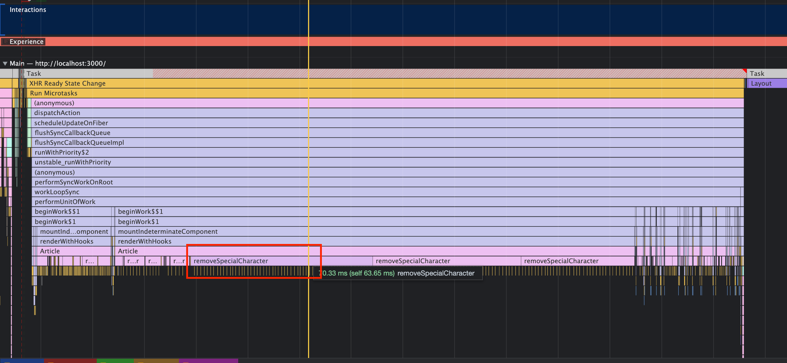
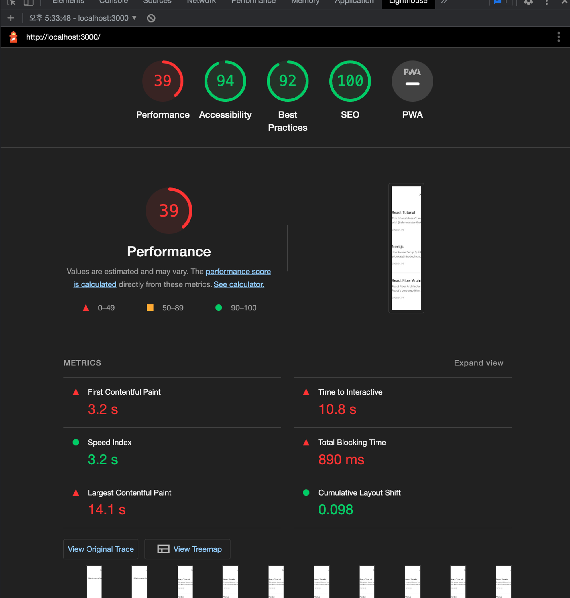
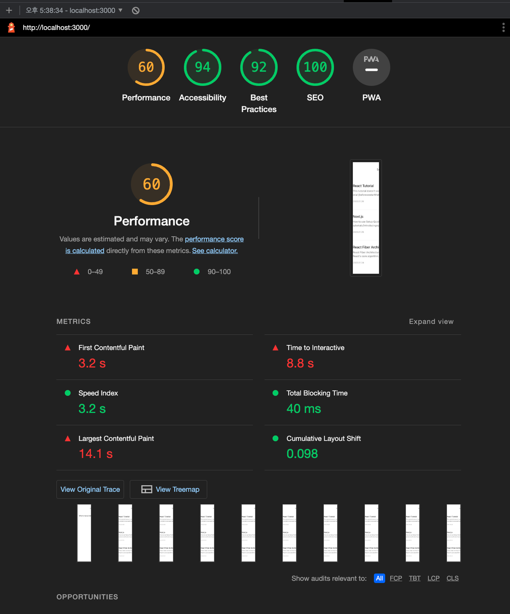
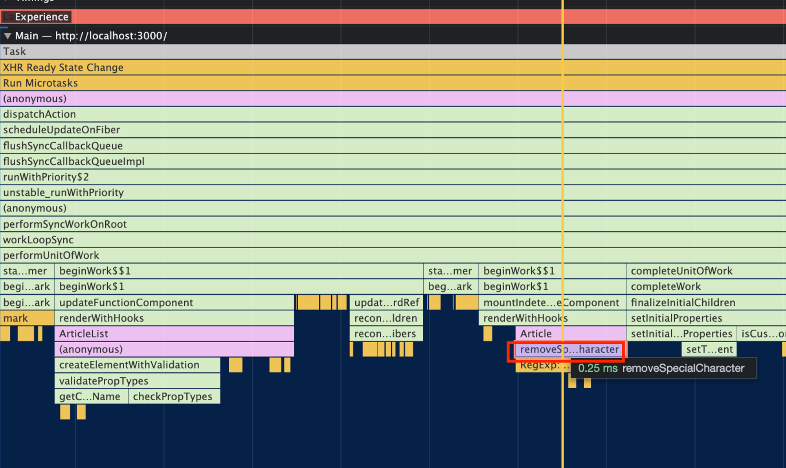

removeSpecialCharacter라는 함수의 실행으로 인해 Article 컴포넌트 렌더링이 자바스크립트 스레드에서 많은 시간 병목 현상을 만들어내고 있습니다. 10.33ms 차지



퍼포먼스 점수도 39점입니다.



이를 위해 해당 함수를 개선할 필요가 있습니다.

# 병목 코드 개선

```jsx
function removeSpecialCharacter(str) {
  const removeCharacters = [
    "#",
    "_",
    "*",
    "~",
    "&",
    ";",
    "!",
    "[",
    "]",
    "`",
    ">",
    "\n",
    "=",
    "-",
  ];
  let _str = str;
  let i = 0,
    j = 0;

  for (i = 0; i < removeCharacters.length; i++) {
    j = 0;
    while (j < _str.length) {
      if (_str[j] === removeCharacters[i]) {
        _str = _str.substring(0, j).concat(_str.substring(j + 1));
        continue;
      }
      j++;
    }
  }

  return _str;
}
```

다음의 코드는 다음과 같이 바꿀 수 있습니다.

```jsx
function removeSpecialCharacter(str) {
  let _str = str.substring(0, 300);
  _str = str.replace(/[#_*~&;![\]`>\n=\->]/g, "");
  return _str;
}
```

병목 코드를 개선 후, Lighthouse 점수가 많이 향상되었습니다.



병목코드 개선으로 인해 0.25ms로 크게 향상했습니다.


