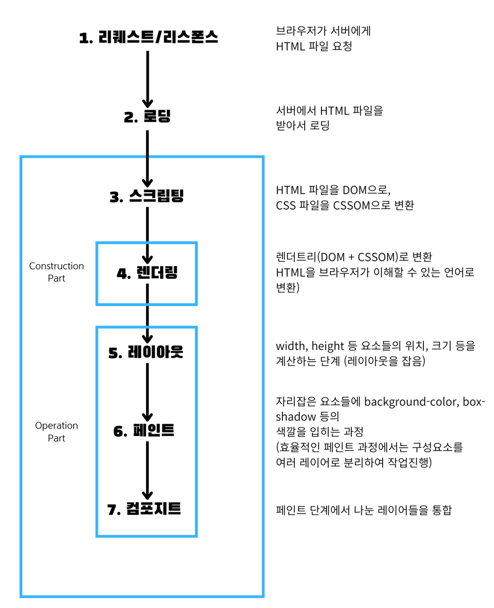

# 애니메이션이 발생 시, 쟁크현상이 일어나는 이유?

애니메이션은 여러 이미지를 빠르게 보여줌으로써 움직임을 표현

=> 만약 브라우저가 60FPS(Frame Per Second)를 그려야하는 애니메이션이 40FPS, 20FPS로 그려낸다면 끊김현상이 발생

쟁크(Jank) 현상

애니메이션이 뚝뚝 끊기는 현상

# 쟁크현상을 방지하는 방법?

리플로우, 리페인트를 막는 CSS 속성으로 애니메이션을 표현한다(= GPU 가속(하드웨어 가속)을 이용해서)

# 리플로우, 리페인트란?

리플로우, 리페인트를 이해하기 위해 브라우저에 렌더링되는 과정을 살펴볼 필요가 있습니다.

### 리퀘스트/리스폰스 및 로딩

서버로부터 HTML 파일을 요청해서 HTML파일을 로딩합니다.


### 스크립팅

HTML파일을 DOM으로, CSS 파일을 CSSOM으로 변환하는 과정


### 레이아웃

width, height 등 요소들의 위치 등 레이아웃을 잡는 단계


### 페인트

레이아웃 단계를 거친 요소들에 background, box-shadow 등 색깔을 입히는 작업

(효율적인 페인트 과정을 위해 여러 레이어로 분리해서 작업)


### 컴포지트

페인트 단계에서 나뉜 레이어들을 하나로 통합하는 과정



### 리플로우

레이아웃 시 적용했던 width, height 등의 레이아웃이 변경 시, 1 ~ 7번 과정을 모두 다시 만들어내는 과정이고,

### 리페인트

작업 페인트 작업에서 적용한 것들을 변경 시, 5번만 빼고 1 ~ 7번 과정을 모두 다시 만들어내는 과정을 말합니다.

따라서 리페인트 작업은 리플로우과정보다 성능이 좋긴하나, 둘 다 렌더링과정을 처음부터 다시 만들어야하기 때문에

성능에 좋지 않습니다.

| 리플로우 발생 속성                                                                                                                        | 리페인트 발생 속성                                                                                                    |
| ----------------------------------------------------------------------------------------------------------------------------------------- | --------------------------------------------------------------------------------------------------------------------- |
| position, display, width, float, height, font-family, top, left, font-size, font-weight, line-height, min-height, margin, padding, border | background, background-image, background-position, border-radius,border-style, box-shadow, color, line-style, outline |

# 다시 쟁크현상 방지를 위한 GPU 가속으로 돌아와서...

GPU 가속을 사용하려면 요소를 별도의 레이어로 분리하여 GPU로 보냄 => transform, opacity 속성이 이 역할을 함 => 이 때 레이아웃, 페인트 단계 없이 화면상의 요소의 스타일을 변경 가능

따라서 애니메이션을 나타낼 때, widht, height 등의 리플로우를 발생시킬 수 있는 CSS 속성보다 transform, opacity 속성을 사용하는 것이 성능에 좋습니다.

```css
/* 레이어가 많아질수록 메모리를 많이 사용 => 성능에 무리 */div.container {
/* 처음부터 레이어 분리하지 않고 변화가 일어나는 순간 레이어 분리 */transform: translate()

    /* 처음부터 레이어분리 => 변화에 더 빠르게 대체 */
    transform: translate3d()
    transform: scale3d()
}
```

width를 이용해서 애니메이션을 구현할 경우, 다음과 같이 스타일이 변화할 때마다 리플로우가 됩니다.

```jsx
const BarGraph = styled.div`
  position: absolute;
  left: 0;
  top: 0;
  width: ${({ width }) => width}%;
  transition: width 1.5s ease;
  height: 100%;
  background: ${({ isSelected }) =>
    isSelected ? "rgba(126, 198, 81, 0.7)" : "rgb(198, 198, 198)"};
  z-index: 1;
`;
```


여기서는 프레임드롭(60FPS으로 못 보여줘서, 일부 프레임이 제때 보이지 않고 생략됨)이 발생하지는 않았지만, 조금만 더 CPU가 바쁘거나 성능이 좋지 않으면 렌더링작업을 제 때 마무리 못했을 것입니다.(회색 dotted 줄에 Paint, Layout 등의 과정이 걸칠 수도 있음)

하지만 GPU 가속을 이용하면 다음과 같습니다.

```jsx
const BarGraph = styled.div`
  position: absolute;
  left: 0;
  top: 0;
  width: 100%;
  transform: scaleX(${({ width }) => width / 100});
  transform-origin: center left;
  transition: transform 1.5s ease;
  height: 100%;
  background: ${({ isSelected }) =>
    isSelected ? "rgba(126, 198, 81, 0.7)" : "rgb(198, 198, 198)"};
  z-index: 1;
`;
```


최적화 전보다 훨씬 더 여유롭게 애니메이션을 실행시켰습니다.

출처

- 프론트엔드 성능 최적화 가이드(유동균 지음)
