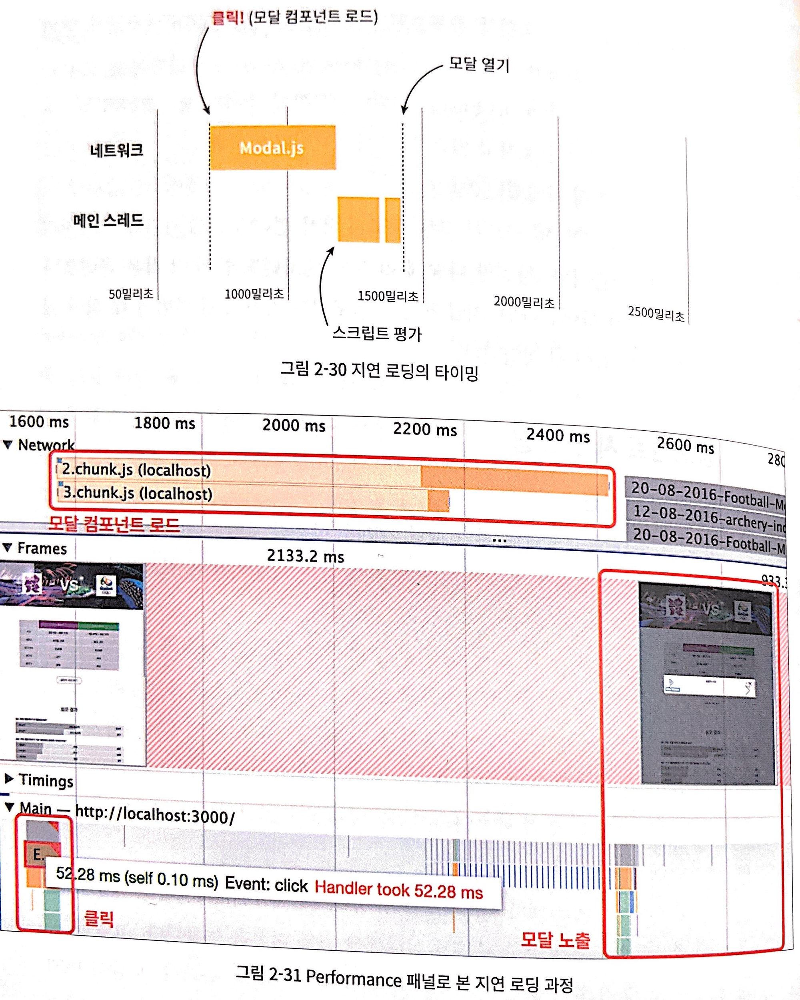
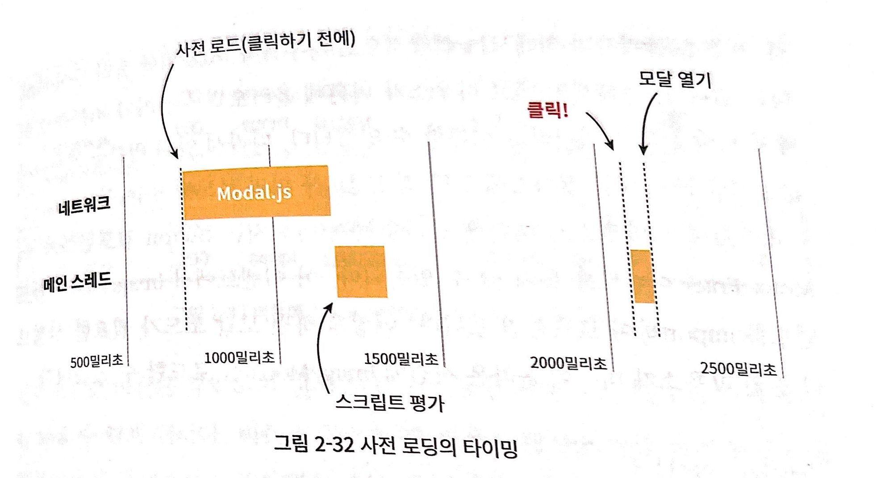

Lazy로딩을 할 경우, 필요할 때 로딩할 수 있다는 장점이 있지만

초기 렌더링에는 효과적일지 몰라도, 모달 자체를 렌더링할 때, 모달의 용량이 클 경우 띄울 때 오히려 이부분에서는 시간이 오래 걸릴 수 있다.



```jsx
import React, { lazy, Suspense, useState } from "react";
import styled from "styled-components";
import Header from "./components/Header";
import InfoTable from "./components/InfoTable";
import SurveyChart from "./components/SurveyChart";
import Footer from "./components/Footer";

const Image = lazy(() => import("./components/ImageModal"));

function App() {
  const [load, setLoad] = useState(false);

  const handleClick = () => {
    setLoad(true);
  };

  return (
    <Suspense fallback={<p>loadingf</p>}>
      <div className="App">
        <Header />
        <InfoTable />
        <ButtonModal
          // onMouseEnter={handleMouseEnter}
          onClick={() => {
            handleClick();
          }}
        >
          올림픽 사진 보기
        </ButtonModal>
        <SurveyChart />
        <Footer />
        {load ? <Image /> : null}
      </div>
    </Suspense>
  );
}

const ButtonModal = styled.button`
  border-radius: 30px;
  border: 1px solid #999;
  padding: 12px 30px;
  background: none;
  font-size: 1.1em;
  color: #555;
  outline: none;
  cursor: pointer;
`;

export default App;
```

따라서 모달을 띄울 경우, Lazy Loading을 적용하면서 동시에 클릭 전에 사전에 로딩을 한다면 두 개의 이점을 동시에 얻을 수 있을 것입니다.



따라서 클릭 시에 Lazy Loading으로 부르는 것이 아닌, 버튼에 Hover 시 Lazy Loading으로 먼저 불러오고 나서 클릭 시 렌더링을 하게끔 한다면 모달 렌더링 시 사용자가 느끼는 성능에 있어서 더 향상된 느낌을 받을 수 있을 것입니다.

```jsx
import React, { useEffect, useState, Suspense, lazy } from "react";
import styled from "styled-components";
import Header from "./components/Header";
import InfoTable from "./components/InfoTable";
import SurveyChart from "./components/SurveyChart";
import Footer from "./components/Footer";
// import ImageModal from './components/ImageModal'const LazyImageModal = lazy(() => import('./components/ImageModal'))

function App() {
  const [showModal, setShowModal] = useState(false);

  // const handleMouseEnter = () => {//   const component = import('./components/ImageModal')// }

  useEffect(() => {
    const component = import("./components/ImageModal");
  }, []);

  return (
    <div className="App">
      <Header />
      <InfoTable />
      <ButtonModal
        // onMouseEnter={handleMouseEnter}
        onClick={() => {
          setShowModal(true);
        }}
      >
        올림픽 사진 보기
      </ButtonModal>
      <SurveyChart />
      <Footer />
      <Suspense fallback={null}>
        {showModal ? (
          <LazyImageModal
            closeModal={() => {
              setShowModal(false);
            }}
          />
        ) : null}
      </Suspense>
    </div>
  );
}

const ButtonModal = styled.button`
  border-radius: 30px;
  border: 1px solid #999;
  padding: 12px 30px;
  background: none;
  font-size: 1.1em;
  color: #555;
  outline: none;
  cursor: pointer;
`;

export default App;
```

참고

이미지 사전로딩

```jsx
import React, { useEffect, useState, Suspense, lazy } from "react";
import styled from "styled-components";
import Header from "./components/Header";
import InfoTable from "./components/InfoTable";
import SurveyChart from "./components/SurveyChart";
import Footer from "./components/Footer";
// import ImageModal from './components/ImageModal'const LazyImageModal = lazy(() => import("./components/ImageModal"));

function App() {
  const [showModal, setShowModal] = useState(false);

  // const handleMouseEnter = () => {//   const component = import('./components/ImageModal')// }

  useEffect(() => {
    const component = import("./components/ImageModal");

    const img = new Image();
    img.src =
      "https://stillmed.olympic.org/media/Photos/2016/08/20/part-1/20-08-2016-Football-Men-01.jpg?interpolation=lanczos-none&resize=*:800";
  }, []);

  return (
    <div className="App">
      <Header />
      <InfoTable />
      <ButtonModal
        // onMouseEnter={handleMouseEnter}
        onClick={() => {
          setShowModal(true);
        }}
      >
        올림픽 사진 보기
      </ButtonModal>
      <SurveyChart />
      <Footer />
      <Suspense fallback={null}>
        {showModal ? (
          <LazyImageModal
            closeModal={() => {
              setShowModal(false);
            }}
          />
        ) : null}
      </Suspense>
    </div>
  );
}

const ButtonModal = styled.button`
  border-radius: 30px;
  border: 1px solid #999;
  padding: 12px 30px;
  background: none;
  font-size: 1.1em;
  color: #555;
  outline: none;
  cursor: pointer;
`;

export default App;
```

출처

- 프론트엔드 성능 최적화 가이드(유동균 지음)
