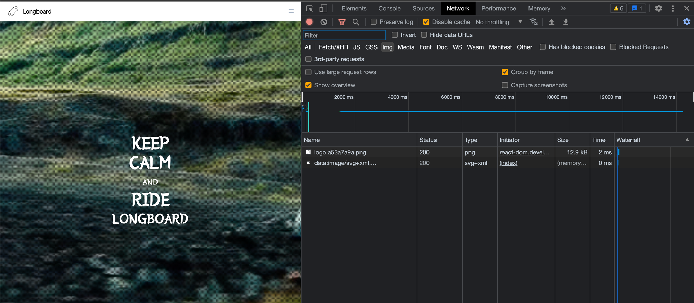
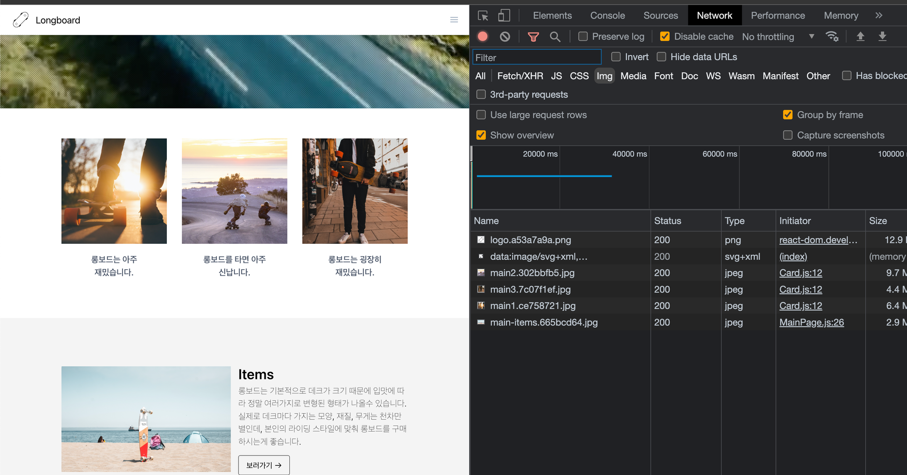

이미지나 영상을 처음에 모두 띄울 필요는 없습니다.

첫 로딩을 빠르게 하고, 그 이후에 뷰포트가 이미지가 필요한 곳으로 들어왔을 때

그 때 로딩하는 방법도 성능 향상에 좋은 요소가 됩니다.



스크롤 이벤트에 LazyLoading을 할당할 경우, 수많은 콜을 부를 것입니다.

따라서 Intersection Observer를 이용해서 특정 뷰포트에 들어올 때만

Lazy Loading을 트리거하게끔 합니다.

```jsx
import React, { useEffect, useRef } from "react";

function Card(props) {
  const imgRef = useRef(null);

  useEffect(() => {
    const options = {};
    const callback = (entries, observer) => {
      entries.forEach((entry) => {
        if (entry.isIntersecting) {
          console.log("is intersecting", entry, entry.target.dataset.src);
          entry.target.src = entry.target.dataset.src;
          observer.unobserve(entry.target);
        }
      });
    };
    const observer = new IntersectionObserver(callback, options);

    observer.observe(imgRef.current);
  }, []);

  return (
    <div className="Card text-center">
      
      <div className="p-5 font-semibold text-gray-700 text-xl md:text-lg lg:text-xl keep-all">
        {props.children}
      </div>
    </div>
  );
}

export default Card;
```

```jsx
import React, { useEffect, useRef } from "react";
import BannerVideo from "../components/BannerVideo";
import ThreeColumns from "../components/ThreeColumns";
import TwoColumns from "../components/TwoColumns";
import Card from "../components/Card";
import Meta from "../components/Meta";
import main1 from "../assets/main1.jpg";
import main2 from "../assets/main2.jpg";
import main3 from "../assets/main3.jpg";
import main_items from "../assets/main-items.jpg";
import main_parts from "../assets/main-parts.jpg";
import main_styles from "../assets/main-styles.jpg";

function MainPage(props) {
  const imgEl1 = useRef(null);
  const imgEl2 = useRef(null);
  const imgEl3 = useRef(null);

  useEffect(() => {
    const options = {};

    const callback = (entries, observer) => {
      entries.forEach((entry) => {
        if (entry.isIntersecting) {
          console.log(entry.target.dataset.src);
          entry.target.src = entry.target.dataset.src;
          observer.unobserve(entry.target);
        }
      });
    };

    let observer = new IntersectionObserver(callback, options);
    observer.observe(imgEl1.current);
    observer.observe(imgEl2.current);
    observer.observe(imgEl3.current);

    return () => observer.disconnect();
  }, []);

  return (
    <div className="MainPage -mt-16">
      <BannerVideo />
      <div className="mx-auto">
        <ThreeColumns
          columns={[
            <Card image={main1}>롱보드는 아주 재밌습니다.</Card>,
            <Card image={main2}>롱보드를 타면 아주 신납니다.</Card>,
            <Card image={main3}>롱보드는 굉장히 재밌습니다.</Card>,
          ]}
        />
        <TwoColumns
          bgColor={"#f4f4f4"}
          columns={[
            ,
            <Meta
              title={"Items"}
              content={
                "롱보드는 기본적으로 데크가 크기 때문에 입맛에 따라 정말 여러가지로 변형된 형태가 나올수 있습니다. 실제로 데크마다 가지는 모양, 재질, 무게는 천차만별인데, 본인의 라이딩 스타일에 맞춰 롱보드를 구매하시는게 좋습니다."
              }
              btnLink={"/items"}
            />,
          ]}
        />
        <TwoColumns
          bgColor={"#fafafa"}
          columns={[
            <Meta
              title={"Parts of Longboard"}
              content={
                "롱보드는 데크, 트럭, 휠, 킹핀, 베어링 등 여러 부품들로 구성됩니다. 롱보드를 타다보면 조금씩 고장나는 부품이 있기 마련인데, 이럴때를 위해 롱보들의 부품들에 대해서 알고 있으면 큰 도움이 됩니다."
              }
              btnLink={"/part"}
            />,
            ,
          ]}
          mobileReverse={true}
        />
        <TwoColumns
          bgColor={"#f4f4f4"}
          columns={[
            ,
            <Meta
              title={"Riding Styles"}
              content={
                "롱보드 라이딩 스타일에는 크게 프리스타일, 다운힐, 프리라이딩, 댄싱이 있습니다. 보통 롱보드는 라이딩 스타일에 따라 데크의 모양이 조금씩 달라집니다. 많은 롱보드 매니아들이 각 쓰임새에 맞는 보드들을 소유하고 있습니다."
              }
              btnLink={"/riding-styles"}
            />,
          ]}
        />
      </div>
    </div>
  );
}

export default MainPage;
```



# Observer.disconnect()와 Observer.unobserve()의 차이

### [IntersectionObserver.unobserve(targetElement)](https://developer.mozilla.org/en-US/docs/Web/API/IntersectionObserver/unobserve)

타겟 엘리먼트에 대한 관찰을 멈추고 싶을 때 사용하면 됩니다. 예를 들어 Lazy-loading(지연 로딩)을 할 때는 한 번 처리를 한 후에는 관찰을 멈춰도 됩니다. 이 경우에는 처리를 한 후 해당 엘리먼트에 대해 unobserve(targetElement)을 실행하면 이 엘리먼트에 대한 관찰만 멈출 수 있습니다.

### [IntersectionObserver.disconnect()](https://developer.mozilla.org/en-US/docs/Web/API/IntersectionObserver/disconnect)

다수의 엘리먼트를 관찰하고 있을 때, 이에 대한 모든 관찰을 멈추고 싶을 때 사용하면 됩니다.

출처

- 프론트엔드 성능 최적화 가이드 (유동균 지음)
