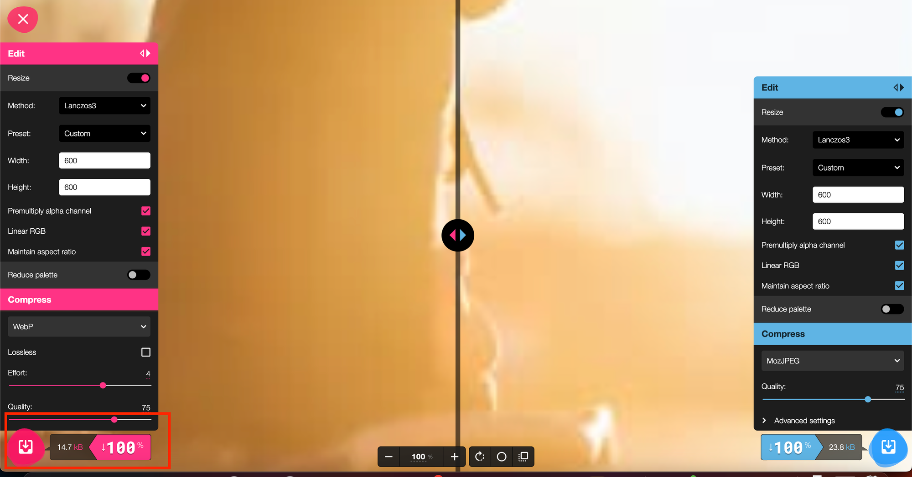
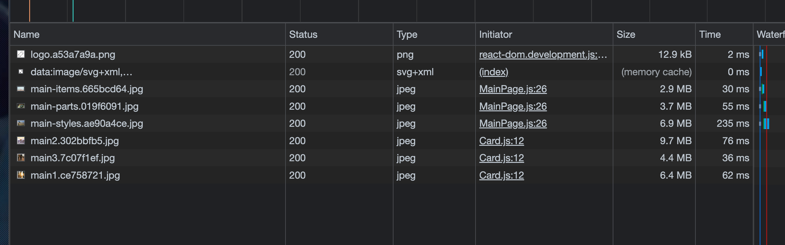
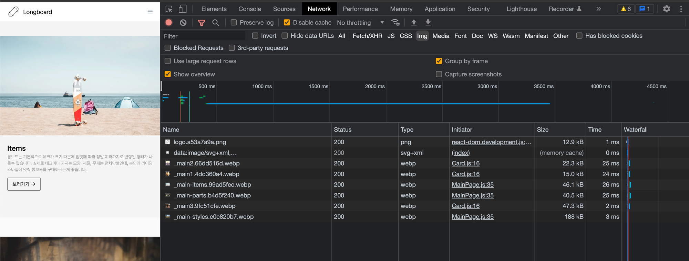

# png, jpg, webp 비교

### png

무손실압축 방식

알파채널(투명도) 지원 => 배경색을 투명하게 해서 뒤의 요소가 보이는 이미지 만들기 가능

고화질 혹은 투명도 정보가 필요하면 png 사용

### jpg

압축 시 손실 많이 발생

더 작은 사이즈로 줄일 수 있음 => 고화질 혹은 투명도 정보가 필요한게 아니면 jpg 사용

### webp

무손실압축, 손실압축 모두 제공(최신이미지 포맷) => png, jpg 비해서 효율적인 이미지 압축

(png 대비 26%, jpg 대비 25~34% 고효율)

하지만 최신 포맷(2010년 발표)이라서 지원하지 않는 브라우저가 있을 수 있음

- 사이즈: png > jpg > webp
- 화질: png === webp > jpg
- 호환성: png === jpg > webp

# 압축해보기

구글에서 만든 이미지 포맷 변경이 가능한 웹사이트입니다.

다음에서 비트맵 이미지 확장자를 변경할 수 있습니다(jpg, png, webp)

https://squoosh.app/

[
Squoosh
Simple Open your image, inspect the differences, then save instantly. Feeling adventurous? Adjust the settings for even smaller files.
squoosh.app](https://squoosh.app/)

저는 여기서 jpg를 webp 확장자로 바꾸려고 합니다.



#

# jpg vs webp 로딩 속도 비교

webp가 차이가 나게 다운로드 시간도 빠르고, 용량도 적은 것을 확인할 수 있습니다.



jpg로 렌더링 시, 용량 및 다운로드 시간



webp로 렌더링 시, 용량 및 다운로드 시간

# webp를 최우선으로, 만약 호환이 안된다면 jpg 혹은 png로 바꾸면 딱 좋을 듯!

webp를 최우선으로, 만약 호환이 안된다면 jpg 혹은 png로 바꾸려면,

picture 태그 안에 꼭 넣어야합니다.

picture 태그는 다양한 타입의 이미지를 렌더링하는 컨테이너로 사용됩니다.

```jsx
// 예시: 뷰포트별 이미지 변경
<picture>
  <source media="(min-width:650px)" srcset="img_pink_flowers.jpg">
  <source media="(min-width:465px)" srcset="img_white_flower.jpg">
  
</picture>

// 예시: 이미지 포맷별 구분
<picture>
  <source srcset="photo.avif" type="image/avif">
  <source srcset="photo.webp" type="image/webp">
  
</picture>
```

다음과 같이 적용할 수 있습니다.

```jsx
import React, { useEffect, useRef } from "react";

function Card(props) {
  const imgRef = useRef(null);

  useEffect(() => {
    const options = {};
    const callback = (entries, observer) => {
      entries.forEach((entry) => {
        if (entry.isIntersecting) {
          const target = entry.target;
          const previousSibling = target.previousSibling;

          console.log("is intersecting", entry.target.dataset.src);
          target.src = target.dataset.src;
          previousSibling.srcset = previousSibling.dataset.srcset;
          observer.unobserve(entry.target);
        }
      });
    };
    const observer = new IntersectionObserver(callback, options);

    observer.observe(imgRef.current);
  }, []);

  return (
    <div className="Card text-center">
      <picture>
        <source data-srcset={props.webp} type="image/webp" />
        
      </picture>
      <div className="p-5 font-semibold text-gray-700 text-xl md:text-lg lg:text-xl keep-all">
        {props.children}
      </div>
    </div>
  );
}

export default Card;
```

```jsx
import React, { useEffect, useRef } from "react";
import BannerVideo from "../components/BannerVideo";
import ThreeColumns from "../components/ThreeColumns";
import TwoColumns from "../components/TwoColumns";
import Card from "../components/Card";
import Meta from "../components/Meta";
import main1_webp from "../assets/_main1.webp";
import main2_webp from "../assets/_main2.webp";
import main3_webp from "../assets/_main3.webp";
import main_items_webp from "../assets/_main-items.webp";
import main_parts_webp from "../assets/_main-parts.webp";
import main_styles_webp from "../assets/_main-styles.webp";
import main1 from "../assets/_main1.jpg";
import main2 from "../assets/_main2.jpg";
import main3 from "../assets/_main3.jpg";
import main_items from "../assets/_main-items.jpg";
import main_parts from "../assets/_main-parts.jpg";
import main_styles from "../assets/_main-styles.jpg";

function MainPage(props) {
  const imgEl1 = useRef(null);
  const imgEl2 = useRef(null);
  const imgEl3 = useRef(null);

  useEffect(() => {
    const options = {};

    const callback = (entries, observer) => {
      entries.forEach((entry) => {
        if (entry.isIntersecting) {
          console.log(entry.target.dataset.src);

          const sourceEl = entry.target.previousSibling;
          sourceEl.srcset = sourceEl.dataset.srcset;
          entry.target.src = entry.target.dataset.src;

          observer.unobserve(entry.target);
        }
      });
    };

    let observer = new IntersectionObserver(callback, options);
    observer.observe(imgEl1.current);
    observer.observe(imgEl2.current);
    observer.observe(imgEl3.current);
  }, []);

  return (
    <div className="MainPage -mt-16">
      <BannerVideo />
      <div className="mx-auto">
        <ThreeColumns
          columns={[
            <Card webp={main1_webp} image={main1}>
              롱보드는 아주 재밌습니다.
            </Card>,
            <Card webp={main2_webp} image={main2}>
              롱보드를 타면 아주 신납니다.
            </Card>,
            <Card webp={main3_webp} image={main3}>
              롱보드는 굉장히 재밌습니다.
            </Card>,
          ]}
        />
        <TwoColumns
          bgColor={"#f4f4f4"}
          columns={[
            <picture>
              <source data-srcset={main_items_webp} type="image/webp" />
              
            </picture>,
            <Meta
              title={"Items"}
              content={
                "롱보드는 기본적으로 데크가 크기 때문에 입맛에 따라 정말 여러가지로 변형된 형태가 나올수 있습니다. 실제로 데크마다 가지는 모양, 재질, 무게는 천차만별인데, 본인의 라이딩 스타일에 맞춰 롱보드를 구매하시는게 좋습니다."
              }
              btnLink={"/items"}
            />,
          ]}
        />
        <TwoColumns
          bgColor={"#fafafa"}
          columns={[
            <Meta
              title={"Parts of Longboard"}
              content={
                "롱보드는 데크, 트럭, 휠, 킹핀, 베어링 등 여러 부품들로 구성됩니다. 롱보드를 타다보면 조금씩 고장나는 부품이 있기 마련인데, 이럴때를 위해 롱보들의 부품들에 대해서 알고 있으면 큰 도움이 됩니다."
              }
              btnLink={"/part"}
            />,
            <picture>
              <source data-srcset={main_parts_webp} type="image/webp" />
              
            </picture>,
          ]}
          mobileReverse={true}
        />
        <TwoColumns
          bgColor={"#f4f4f4"}
          columns={[
            <picture>
              <source data-srcset={main_styles_webp} type="image/webp" />
              
            </picture>,
            <Meta
              title={"Riding Styles"}
              content={
                "롱보드 라이딩 스타일에는 크게 프리스타일, 다운힐, 프리라이딩, 댄싱이 있습니다. 보통 롱보드는 라이딩 스타일에 따라 데크의 모양이 조금씩 달라집니다. 많은 롱보드 매니아들이 각 쓰임새에 맞는 보드들을 소유하고 있습니다."
              }
              btnLink={"/riding-styles"}
            />,
          ]}
        />
      </div>
    </div>
  );
}

export default MainPage;
```
