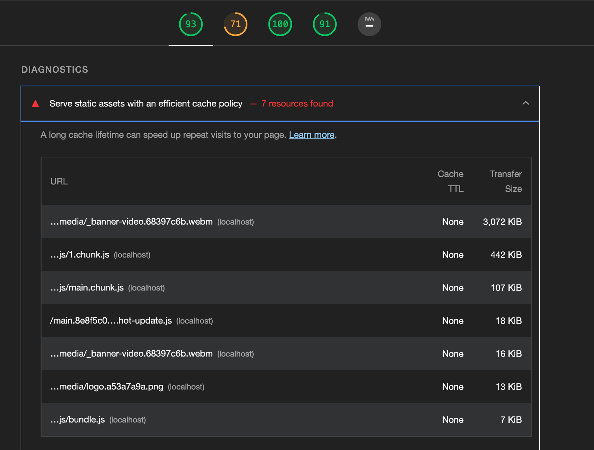
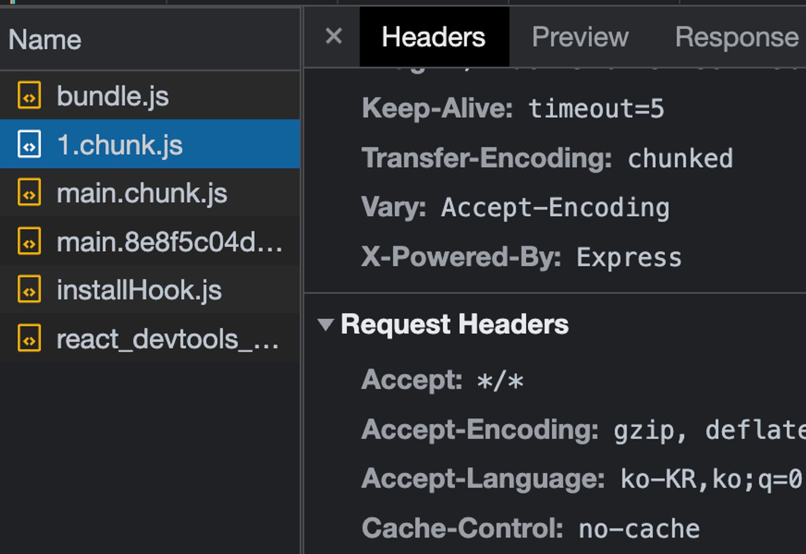

크롬 라이트하우스로 평가 시, 진단에서 'Serve static assets with an efficient cache policy'라는 부분이 있습니다.

이 부분은 네트워크를 통해 다운로드하는 리소스에 캐시를 적용하라는 뜻입니다.



실제로 하나를 들어가보면 Cache-Control이 no-cache로 되어있습니다.

이것은 캐시를 사용하지 않는 다는 것은 아니고 사용전에 서버에 캐시된 리소슬극 사용해도 되는지 한 번 체크하도록 하는 옵션입니다.

캐시를 사용하지 않을 땐 Cache-Control: no-store을 보여줍니다.



# 캐시 종류

- 메모리 캐시: 램에 저장
- 디스크 캐시: 파일 형태로 디스크에 저장

어떤 캐시에 저장할지는 브라우저의 알고리즘이 알아서 처리해줍니다.


# 캐시 하기

캐시를 적용하려면 응답 헤더에 Cache-Control이라는 헤더가 존재해야합니다.

응답 헤더는 서버에서 적용해주어야합니다.

Cache-Control

- no-cache: 캐시를 사용하기 전 서버에 검사 후 사용
- no-store: 캐시 사용 안함
- public: 모든 환경에서 캐시 사용 가능
- private: 브라우저 환경에서만 캐시 사용, 외부 캐시 서버에서는 사용 불가
- max-age: 캐시의 유효기간

이것은 서버의 역할입니다.

노드서버로 예를 들겠습니다.

```jsx
// server.jsconst express = require('express')
const app = express();
const port = 5000;
const path = require("path");

const header = {
  setHeaders: (res, path) => {
    if (path.endsWith(".html")) {
      res.setHeader("Cache-Control", "no-cache");
    } else if (
      path.endsWith(".js") ||
      path.endsWith(".css") ||
      path.endsWith(".webp")
    ) {
      res.setHeader("Cache-Control", "public, max-age=31536000");
    } else {
      res.setHeader("Cache-Control", "no-store");
    }
  },
};

app.use(express.static(path.join(__dirname, "../build"), header));
app.get("*", (req, res) => {
  res.sendFile(path.join(__dirname, "../build/index.html"));
});

app.listen(port, () =>
  console.log(`Example app listening at http://localhost:${port}`)
);
```
