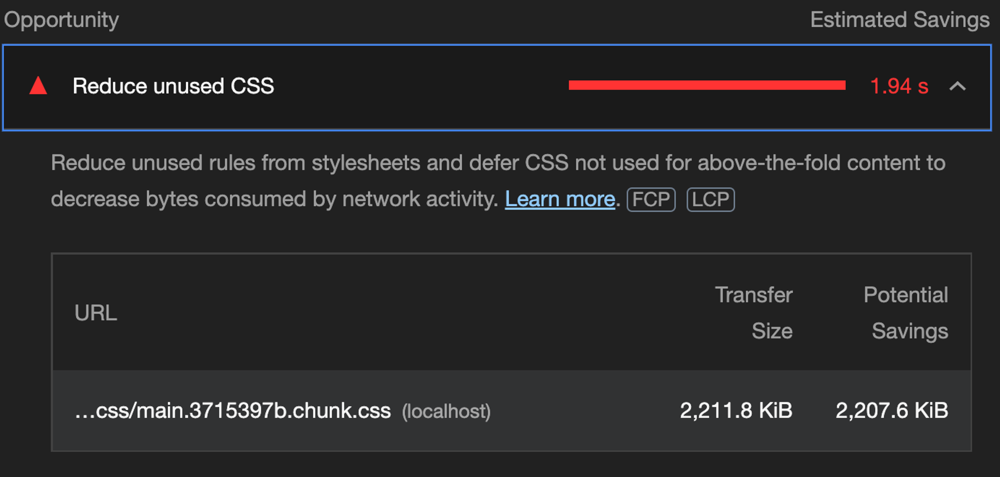
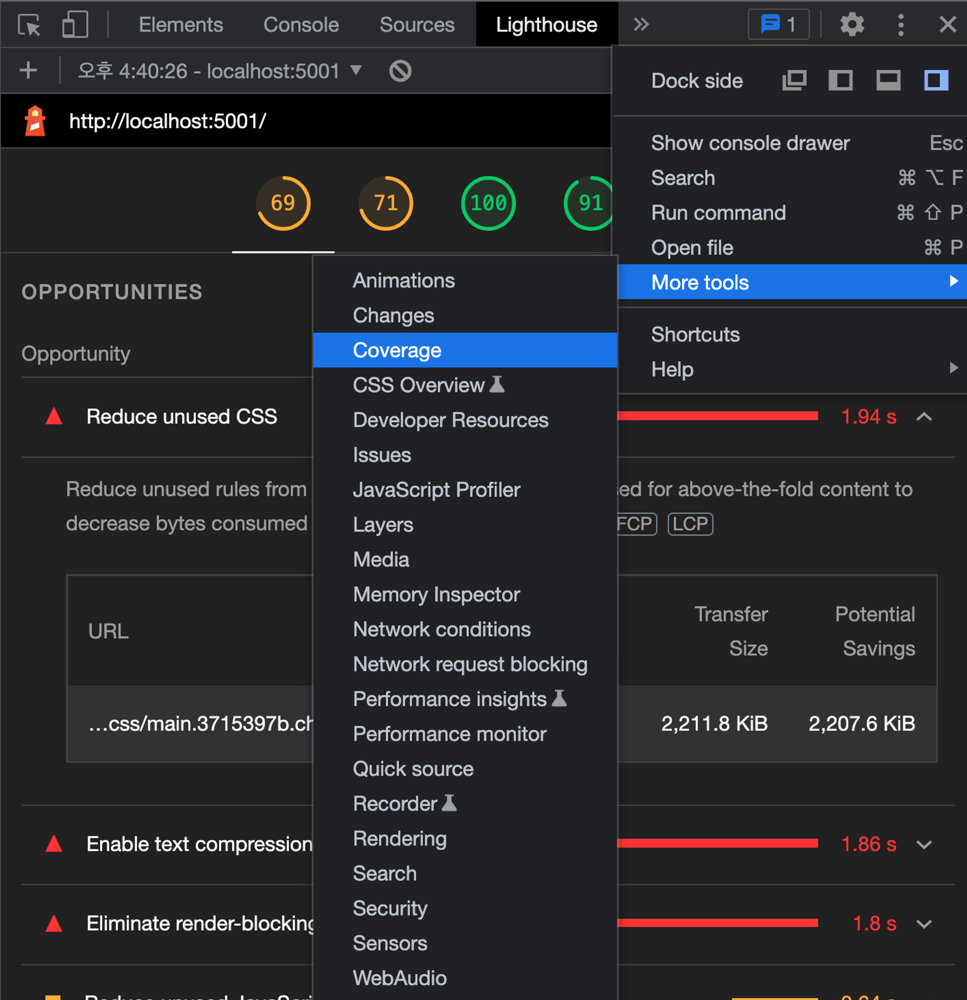
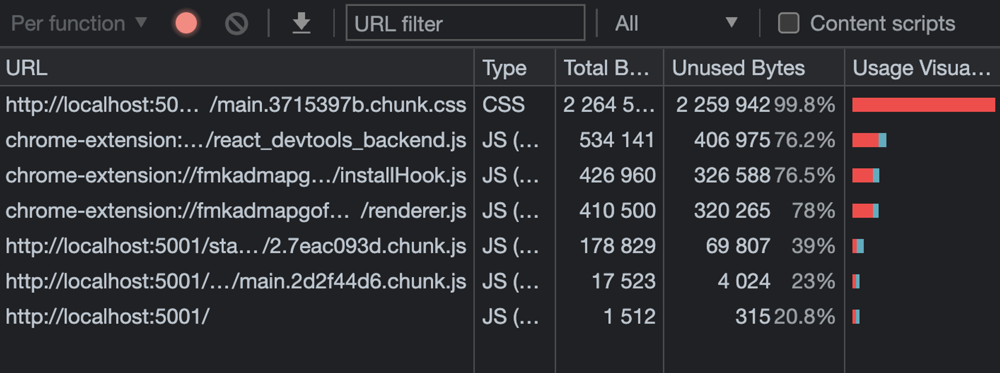
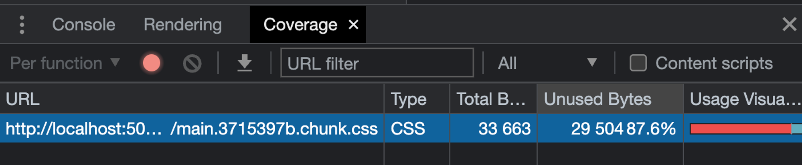
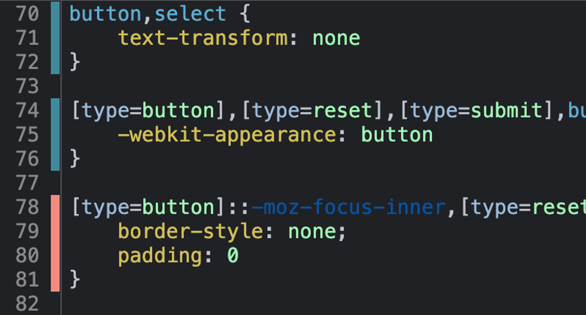

크롬 라이트하우스로 검사를 해보았습니다.

그런데 Reduce unused CSS라는 권장사항이 나왔습니다.



이에 대해 사용하지 않는 코드들이 있는지 더 파악하기 위해

라이트하우스의 커버리지를 확인하기로 했습니다.



라이트하우스의 커버리지를 보면 CSS이외에도 파일 별로 사용하지 않는 코드들이 얼마나 있는지 보여줍니다.



PurgeCSS를 사용하려고 합니다.

```jsx
yarn add -D purgecss
```

```jsx
// package.json

{
  ...
  "scripts": {
    "start": "npm run build:style && react-app-rewired start",
    "build": "npm run build:style && react-app-rewired build",
    "build:style": "postcss src/tailwind.css -o src/styles.css",
    "serve": "node ./server/server.js",
    "server": "node ./node_modules/json-server/lib/cli/bin.js --watch ./server/database.json -c ./server/config.json",
    "purge": "purgecss --css ./build/static/css/*.css --output ./build/static/css/ --content ./build/index.html ./build/static/js/*.js --config ./purgecss.config.js"
  },
  ...
}
```

```jsx
yarn build && yarn purge
```



purgecss를 돌린 결과 이렇게 안쓰는 코드가 적어졌습니다.

이렇게도 확인할 수 있습니다.

파란색은 사용하는 것, 빨간색은 사용하지 않는 것입니다.


