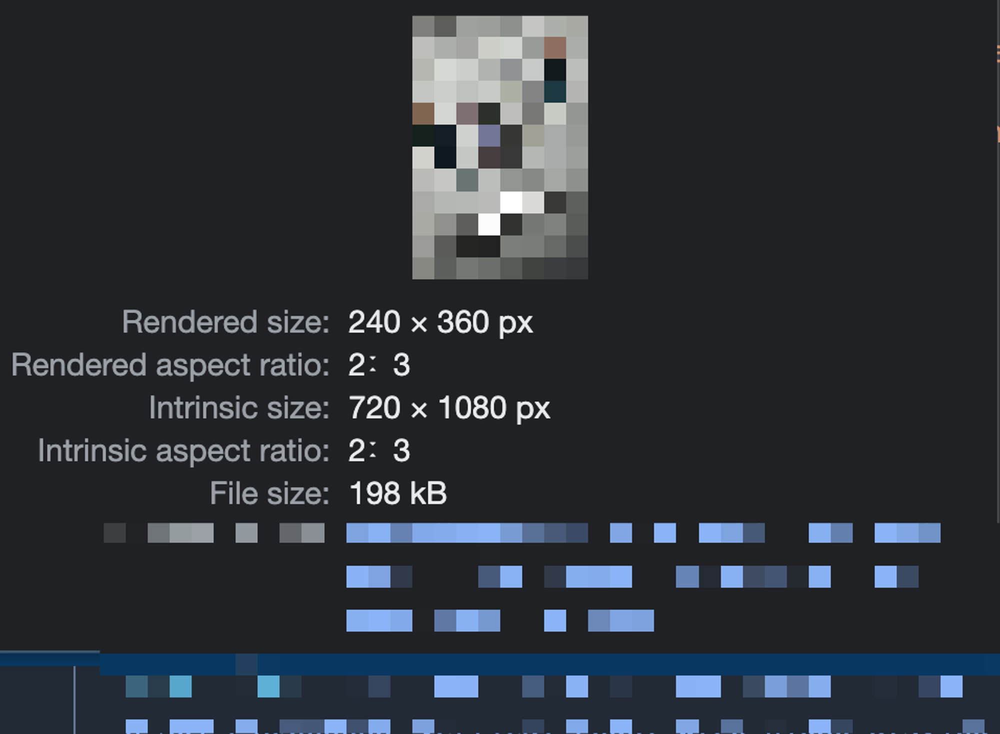

### Layout Shift

네트워크로 이미지를 불러올 때, 폰트 보다 늦게 뜬 후, 이미지가 차지하는 공간만큼 레이아웃이 밀려날 때 나타나는 현상

### Layout Shift가 발생하는 원인

1. 크기가 정해지지 않은 이미지, 광고, 임베드 및 iframe

2. 동적인 컨텐츠

3. FOIT/FOUT을 유발하는 웹 폰트

4. DOM 업데이트 전에 네트워크 응답 대기 작업

### Layout Shift를 막는 방법

레이아웃 이동은 요소의 사이즈를 미리 정하지 않아서 발생합니다.

따라서 레이아웃 이동을 유발하는 요소의 사이즈를 정하면 됩니다.

이미지 사이즈는 브라우저의 가로 사이즈에 따라 변합니다.

따라서 단순히 너비와 높이를 고정하는 것이 아닌

이미지의 너비, 높이 비율로 공간을 잡아두면 됩니다.



크롬에서 보면 개발자도구를 통해 이미지의 비율을 확인할 수 있습니다.

여기서 사용하는 이미지의 비율은 2:3 입니다.

이미지 크기를 비율로 설정하는 방법은 다음과 같이 크게 2가지가 있습니다.

1. padding으로 박스를 만들고, 그 안에 이미지를 absolute로 띄우는 방식

```jsx
import React from "react";
import styled from "styled-components";

const App = () => {
  return (
    <Wrapper>
      
    </Wrapper>
  );
};

const Wrapper = styled.div`
  position: relative;
  width: 160px;
  padding-top: 66.66% /* 2:3 비율 */ .image {
    position: absolute;
    width: 100%;
    height: 100%;
    top: 0;
    left: 0;
  }
`;
```

2. CSS의 aspect-radio 속성 이용

이 속성은 지원하지 않는 브라우저가 있을 수 있습니다.

그럴 경우 1번을 이용합니다.

```jsx
import React from "react";
import styled from "styled-components";

const App = () => {
  return (
    <Wrapper>
      
    </Wrapper>
  );
};

const Wrapper = styled.div`
  width: 100%;
  aspect-ratio: 16 / 9;

  .image {
    width: 100%;
    height: 100%;
  }
`;
```
