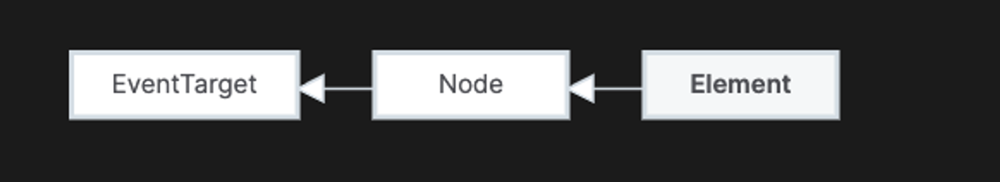
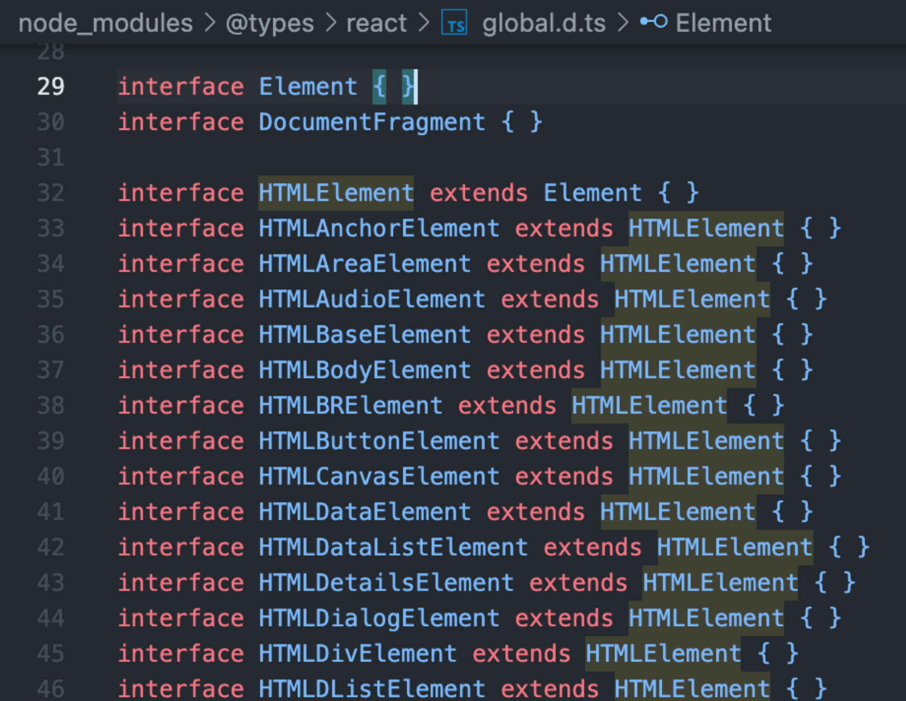
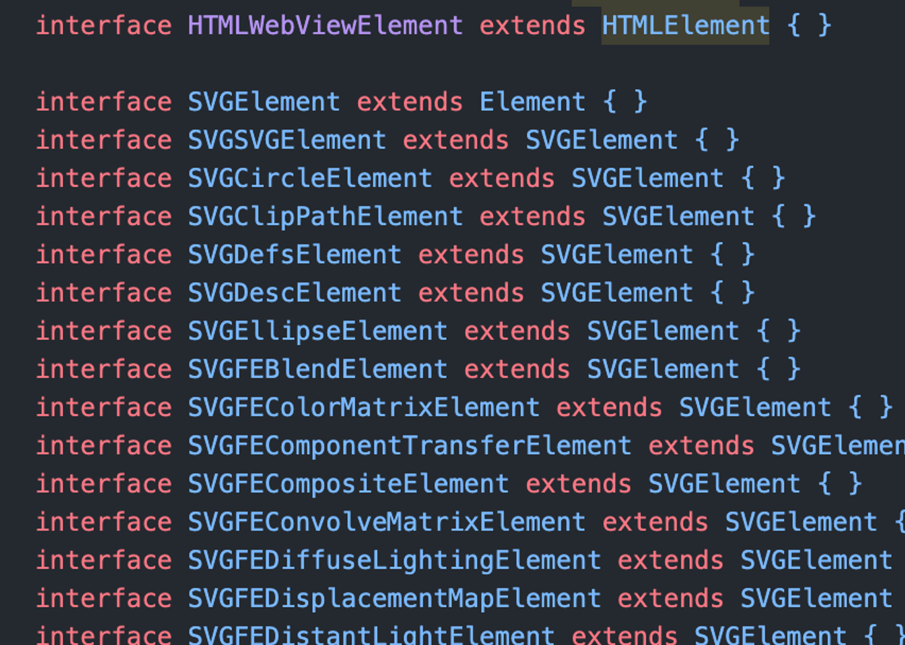

### 결론

Element에 scroll에 모킹한 함수를 넣는다

```tsx
describe('버튼을 클릭한다' () => {
    Element.prototype.scroll = jest.fn();
    render(<Button />)
    expect(...).toBeTruthy()
})
```

---

MDN에서 Element가 뭔가하니 찾아보았다.

Element는 문서의 모든 Element 객체(즉, Element를 나타내는 객체)가 상속되는 가장 일반적인 기본 클래스입니다.

모든 종류의 Element에 공통된 방법과 속성만 가지고 있습니다.

보다 구체적인 클래스가 Element에서 상속됩니다.

예를 들어, HTMLElement의 기본 인터페이스는 HTMLElement의 기본 인터페이스인 반면,

SVGElement의 기본 인터페이스는 SVGElement의 기본 인터페이스입니다.

대부분의 기능은 클래스 계층 아래에 지정됩니다.



이건 또 뭔소리인가.. 싶어서 리액트 타입스크립트를 또 봤다.

말하자면 가장 기본적인 Element 인터페이스를 상속받는게 HTMLElement, SVGElement이고,

나머지 Element들은 HTMLElement 혹은 SVGElement을 상속받는다라는 뜻으로 보인다.





그럼 그 Element라는 객체는 뭔가 하니...

Element는 노드의 특정 타입 중에 하나이다.

DOM의 text node, comment node, document node 등을 의미하는 것이었다.

JS로 document.getElementById("test")라는 것이 있다면, 이 것은 하나의 노드이면서, Element이다.
