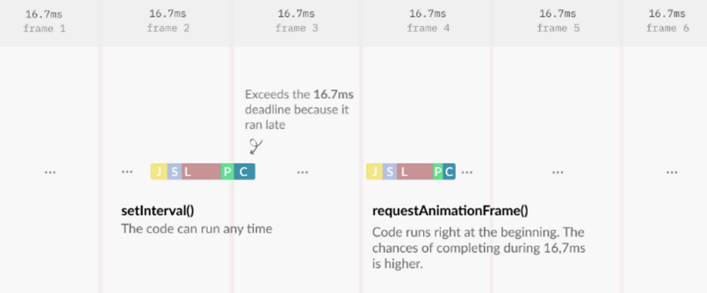

- requestAnimationFrame은 16.7ms(1프레임은 16.7ms(= 1s / 60frame)에 한 번씩 그려짐)안에 브라우저 렌더링 사이클(레이아웃 > 페인트 > 컴포지션)을 모두 끝내고 frame 생성시마다 callback을 실행시켜서 frame 유실을 방지할 수 있음(16.7ms 내 렌더링 완료 보장 더 안정적이게 가능)
  - setInterval, setTimeout의 경우, 16.7ms를 벗어나는 경우가 있음 ⇒ 이는 frame 생성시점에 callback 실행이 어려워서, frame이 지연 혹은 유실될 가능성이 있다.

```tsx
const animateSomething = () => {
  // make some change

  // 그 이후에 계속적으로 프레임 계산 시에 맞춰서 애니메이션 업데이트
  requestAnimationFrame(animateSomething);
};

// 처음 애니메이션을 시작
requestAnimationFrame(animateSomething);
```

참고

[[Web] requestAnimationFrame vs setInterval (feat. React 숫자 카운트 애니메이션)](https://velog.io/@unhyif/Web-requestAnimationFrame-vs-setInterval-feat.-React-숫자-카운트-애니메이션)
