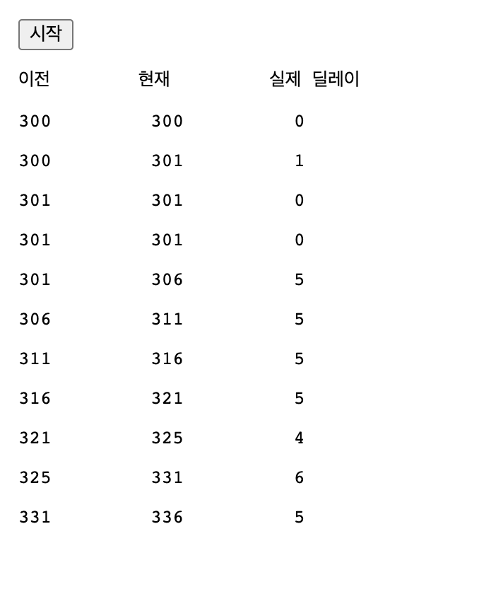
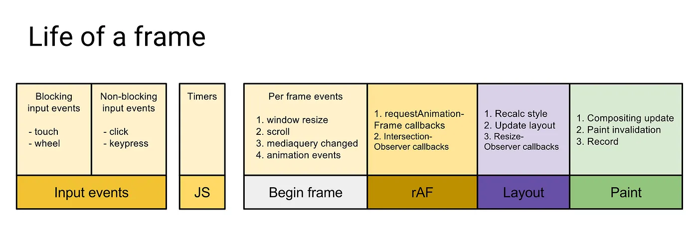
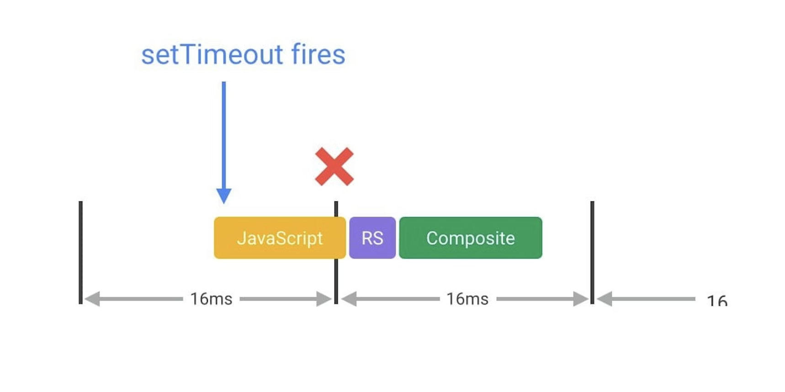

setTimeout와 requestAnimationFrame을 비교하기 전에 먼저 특정 타이밍에 실행하기 위해서 setTimeout을 지양해야하는 이유를 알아보자

---

## setTimeout의 시간은 보장되는가?

### 5번이상 setTimeout을 중첩시킬 경우의 4ms의 딜레이

---

- setTimeout의 의존성으로 걸어둔 시간은 보장되지 않고, 더 길 수도 있다.
  - 브라우저는 setTimeout 호출을 5번 이상 중첩하면, 4ms의 최소 타임아웃을 강제한다.

```html
<button id="run">시작</button>
<pre>이전        현재         실제 딜레이</pre>
<div id="log"></div>
```

```jsx
let last = 0;
let iterations = 10;

function timeout() {
  // log the time of this call
  logline(new Date().getMilliseconds());

  // if we are not finished, schedule the next call
  if (iterations-- > 0) {
    setTimeout(timeout, 0);
  }
}

function run() {
  // clear the log
  const log = document.querySelector("#log");
  while (log.lastElementChild) {
    log.removeChild(log.lastElementChild);
  }

  // initialize iteration count and the starting timestamp
  iterations = 10;
  last = new Date().getMilliseconds();

  // start timer
  setTimeout(timeout, 0);
}

function pad(number) {
  return number.toString().padStart(3, "0");
}

function logline(now) {
  // log the last timestamp, the new timestamp, and the difference
  const newLine = document.createElement("pre");
  newLine.textContent = `${pad(last)}         ${pad(now)}          ${
    now - last
  }`;
  document.getElementById("log").appendChild(newLine);
  last = now;
}

document.querySelector("#run").addEventListener("click", run);
```



- 딜레이를 0으로 지정한 setTimeout을 여러번 중첩하고, 실제 각각 콜백 호출되기까지 딜레이를 기록해보았다.
  - 4번째까지는 0ms 딜레이에 근접하지만, 5번째 부터는 딜레이가 4ms에 근접함을 볼 수 있음

### 늦은 타임아웃

---

- 페이지, 운영체제, 브라우저가 다른 작업으로 인해 바쁘면, setTimeout의 타임아웃이 예상보다 늦게 실행될 수 있음
  - setTimeout을 호출한 스레드가 종료되기 전에는 지정한 함수, 코드 스니펫을 실행할 수 없음
  - delay가 0인데도 “setTimeout 완료”라는 스트링이 먼저 나온이유
    - 0으로 딜레이를 호출하긴 했으나, setTimeout 콜백을 대기열에 넣고, 다음 기회에 실행하라고 설정한 것과 같음 → 즉시 호출하라는 것이 아님

```jsx
function foo() {
  console.log("foo 호출");
}
setTimeout(foo, 0);
console.log("setTimeout 완료");

/*
결과
-------
setTimeout 완료
foo 호출
*/
```

참고

[setTimeout() - Web API | MDN](https://developer.mozilla.org/ko/docs/Web/API/setTimeout)

---

이와 같이 setTimeout은 delay에 넣은 시간보다 더 딜레이가 생기기 때문에, 특정 타이밍에 실행하기 위한 목적으로는 적합하지 않을 수 있습니다.

이럴 경우에 사용하는 것이 requestAnimationFrame API 입니다.

이는 setTimeout처럼 동작하긴 하지만, 조금 더 개선된 버전입니다.

requestAnimationFrame도 callback을 사용하는데, 이 콜백을 repaint 태스크를 시작할 준비가 됐을 때 콜백함수를 예약합니다. ⇒ 따라서 setTimeout의 성능문제를 해결할 수 있습니다.

- setTimeout은 브라우저의 critical rendering path를 고려하지 않습니다. 따라서 repaint 시에 setTimeout이 실행돼 또 repaint가 실행될 수 있어서 사이드 이펙트가 생길 수 있습니다.

## 프레임 생명주기



## setTimeout이 실행되는 설명 이미지



참고

[setTimeout()과 requestAnimationFrame()](https://velog.io/@wejaan/setTimeout과-requestAnimationFrame)
