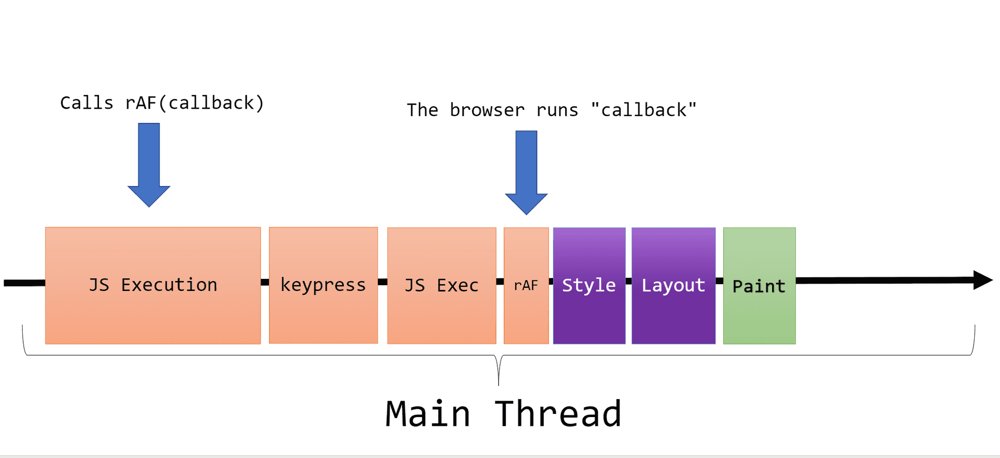
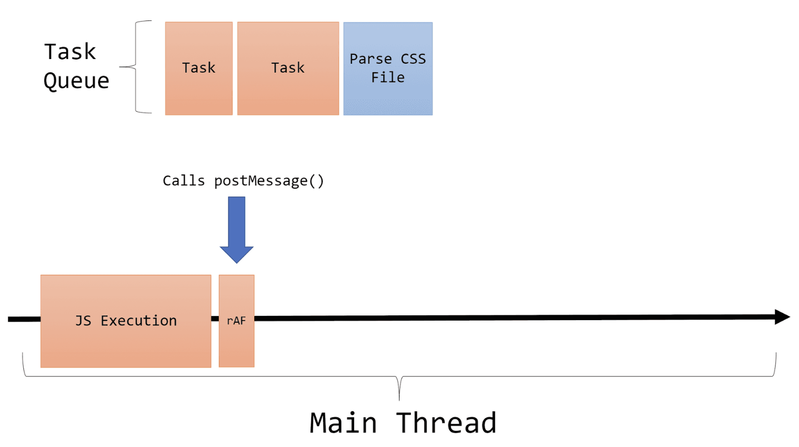
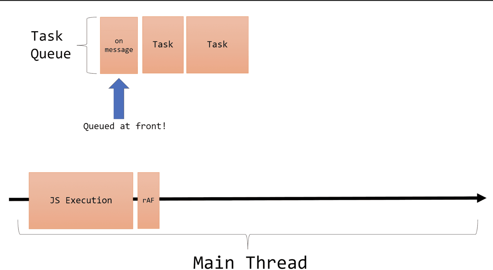
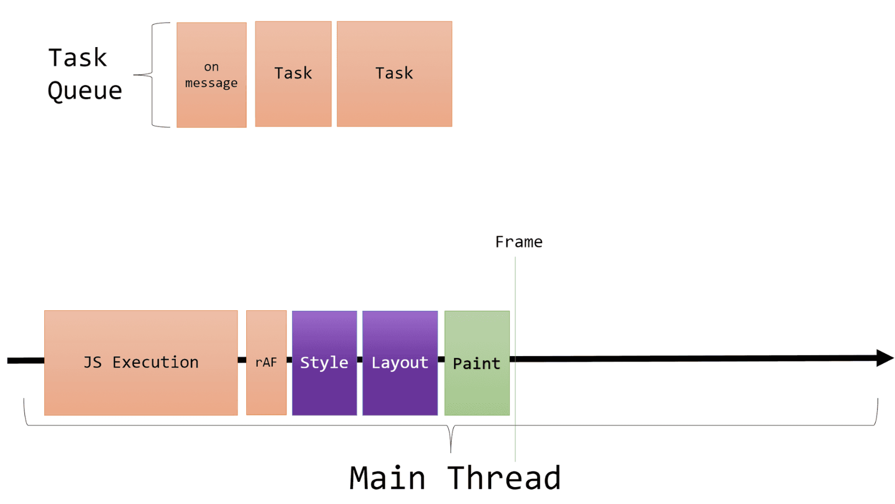
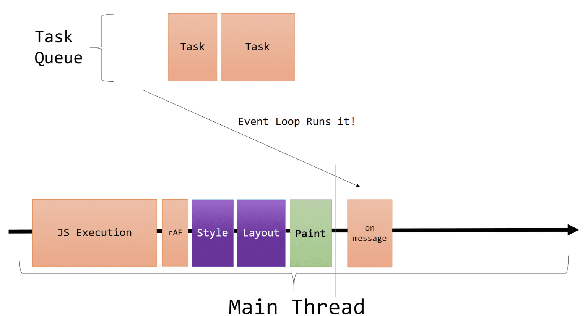
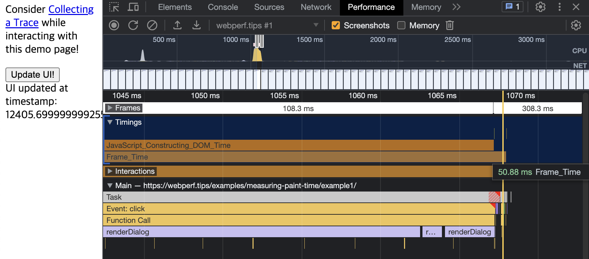
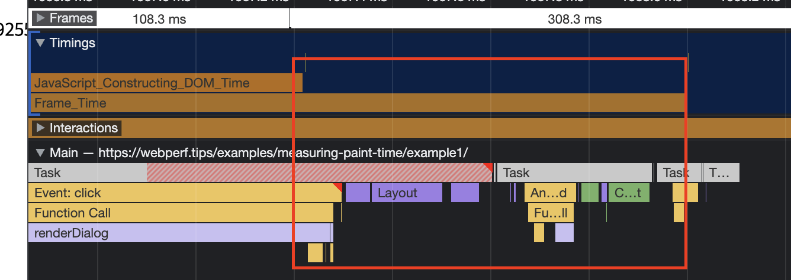
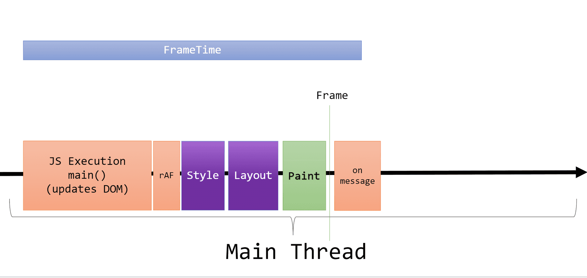
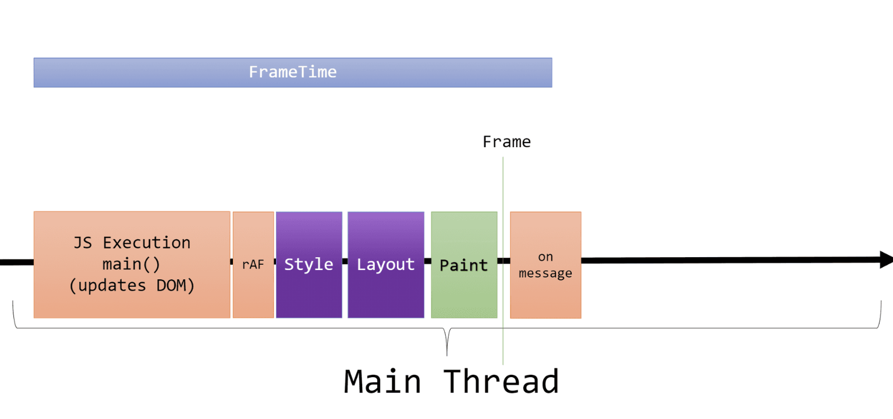
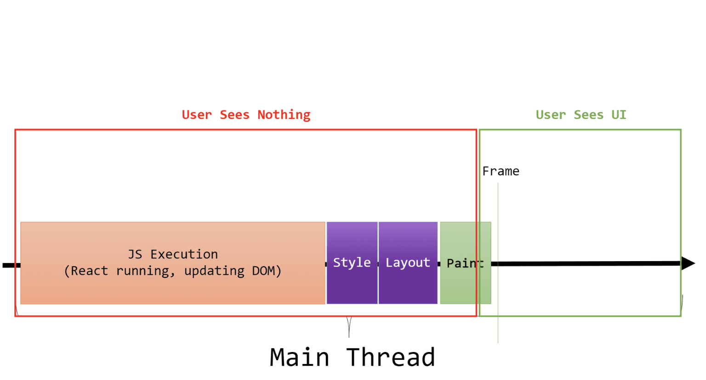

## requestAnimationFrame

- callback은 1초에 60번 호출됨
  - 브라우저가 1초당 60FPS를 목표로함
- requestAnimation의 콜백은 JS Execution에서 불려지며, 실행자체는 JS Exec 뒤, style, layout, paint 전에 실행된다
  - 브라우저가 다음 렌더링 태스크를 끝내기 바로 전, 콜백을 실행시키는 것
  - 이벤트루프를 통한 끼워넣는 그리고 태스크 큐로부터 꺼내지는 “일반적인 태스크”와는 다름



---

requestAnimationFrame에서 콜백을 콜함



이는 콜백 내용을 태스크 큐의 제일 앞쪽에 위치시킴



1 프레임이 모두 끝나고



태스크 큐의 태스크가 그 다음 바로 실행시킴



---

Frame_Time이 JavaScript_Constructing_DOM_Time보다 시간이 길게 걸림(렌더링 시간이 포함되서 그렇다 → Layout, Style, Paint 등 포함)





이는 곧 다음과 같다.



## 메인스레드의 브라우저렌더링 사이클





```tsx
// 다음 프레임을 그리고 나서 실행
function runAfterFramePaint(callback) {
  // Queue a "before Render Steps" callback via requestAnimationFrame.
  requestAnimationFrame(() => {
    const messageChannel = new MessageChannel();

    // Setup the callback to run in a Task
    messageChannel.port1.onmessage = callback;

    // Queue the Task on the Task Queue
    messageChannel.port2.postMessage(undefined);
  });
}

function updateDom() {
  const node = document.getElementById("some-node");

  node.innerText = "Some Text";

  // Other DOM Updates...
}

function main() {
  performance.mark("App_Start");

  // Updates DOM in this Task
  updateDom();

  // Queues a requestAnimationFrame relative to this executing Task
  runAfterFramePaint(() => {
    performance.mark("App_FrameProduced");

    const measure = performance.measure(
      "FrameTime",
      "App_Start",
      "App_FrameProduced"
    );

    console.log(`The Frame was produced after ${measure.duration}ms`);
  });
}

main();
```

---

### 참고

[Detecting when the Browser Paints Frames in JavaScript](https://webperf.tips/tip/measuring-paint-time/)
