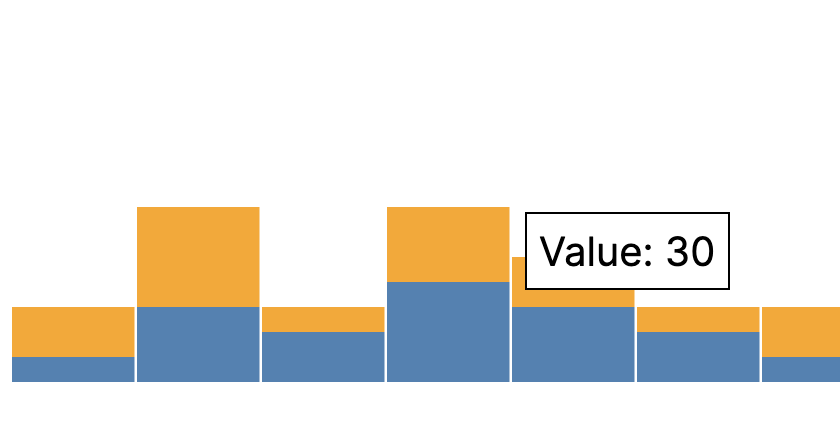

HighCharts, D3, Apache ECharts 등등 차트 라이브러리를 많은데 이런게 어려웠다.

- 커스터마이징
- 애니메이션으로 인한 브라우저 속도 저하 및 브라우저가 죽는 현상

그래서 방법을 찾고 있던 중, 직접 차트를 만들어보자 라는 생각이 들었다.

왜냐하면 D3를 사용하던, Apache Echarts를 사용하던, svg를 사용하기 때문이다.

---

## SVG 태그로 직접 Stack Bar Chart를 만들어보자

```tsx
import React, { MouseEvent, useState } from "react";

const data = [
  [10, 20],
  [30, 40],
  [20, 10],
  [40, 30],
  [30, 20],
  [20, 10],
  [10, 20],
  [30, 40],
  [20, 10],
  [40, 30],
];

interface StackBarChartProps<T> {
  data: T;
}

const StackBarChart = <T extends number[][]>({
  data,
}: StackBarChartProps<T>) => {
  const height = 500;
  const width = 500;
  const barWidth = width / data.length;

  const [tooltip, setTooltip] = useState<{
    opacity: number;
    top?: number;
    left?: number;
    data?: number;
  }>({ opacity: 0 });

  const handleMouseOver = (d: number, i: number, e: MouseEvent) => {
    setTooltip({
      opacity: 1,
      top: e.clientY - 10,
      left: e.clientX + 10,
      data: d,
    });
  };

  const handleMouseOut = () => {
    setTooltip({ opacity: 0 });
  };

  return (
    <div>
      <svg width={width} height={height}>
        {data.map((d, i) => (
          <g key={i} transform={`translate(${i * barWidth}, 0)`}>
            <rect
              y={height - d[0]}
              width={barWidth - 1}
              height={d[0]}
              fill="steelblue"
              onMouseOver={(e) => handleMouseOver(d[0], i, e)}
              onMouseOut={handleMouseOut}
            />
            <rect
              y={height - d[0] - d[1]}
              width={barWidth - 1}
              height={d[1]}
              fill="orange"
              onMouseOver={(e) => handleMouseOver(d[1], i, e)}
              onMouseOut={handleMouseOut}
            />
          </g>
        ))}
      </svg>
      <div
        style={{
          position: "fixed",
          opacity: tooltip.opacity,
          top: tooltip.top,
          left: tooltip.left,
          backgroundColor: "white",
          border: "1px solid black",
          padding: "5px",
        }}
      >
        {tooltip.data && `Value: ${tooltip.data}`}
      </div>
    </div>
  );
};

const HomePage = () => {
  return (
    <div>
      <StackBarChart data={data} />
    </div>
  );
};

export default HomePage;
```

이렇게 짜면 다음과 같이 hover를 통한 tooltip도 구현할 수 있다

이렇게 직접 만들게 되면, 커스터마이징도 용이하고, 애니메이션의 종류 및 그 정도를 손수 커스터마이징할 수 있어서 좋았다.


