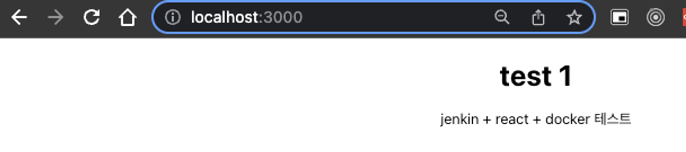
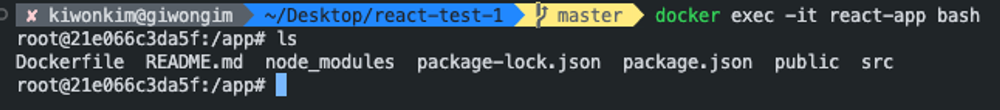
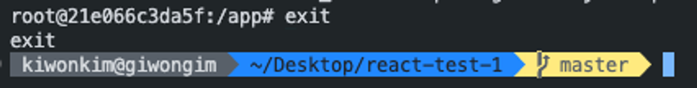
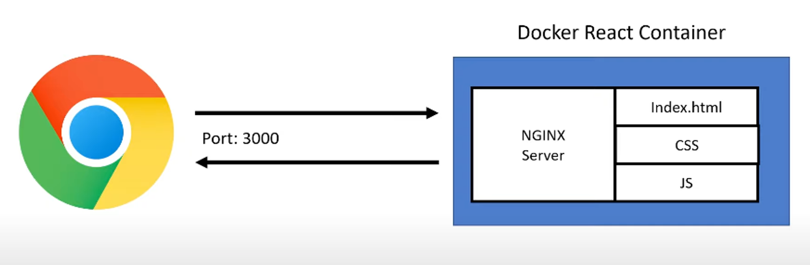
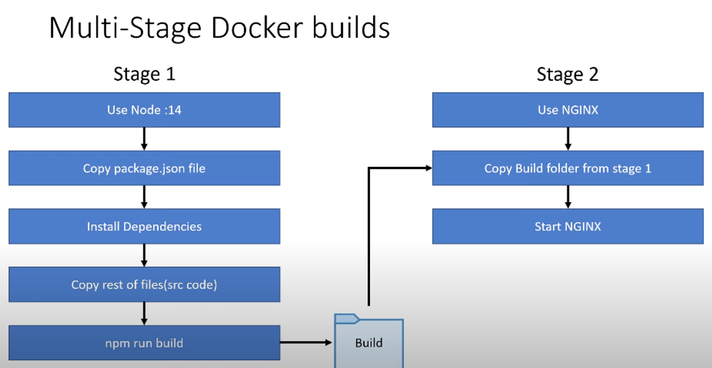
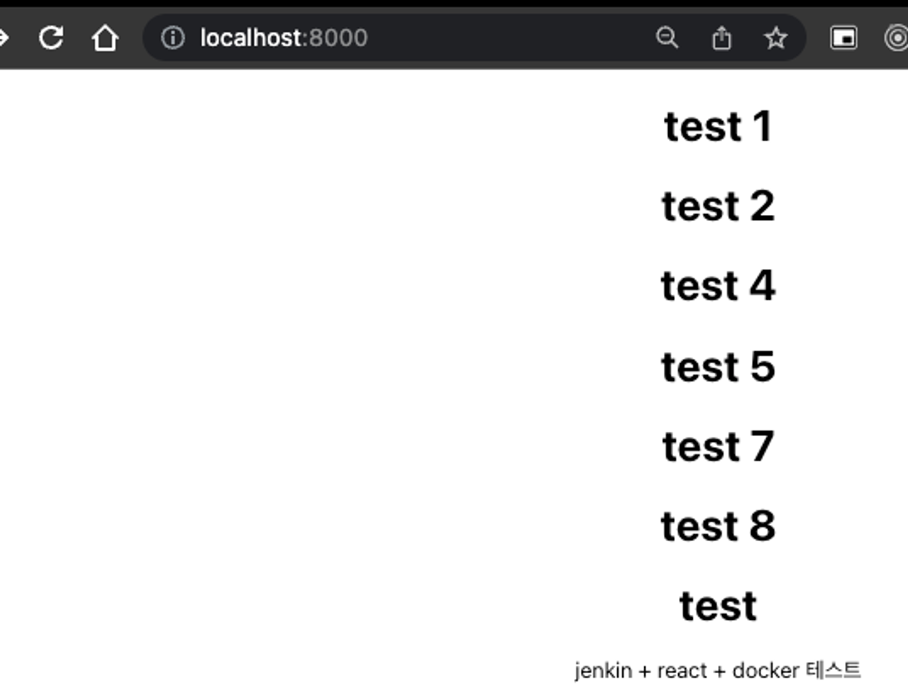

# Docker로 빌드하기

```docker
// Dockerfile// root에 만들기

FROM node

# 도커 이미지 내에서 작업 디렉토리(WORKDIR)를 /app으로 해두는 설정명령
WORKDIR /app

# 도커에 미리 package.json과 전체 디렉토리 파일을 카피한다
# 그리고 이것들을 캐싱해서
# 바뀐게 있는지 감지한다.
# 바뀐게 있을 때만 npm install을 한다

# COPY <소스 경로> <대상 경로>
COPY package.json .
RUN npm install

# 루트 것을 현재 도커 이미지의 루트로 가져온다
COPY . .
EXPOSE 3000
CMD ["npm", "start"]
```

```tsx
// 특정 이미지로 빌드 실행하기
docker build -t react-test-1 .

// 현재 도커 이미지가 뭐가 있는지 확인하기
docker image ls

// 결과값// REPOSITORY             TAG          IMAGE ID       CREATED              SIZE// <none>                 <none>       7aea5541fc87   About a minute ago   1.61GB// 특정 도커 이미지 지우기
docker image rm 7aea5541fc87
```

```tsx
// .dockerignore// root에 저장

node_modules;
Dockerfile.git.gitignore.dockerignore.env;
```

```tsx
// .env// root에 추가

CHOKIDAR_USEPOLLING = true;
REACT_APP_NAME = kiwonkim;
```

```tsx
// -------------- 여러 컨테이너를 하나의 앱으로 통합 ---------------------// 하나의 컨테이너만 존재할 경우, 하나의 컨테이너만 실행한 것 처럼 보이지만 사실은 앱을 띄운것// docker-compose.yml// root에 추가version: "3"
services:
    react-app:
      build: .
      ports:
        - "3000:3000"
      volumes:
        - ./src:/app/src
      environment:
        - REACT_APP_NAME=kiwonkim_compose
        - CHOKIDAR_USEPOLLING=true
      # env_file:
      #   - ./.env

// docker-compose.yml 파일 생성 후 docker-compose 실행
docker-compose up -d --build
// docker-compose 삭제
docker-compose down

// ---------------- 하나의 컨테이너 실행 --------------------
// docker 이미지를 기반으로 컨테이너를 생성
docker run -d -p 3000:3000 --name react-app react-test-1

// docker 이미지를 기반으로 컨테이너로 생성 + 실시간으로 코드 변경사항을 반영해줌
// + .env파일을 이용해서 환경변수를 적용
docker run --env-file ./.env -v /Users/kiwonkim/Desktop/react-test-1/src:/app/src -d -p 3000:3000 --name react-app react-test-1

// ---------------- 기타 -----------------------------// docker 이미지 삭제
docker rm react-app -f

// docker 컨테이너 확인
docker ps

// docker 컨테이너 지우기
docker rm react-app -f
```



컨테이너를 생성하고 localhost:3000에 접속하면 App.js에 반영된 코드들이 렌더링된다.


App.js에 있는 코드를 변경하고 반영하려면 다시 도커 이미지를 삭제하고 다시 이미지와 컨테이너를 실행해야한다

```tsx
docker rm react-app -f
docker build -t react-test-1 .
docker run -d -p 3000:3000 --name react-app react-test-1
```

```tsx
// 도커 컨테이너 내부를 bash로 조작하기
docker exec -it react-app bash

// 도커 컨테이너 안에서 현재 파일들 확인하기
ls

// 결과값// Dockerfile  README.md  node_modules  package-lock.json  package.json  public  src// 도커 컨테이너에서 나올 때
exit
```




# Docker 컨테이너에 NginX 서버를 띄우기



Docker 컨테이너에서의 리액트 실행 구조(2)



```tsx
// docker-compose.dev.yml, docker-compose.prod.yml로 나눈다

// docker-compose.dev.yml
version: "3"
services:
    react-app:
      # stdin_open: true
      # tty: true
      build:
        context: .
        dockerfile: Dockerfile.dev
      ports:
        - "3000:3000"
      volumes:
        - ./src:/app/src
      environment:
        - REACT_APP_NAME=kiwonkim_compose-dev
        - CHOKIDAR_USEPOLLING=true
      # env_file:
      #   - ./.env

// docker-compose.prod.yml
version: "3"
services:
    react-app:
      # stdin_open: true
      # tty: true
      build:
        context: .
        dockerfile: Dockerfile.prod
        args:
          - REACT_APP_NAME=kiwonkim-compose-prod
      ports:
        - "8000:80"
      environment:
        - REACT_APP_NAME=kiwonkim_compose-prod
        - CHOKIDAR_USEPOLLING=true
      # env_file:
      #   - ./.env
```

```tsx
// ------------- dev용 도커 이미지 빌드 ---------------// Dockerfile.dev
docker build -f Dockerfile.dev

// dev용 docker-compsoe
docker-compose -f docker-compose.yml -f docker-compose.dev.yml up -d --build

// ------------- prod용 도커 이미지 ------------------// Dockerfile.prod
FROM node as build
WORKDIR /app
# 도커에 미리 package.json과 전체 디렉토리 파일을 카피한다
# 그리고 이것들을 캐싱해서
# 바뀐게 있는지 감지한다.
# 바뀐게 있을 때만 npm install을 한다
COPY package.json .
RUN npm install
COPY . .
ARG REACT_APP_NAME
ENV REACT_APP_NAME=${REACT_APP_NAME}
RUN npm run build

FROM nginx
COPY --from=build /app/build /usr/share/nginx/html

// prod용 docker-compose
docker-compose -f docker-compose.yml -f docker-compose.dev.yml up -d --build

// ----------------------------------------------// prod용 도커 이미지 빌드
docker build -f Dockerfile.prod -t docker-image-prod .

// 도커 컨테이너 실행
docker run --env-file ./.env -d -p 8000:80 --name react-app-prod docker-image-prod

// ----------------------------------------------// 도커 컨테이너 중지
docker stop react-app-prod

// 도커 컨테이너 삭제
docker rm react-app-prod
```



참고

https://www.youtube.com/watch?v=3xDAU5cvi5E
